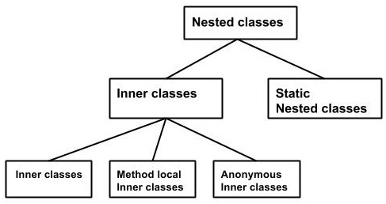
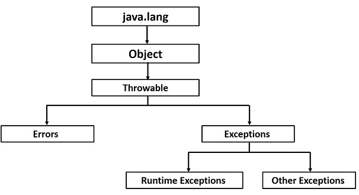
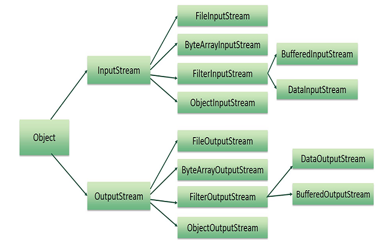

# Java的文件注释

以下内容引用自http://wiki.jikexueyuan.com/project/java/documentation.html：

Java语言支持三种注释形式：

| 注释                 | 描述                                                         |
| -------------------- | ------------------------------------------------------------ |
| /*text*/             | 编译器忽略/*到*/的所有东西                                   |
| //text               | 编译器忽略从//到一行末尾的所有东西                           |
| /** documentation */ | 这是文档注释并且通常而言它被叫做doc comment。JDK javadoc工具当准备自动准备生成文件时使用doc comment |

## **一、什么是Javadoc？**

Javadoc是JDK附带的一个工具，它被用来生成从需要预定义格式的文档的Java源代码至HTML格式的Java代码文件。

简单来说 ：javadoc可以给 Java 类、方法、字段等添加清晰说明，能通过 `javadoc` 工具自动生成 HTML 格式的 API 文档，方便团队协作和项目维护。

以下是一个简单的例子，其中红色部分代表Java注释：


```java
/**
* The HelloWorld program implements an application that
* simply displays "Hello World!" to the standard output.
*
* @author  Zara Ali
* @version 1.0
* @since   2014-03-31 
*/
public class HelloWorld {
    public static void main(String[] args) {
        // Prints Hello, World! on standard output.
        System.out.println("Hello World!");
    }
}
```


可以将需要的HTM 标签包括在描述部分内，比如，下面的例子利用`<h1>...</h1>`来定义头部和`<p>`被用来创建段落间隔：


```java
/**
* <h1>Hello, World!</h1>
* The HelloWorld program implements an application that
* simply displays "Hello World!" to the standard output.
* <p>
* Giving proper comments in your program makes it more
* user friendly and it is assumed as a high quality code.
* 
*
* @author  Zara Ali
* @version 1.0
* @since   2014-03-31 
*/
public class HelloWorld {
    public static void main(String[] args) {
        // Prints Hello, World! on standard output.
        System.out.println("Hello World!");
    }
}
```


## **二、Javadoc标签**

Javadoc标签是Javadoc认可的关键字，它定义了下面信息的类型。

Javadoc工具认可下面的标签：

| 标签              | 描述                                                         | 语法                                                 |         |         |
| ----------------- | ------------------------------------------------------------ | ---------------------------------------------------- | ------- | ------- |
| **@author**       | 添加类的作者                                                 | @author name-text                                    |         |         |
| **{@code}**       | 不把文本转换成HTML标记和嵌套的Java标签而用代码字体展示它     | {@code text}                                         |         |         |
| **{@docRoot}**    | 表示从任何生成页面到生成文档的根目录的相对路径               | {@docRoot}                                           |         |         |
| **@deprecated**   | 添加一个注释暗示API应该不再被使用                            | @deprecated deprecated-text                          |         |         |
| **@exception**    | 用类名和描述文本给生成的文档添加一个副标题                   | @exception class-name description                    |         |         |
| **{@inheritDoc}** | 从最近的可继承的类或可实现的接口继承注释                     | Inherits a comment from the immediate surperclass.   |         |         |
| **{@link}**       | 用指向特定的包，类或者一个引用类的成员名的文档的可见文本标签插入在线链接 | {@link package.class#member label}                   |         |         |
| **{@linkplain}**  | 和{@link}相同，除了链接的标签用纯文本标示而不是代码字体      | {@linkplain package.class#member label}              |         |         |
| **@param**        | 给“参数”区域添加一个有特定参数名且后跟着特定描述的参数       | @param parameter-name description                    |         |         |
| **@return**       | 添加一个有描述文本的“Returns”区域                            | @return description                                  |         |         |
| **@see**          | 添加带有链接或者指向引用的文本入口的标题“See Also”           | @see reference                                       |         |         |
| **@serial**       | 在默认的序列化字段的文本注释中使用                           | @serial field-description                            | include | exclude |
| **@serialData**   | 记录由writeObject( )或writeExternal( )方法所写的数据         | @serialData data-description                         |         |         |
| **@serialField**  | 记录一个ObjectStreamField成分                                | @serialField field-name field-type field-description |         |         |
| **@since**        | 给生成的文档添加一个带有特定since文本的"Since"标题           | @since release                                       |         |         |
| **@throws**       | @throw和@exception标签是同义词                               | @throws class-name description                       |         |         |
| **{@value}**      | 当{@value}被用在一个静态字段的文本注释中，它展示了那个常量的值 | {@value package.class#field}                         |         |         |
| **@version**      | 当-version选项被使用时用特定的version文本给生成的文本添加一个“Version”副标题 | @version version-text                                |         |         |

示例：

下面的程序使用一些重要的标签来做文档注释。可以基于需求利用其它的标签。

关于AddNum类的文档将由HTML文件AddNum.html创建，但是同时一个名为index.html的主文件也将被创建。


```java
import java.io.*;

/**
* <h1>Add Two Numbers!</h1>
* The AddNum program implements an application that
* simply adds two given integer numbers and Prints
* the output on the screen.
* <p>
* <b>Note:</b> Giving proper comments in your program makes it more
* user friendly and it is assumed as a high quality code.
*</p>
* @author  Zara Ali
* @version 1.0
* @since   2014-03-31
*/
public class AddNum {
   /**
   * This method is used to add two integers. This is
   * a the simplest form of a class method, just to
   * show the usage of various javadoc Tags.
   * @param numA This is the first paramter to addNum method
   * @param numB  This is the second parameter to addNum method
   * @return int This returns sum of numA and numB.
   */
   public int addNum(int numA, int numB) {
      return numA + numB;
   }

   /**
   * This is the main method which makes use of addNum method.
   * @param args Unused.
   * @return Nothing.
   * @exception IOException On input error.
   * @see IOException
   */
   public static void main(String args[]) throws IOException
   {

      AddNum obj = new AddNum();
      int sum = obj.addNum(10, 20);

      System.out.println("Sum of 10 and 20 is :" + sum);
   }
}
```


现在，处理使用Javadoc的AddNum.java文件：


```java
$ javadoc AddNum.java
Loading source file AddNum.java...
Constructing Javadoc information...
Standard Doclet version 1.7.0_51
Building tree for all the packages and classes...
Generating /AddNum.html...
AddNum.java:36: warning - @return tag cannot be used in method with void return type.
Generating /package-frame.html...
Generating /package-summary.html...
Generating /package-tree.html...
Generating /constant-values.html...
Building index for all the packages and classes...
Generating /overview-tree.html...
Generating /index-all.html...
Generating /deprecated-list.html...
Building index for all classes...
Generating /allclasses-frame.html...
Generating /allclasses-noframe.html...
Generating /index.html...
Generating /help-doc.html...
1 warning
$
```


如果正在使用JDK 1.7那么Javadoc不生成stysheet.css，所以建议从http://docs.oracle.com/javase/7/docs/api/stylesheet.css下载并使用标准的stylesheet。


# Java中的多线程

以下内容引用自http://wiki.jikexueyuan.com/project/java/multithreading.html：

Java是一种多线程编程语言，这意味着能用Java开发多线程程序。一个多线程程序包含两个或更多的能并行运行的部分，并且每一部分能最优利用可用资源，尤其是当计算机有多个CPU时，同时解决不同的任务。

多任务处理表示多个过程共同处理像CPU这样共享的资源时。多线程将多任务处理的思想扩展到应用程序，可以将一个单独的应用中的特定的操作细分为单独的线程。每一个线程能并行地运行。操作系统不仅在不同的应用程序中划分处理时间，而且在一个应用程序中的每一个线程中也是如此。

多线程可以用一种多个活动能并行地在同一个程序中进行的方法编写程序。

## **一、线程的生命周期**

一个线程在它的生命周期中通过不同的阶段。例如，一个线程生成，开始，运行，然后死亡。下列的图表展示了一个线程的完整的生命周期。

旧版：


新版：


上述提到的阶段在这解释：

- new： 一个新的线程以一个新的状态开始了它的生命周期。它始终留在这个状态中直到程序开始线程。它也被称为一个生成的进程。
- Runnable： 在一个新生成的线程开始后，这个线程变得可运行。在这个状态下的线程被认为正在执行任务。
- Waiting： 有时候，一个线程当它等待另一个线程工作时跃迁到等待状态。一个线程仅当另一个线程发信号给等待的线程继续执行才跃迁回可运行转态。
- Timed Waiting： 一个可运行的线程能进入定时等待状态等待指定的时间间隔。在这种转态下的线程当时间间隔死亡或者当它所等待的活动发生时跃迁回可运行状态。
- Terminated（Dead）： 一个可运行的线程，当它完成了它的任务后进入 terminated 状态，否则它就结束。

## **二、线程优先级**

每一个Java线程有一个帮助操作系统决定线程调度顺序的优先级。

Java线程的优先级在MIN_PRIORITY（一个为1的常数）和MAX_PRIORITY（一个为10的常数)的范围内。缺省状况下，每一个线程给予优先级NORM_PRIORITY（一个为5的常数）。

拥有更高优先级的线程对于一个程序来说更加重要，应当在低优先级的线程前被分配处理时间。然而，线程优先级不能保证线程执行和所依赖的平台。

## **三、通过实现Runnable接口创建线程**

如果一个类想要作为一个线程被执行，那么可以通过实现Runnable接口来到达这个目的。将需要遵从三个基本步骤：

步骤一：

作为第一步需要实现由Runnable接口提供的run()方法。这个方法为线程提供了进入点并且将把完全的业务逻辑放入方法中。下列是简单的run()方法语法：

```java
public void run( )
```

步骤二：

在第二步将使用以下的构造函数实例化一个 Thread 对象:

```java
Thread(Runnable threadObj, String threadName);
```

threadObj是实现Runnable接口的类的一个实例，threadName是给新线程的名字。

步骤三：

一旦Thread对象被创建，可以通过调用run()方法的start()方法来开始它。以下是start()方法的简单语法：

```java
void start( );
```

示例：

这里是一个创建一个新线程并使之运行的例子：


```java
/**
 * 实现Runnable接口的线程任务类
 * 演示如何通过Runnable接口创建和控制线程
 *  @author zhangtaixuan
 */
class RunnableDemo implements Runnable {
    // 线程实例和线程名称
    private Thread t;
    private String threadName;

    /**
     * 构造函数：初始化线程名称
     * @param name 线程名称
     */
    RunnableDemo(String name) {
        threadName = name ;
        System.out.println("Creating " + threadName);
    }

    /**
     * 实现Runnable接口的run()方法
     * 定义线程执行的核心逻辑：循环打印倒计时并休眠
     */
    @Override
    public void run() {
        System.out.println("Running " + threadName);
        try {
            // 循环4次，每次打印当前计数并休眠50毫秒
            for (int i = 4; i > 0; i--) {
                System.out.println("Thread: " + threadName + ", " + i);
                Thread.sleep(50); // 线程休眠50毫秒，模拟耗时操作
            }
        } catch (InterruptedException e) {
            // 处理线程中断异常
            System.out.println("Thread " + threadName + " interrupted.");
            Thread.currentThread().interrupt(); // 恢复中断状态
        }
        System.out.println("Thread " + threadName + " exiting.");
    }

    /**
     * 启动线程的公共方法
     * 确保线程只被启动一次
     */
    public void start() {
        System.out.println("Starting " + threadName);
        if (t == null) {
            // 创建新线程并关联当前Runnable实例
            t = new Thread(this, threadName);
            t.start(); // 调用Thread类的start()方法启动线程
        }
    }
}

/**
 * 测试线程类：创建并启动多个线程
 */
public class TestThread {
    public static void main(String args[]) {
        // 创建第一个线程任务并启动
        RunnableDemo R1 = new RunnableDemo("Thread-1");
        R1.start(); // 调用自定义的start()方法

        // 创建第二个线程任务并启动
        RunnableDemo R2 = new RunnableDemo("Thread-2");
        R2.start(); // 调用自定义的start()方法

        // 主线程继续执行，不会等待R1和R2完成
        // 两个子线程将并行执行run()方法中的逻辑
    }
}

// 这将产生以上结果
Creating Thread-1
Starting Thread-1
Creating Thread-2
Starting Thread-2
Running Thread-1
Thread: Thread-1, 4
Running Thread-2
Thread: Thread-2, 4
Thread: Thread-2, 3
Thread: Thread-1, 3
Thread: Thread-1, 2
Thread: Thread-2, 2
Thread: Thread-2, 1
Thread: Thread-1, 1
Thread Thread-1 exiting.
Thread Thread-2 exiting.
```


## **四、通过继承Thread类来创建线程**

第二个创建线程的方法是创建一个通过使用以下两个简单步骤继承Thread类的新的类。这个方法在解决Thread类中使用可行方法创建的多线程的问题上提供了更多的灵活性。

步骤一：

将需要覆写Thread类中可用的run()方法。这个方法为线程提供入口并且将把完全的业务逻辑放入方法中。以下是run()方法的简单的语法。

```java
public void run( )
```

步骤二：

一旦Thread对象被创建，可以通过调用run()方法的start()方法来开始它。以下是start()方法的简单语法：

```java
void start( );
```

示例：

这是前面的重写继承Thread的程序：


```java
/**
 * 线程测试类，用于创建并启动多个线程实例
 * 演示通过继承Thread类实现多线程的基本用法
 *
 * @author zhangtaixuan
 */
public class TestThread {
    /**
     * 程序入口方法，创建并启动两个线程
     *
     * @param args 命令行参数（未使用）
     */
    public static void main(String args[]) {
        // 创建第一个线程实例并启动
        ThreadDemo T1 = new ThreadDemo("Thread-1");
        T1.start();

        // 创建第二个线程实例并启动
        ThreadDemo T2 = new ThreadDemo("Thread-2");
        T2.start();
    }
}

/**
 * 线程演示类，通过继承Thread类实现多线程
 * 包含线程的创建、启动和执行逻辑
 * @version jdk 1.8
 * @author zhangtaixuan
 */
class ThreadDemo extends Thread {
    /** 线程对象引用 */
    private Thread t;
    /** 线程名称 */
    private String threadName;

    /**
     * 构造方法，初始化线程名称并打印创建信息
     *
     * @param name 线程名称
     */
    ThreadDemo(String name) {
        threadName = name;
        System.out.println("Creating " + threadName);
    }

    /**
     * 线程执行的核心方法，定义线程的具体任务
     * 实现循环打印倒计时并休眠的逻辑
     */
    @Override
    public void run() {
        System.out.println("Running " + threadName);
        try {
            // 循环4次，每次打印当前计数并休眠50毫秒
            for (int i = 4; i > 0; i--) {
                System.out.println("Thread: " + threadName + ", " + i);
                // 线程休眠50毫秒，模拟耗时操作
                Thread.sleep(50);
            }
        } catch (InterruptedException e) {
            // 处理线程中断异常
            System.out.println("Thread " + threadName + " interrupted.");
        }
        System.out.println("Thread " + threadName + " exiting.");
    }

    /**
     * 启动线程的方法，确保线程只被启动一次
     * 内部创建Thread实例并调用其start()方法
     */
    public void start() {
        System.out.println("Starting " + threadName);
        if (t == null) {
            // 创建新线程并关联当前Thread实例
            t = new Thread(this, threadName);
            t.start(); // 启动线程
        }
    }
}

// 这将产生一下结果
Creating Thread-1
Starting Thread-1
Creating Thread-2
Starting Thread-2
Running Thread-1
Thread: Thread-1, 4
Running Thread-2
Thread: Thread-2, 4
Thread: Thread-1, 3
Thread: Thread-2, 3
Thread: Thread-1, 2
Thread: Thread-2, 2
Thread: Thread-1, 1
Thread: Thread-2, 1
Thread Thread-1 exiting.
Thread Thread-2 exiting.
```


## **五、Thread方法**

以下是在Thread类中可以获得的重要方法的列表。

| 接口                                        | 描述                                                         |
| ------------------------------------------- | ------------------------------------------------------------ |
| Methods with Description                    | 在一个独立的执行路径中开始一个线程，然后在这个Thread对象上调用 run() 方法。 |
| public void run()                           | 如果这个Thread对象是使用一个单独的Runnable目标实例化的,run()方法被Runnable对象调用。 |
| public final void setName(String name)      | 改变Thread对象的名字。也有一个getName()方法来检索名字。      |
| public final void setPriority(int priority) | 设置Thread对象的优先级。可能的值在1到10之间。                |
| public final void setDaemon(boolean on)     | 一个真值将这个线程标志为守护进程。                           |
| public final void join(long millisec)       | 当前进程在第二个线程上调用这个方法，使得当前进程阻塞直到第二个线程终结或者指定的毫秒数过去。 |
| public void interrupt()                     | 中断这个进程，如果由于任何原因而阻塞，使得它也继续执行。     |
| public final boolean isAlive()              | 如果线程是活的，返回真值，可在线程已经开始但在运行到完成之前的任何时间。 |

以前的方法是被一个特殊的Thread对象调用的。以下在Thread类中的方法是静态的。调用静态方法会在当前运行的线程上执行操作。

| 接口                                      | 描述                                                         |
| ----------------------------------------- | ------------------------------------------------------------ |
| public static void yield()                | 使得当前正在运行的线程让步于任何其他相同优先级的正在等待调度的线程。 |
| public static void sleep(long millisec)   | 使当前运行的线程阻塞至少指定的毫秒数。                       |
| public static boolean holdsLock(Object x) | 如果当前线程持有给定对象的锁，返回真值。                     |
| public static Thread currentThread()      | 返回对当前运行的线程的引用，也就是调用这个方法的线程。       |
| public static void dumpStack()            | 为当前运行的线程打印堆栈跟踪，这在当调试多线程应用程序时是有用的。 |

示例：

以下ThreadClassDemo程序展示了一些Thread类的方法。考虑实现Runnable的类DisplayMessage：


```java
// File Name : DisplayMessage.java
// Create a thread to implement Runnable
public class DisplayMessage implements Runnable
{
   private String message;
   public DisplayMessage(String message)
   {
      this.message = message;
   }
   public void run()
   {
      while(true)
      {
         System.out.println(message);
      }
   }
}
```


以下是继承Thread类的另一个类：


```java
/**
 * 猜数字游戏线程类 - 继承自 Thread 类，用于在独立线程中进行猜数字逻辑
 * 每个线程会随机猜测 1-100 之间的数字，直到猜中目标数字为止
 * @author zhangtaixuan
 */
public class GuessANumber extends Thread {
    // 要猜测的目标数字（通过构造函数传入）
    private int number;

    /**
     * 构造函数：初始化线程名称和目标数字
     * @param number 要猜测的目标数字（1-100之间）
     */
    public GuessANumber(int number) {
        this.number = number ;
    }

    /**
     * 线程执行的核心逻辑：循环随机猜测数字，直到猜中目标数字
     */
    @Override
    public void run() {
        int counter = 0;    // 记录猜测次数
        int guess = 0;      // 存储当前猜测的数字

        // 循环猜测，直到猜中目标数字
        do {
            // 生成 1-100 之间的随机整数
            guess = (int) (Math.random() * 100 + 1);
            System.out.println(this.getName() + " guesses " + guess);
            counter++;
        } while (guess != number);

        // 输出猜中信息和猜测次数
        System.out.println("** Correct! " + this.getName() + " in " + counter + " guesses.**");
    }
}
```


以下是使用上面定义的类的主程序:


```java
// File Name : ThreadClassDemo.java
public class ThreadClassDemo
{
   public static void main(String [] args)
   {
      Runnable hello = new DisplayMessage("Hello");
      Thread thread1 = new Thread(hello);
      thread1.setDaemon(true);
      thread1.setName("hello");
      System.out.println("Starting hello thread...");
      thread1.start();

      Runnable bye = new DisplayMessage("Goodbye");
      Thread thread2 = new Thread(bye);
      thread2.setPriority(Thread.MIN_PRIORITY);
      thread2.setDaemon(true);
      System.out.println("Starting goodbye thread...");
      thread2.start();

      System.out.println("Starting thread3...");
      Thread thread3 = new GuessANumber(27);
      thread3.start();
      try
      {
         thread3.join();
      }catch(InterruptedException e)
      {
         System.out.println("Thread interrupted.");
      }
      System.out.println("Starting thread4...");
      Thread thread4 = new GuessANumber(75);

      thread4.start();
      System.out.println("main() is ending...");
   }
}
```


这将产生以下结果。可以一次一次地尝试这个例子并且将每次得到不同的结果。


```java
Starting hello thread...
Starting goodbye thread...
Hello
Hello
Hello
Hello
Hello
Hello
Goodbye
Goodbye
Goodbye
Goodbye
Goodbye
.......
```


#  Java的发送邮件

下内容引用自http://wiki.jikexueyuan.com/project/java/sending-email.html：

用Java应用程序来发送一封电子邮件是足够简单的，但是开始时应该在机器上安装有JavaMail API和Java Activation Framework(JAF)。

- 可以从Java的标准企业网站上下载最新的[JavaMail（1.2 版本）](http://www.oracle.com/technetwork/java/index.html)版本。
- 可以从Java的标准企业网站上下载最新的[JAF（1.1.1 版本）](http://www.oracle.com/technetwork/java/index.html)版本。

下载并解压这些文件，在新创建的顶级目录中将找到许多应用程序的jar文件。需要CLASSPATH中添加mail.jar和activation.jar文件。（POM项目和Eclipse工程省略这一步）

## **一、发送一封简单的电子邮件**

这是从机器中发送一封简单的电子邮件的例子。这里假设本地主机连接到了因特网并且能够发送一封电子邮件。

以下我是通过QQ邮箱的测试发送。


```java
// File Name SendEmail.java
// 导入邮件发送所需的包
import java.util.*;
import javax.mail.*;
import javax.mail.internet.*;

/**
 * 发送邮件的 Java 程序
 * 通过 SMTP 协议连接 QQ 邮箱服务器发送邮件
 * 一下示例为QQ邮箱发送邮件测试	
 */
public class SendEmail {
    public static void main(String[] args) {
        // 收件人邮箱地址
        String to = "收件人邮箱";
        // 发件人邮箱地址
        String from = "发件人邮箱";
        // QQ 邮箱 SMTP 服务器地址
        String host = "smtp.qq.com";
        // SMTP 服务器端口号，SSL 加密方式默认使用 465
        String port = "465";
        // 发件人邮箱用户名
        String user = "你的qq邮箱";
        // 发件人邮箱授权码（非邮箱登录密码）
        String password = "邮箱授权码";

        // 获取系统属性
        Properties properties = System.getProperties();
        // 设置 SMTP 服务器地址
        properties.put("mail.smtp.host", host);
        // 设置 SMTP 服务器端口
        properties.put("mail.smtp.port", port);
        // 启用 SMTP 身份验证
        properties.put("mail.smtp.auth", "true");
        // 启用 SSL 加密
        properties.put("mail.smtp.ssl.enable", "true");

        // 创建认证器，用于 SMTP 身份验证
        Authenticator authenticator = new Authenticator() {
            @Override
            protected PasswordAuthentication getPasswordAuthentication() {
                return new PasswordAuthentication(user, password);
            }
        };

        // 创建邮件会话，包含 SMTP 服务器配置和认证信息
        Session session = Session.getInstance(properties, authenticator);
        // 启用调试模式，打印邮件发送过程中的详细信息
        session.setDebug(true);

        try {
            // 创建 MIME 格式的邮件消息
            MimeMessage message = new MimeMessage(session);
            // 设置发件人
            message.setFrom(new InternetAddress(from));
            // 设置收件人，类型为 TO（主送）
            message.addRecipient(javax.mail.Message.RecipientType.TO, new InternetAddress(to));
            // 设置邮件主题
            message.setSubject("This is the Subject Line");
            // 设置邮件正文（纯文本格式）
            message.setText("This is actual message");
            // 发送邮件
            Transport.send(message);
            // 邮件发送成功提示
            System.out.println("Sent message successfully....");
        } catch (MessagingException mex) {
            // 捕获并打印邮件发送过程中的异常信息
            mex.printStackTrace();
        }
    }
}
```


如果想要给多个收信者发送一封电子邮件，那么以下的方法将被用来发送给指定的多个电子邮件ID：

```java
void addRecipients(Message.RecipientType type,  Address[] addresses) throws MessagingException
```

这是参数的描述：

- type：这将被设置为TO，CC或者BCC。这里CC表示副本，BCC表示Black Carbon Copy。例如Message.RecipientType.TO。
- addresses：这是电子邮件ID的数组。当指定电子邮件ID时，需要使用InternetAddress()。


## **二、发送一封HTML电子邮件**

这是从机器发送一封HTML电子邮件的例子。这里假设本地主机连接到了因特网并且能够发送一封电子邮件。

这个例子和前一个非常相似，除了在这用setContent()方法来设置第二个参数为"text/html"以指定 HTML 内容被包括在消息中的内容。

使用这个例子，可以发送任何HTML内容。

```java
import javax.mail.*;
import javax.mail.internet.*;
import java.util.Properties;

public class SendHTMLEmail {
    public static void main(String[] args) {
        // 收件人邮箱
        String to = "收件人邮箱";

        // 发件人邮箱
        String from = "发件人邮箱";

        // SMTP服务器地址
        String host = "smtp.qq.com";

        // SMTP服务器端口（通常SSL为465，TLS为587）
        String port = "465";

        // 发件人邮箱用户名和密码
        String user = "你的QQ邮箱";
        String password = "邮箱授权码";

        // 配置邮件属性
        Properties properties = new Properties();
        properties.put("mail.smtp.host", host);
        properties.put("mail.smtp.port", port);
        properties.put("mail.smtp.auth", "true");
        properties.put("mail.smtp.ssl.enable", "true"); // 启用SSL加密

        // 创建认证器
        Authenticator authenticator = new Authenticator() {
            @Override
            protected PasswordAuthentication getPasswordAuthentication() {
                return new PasswordAuthentication(user, password);
            }
        };

        // 获取会话对象
        Session session = Session.getInstance(properties, authenticator);
        session.setDebug(true); // 启用调试模式，方便查看邮件发送过程

        try {
            // 创建MIME邮件对象
            MimeMessage message = new MimeMessage(session);

            // 设置发件人
            message.setFrom(new InternetAddress(from));

            // 设置收件人
            message.addRecipient(javax.mail.Message.RecipientType.TO, new InternetAddress(to));

            // 设置邮件主题
            message.setSubject("这是测试邮件主题", "UTF-8");

            // 设置邮件正文（支持HTML格式）
            message.setContent("<h1>Hello,Java</p>", "text/html;charset=UTF-8");

            // 发送邮件
            Transport.send(message);
            System.out.println("邮件发送成功！");

        } catch (MessagingException e) {
            e.printStackTrace();
        }
    }
}
```


## **三、发送电子邮件中的附件**

这是一个从机器中发送一封带有附件的电子邮件的例子。这里假设本地主机连接到了因特网并且能够发送一封电子邮件。


```java
// File Name SendFileEmail.java
import java.util.*;
import javax.mail.*;
import javax.mail.internet.*;
import javax.activation.*;

public class SendFileEmail {
    public static void main(String[] args) {
        // 收件人邮箱地址
        String to = "收件人邮箱";

        // 发件人邮箱地址（需与授权码对应）
        String from = "发件人邮箱";

        // QQ邮箱的SMTP服务器配置（固定值，不同邮箱服务商不同）
        String host = "smtp.qq.com";  // QQ邮箱SMTP服务器地址
        String port = "465";         // SSL加密端口（QQ邮箱要求必须使用SSL）

        // 发件人认证信息（用于登录SMTP服务器）
        String user = "你的QQ邮箱";  // 邮箱账号
        String password = "邮箱授权码";  // 邮箱授权码（非登录密码）

        // 配置邮件发送的系统属性（关键设置）
        Properties properties = System.getProperties();
        properties.put("mail.smtp.host", host);        // 设置SMTP服务器地址
        properties.put("mail.smtp.port", port);        // 设置SSL端口
        properties.put("mail.smtp.auth", "true");      // 启用SMTP认证（必须开启）
        properties.put("mail.smtp.ssl.enable", "true"); // 启用SSL加密（QQ邮箱强制要求）

        // 创建邮件会话，添加认证器（用于传递账号和授权码）
        Session session = Session.getDefaultInstance(properties, new Authenticator() {
            protected PasswordAuthentication getPasswordAuthentication() {
                return new PasswordAuthentication(user, password); // 提供认证信息
            }
        });
        session.setDebug(true); // 启用调试模式（打印详细的邮件发送过程）

        for (int i = 1; i <= 10; i++) {
            try {
                // 创建MIME格式的邮件对象
                MimeMessage message = new MimeMessage(session);
                message.setFrom(new InternetAddress(from)); // 设置发件人
                message.addRecipient(javax.mail.Message.RecipientType.TO, new InternetAddress(to));// 设置收件人
                message.setSubject("带附件的测试邮件", "UTF-8"); // 设置邮件主题（指定UTF-8支持中文）

                // 创建多部分内容（用于包含正文和附件）
                Multipart multipart = new MimeMultipart();

                // 第一部分：邮件正文（纯文本格式）
                BodyPart messageBodyPart = new MimeBodyPart();
                messageBodyPart.setText("这是带附件的测试邮件正文！"); // 设置正文内容
                multipart.addBodyPart(messageBodyPart); // 添加到多部分内容中

                // 第二部分：附件（通过文件路径加载）
                messageBodyPart = new MimeBodyPart();
                String filename = "发送的文件"; // 附件文件路径
                DataSource source = new FileDataSource(filename); // 创建文件数据源
                messageBodyPart.setDataHandler(new DataHandler(source)); // 设置附件数据
                // 解决中文附件名乱码问题（使用MimeUtility进行编码）
                messageBodyPart.setFileName(MimeUtility.encodeText(filename));
                multipart.addBodyPart(messageBodyPart); // 添加附件到多部分内容

                // 将多部分内容设置到邮件中
                message.setContent(multipart);

                // 发送邮件
                Transport.send(message);
                System.out.println("带附件的邮件发送成功！");
            } catch (Exception mex) {
                // 异常处理（打印详细错误信息，便于排查问题）
                mex.printStackTrace();
            }
        }
    }
}

```


**四、用户身份认证部分**

如果为了身份认证的目的需要给电子邮件服务器提供用户ID和密码，可以像这样设置这些属性：

```java
 props.setProperty("mail.user", "myuser");
 props.setProperty("mail.password", "mypwd");
```

电子邮件发送机制的剩余部分和上述解释的一样。


# Java中的网络编程

以下内容引用自http://wiki.jikexueyuan.com/project/java/networking.html：

术语网络编程指编写跨多种设备（电脑）执行的，设备使用一个网络互相连接的程序。

J2SE API的java.net包包含了一个类的集合和提供底层通信细节的接口，允许编写专注解决即将到来的问题的程序。

java.net包为两种常用的网络协议提供支持：

- TCP：TCP代表传输控制协议，允许两个应用程序间的可靠通信。TCP通常在因特网协议上被使用，这被称为TCP/IP。
- UDP：UDP代表用户数据报协议，一个无连接的允许应用程序间数据包传输的协议。

以下两个主题提供更好的理解：

- 套接字编程：这是在网络中最广泛使用的概念并且被很详细地解释。
- URL处理：这将被个别地解释。

## **一、套接字编程**

套接字利用TCP在两台电脑间提供通信机制。一个客户端程序在通信最后创建一个套接字并努力连接服务器套接字。

当连接建立时，服务器在通信结束时创建一个套接字对象。客户端和服务器现在可以通过从套接字读或者写来交流。

java.net.Socket类代表一个套接字，而且java.net.ServerSocket类为服务器程序提供了一种机制来监听客户端并和它们建立连接。

以下步骤发生在两台电脑使用套接字建立TCP连接时：

- 服务器实例化一个ServerSocket对象，指示通信将产生在哪个端口号；
- 服务器调用ServerSocket类的accept()方法。这个方法等待直到一个客户端在给定的端口上连接到服务器；
- 在服务器等待后，一个客户端实例化一个Socket对象，指定服务器名称和连接的端口号；
- Socket类的构造函数努力将客户端连接到指定的服务器和端口号。如果通信建立，客户端现在就拥有了一个能和服务器通信的Socket对象；
- 在服务器端，accept()方法在服务器上返回一个连接到客户端套接字的新的套接字。

在连接建立后，通信可以使用I/O流产生。每个套接字都有一个输出流和一个输入流。客户端的输出流连接到服务器端的输入流，客户端的输入流连接到服务器端的输出流。

TCP是一个双向的通信协议，所以数据可以在两个流同时发送。由以下提供完整的方法的类来实现套接字。

**1、ServerSocket类方法**

java.net.ServerSocket类被服务器应用程序使用来获得一个端口和监听客户端请求。

ServerSocket类有四个构造函数：

| 方法                                                         | 描述                                                         |
| ------------------------------------------------------------ | ------------------------------------------------------------ |
| public ServerSocket(int port) throws IOException             | 尝试创建一个连接到指定端口的服务器套接字。如果端口已经连接到另一个应用程序那么将产生一个异常。 |
| public ServerSocket(int port, int backlog) throws IOException | 和前一个构造函数相同，backlog参数指定了在等待队列中有多少传入的客户端要存储 |
| public ServerSocket(int port, int backlog, InetAddress address) throws IOException | 和前一个构造函数相同，InetAddress参数指定了本地捆绑的IP地址。InetAddress用于有多个IP地址的服务器，允许服务器指定它的哪个IP地址 来接收客户端请求。 |
| public ServerSocket() throws IOException                     | 创建一个为绑定服务器的套接字。当使用这个构造函数时，当准备好绑定服务器套接字时使用bind()方法。 |

如果ServerSocket的构造函数不抛出一个异常，这意味着应用程序已经成功地绑定到特定的端口并且准备好客户端的请求了。

这里是一些ServerSocket类的常见方法：

| 方法                                              | 描述                                                         |
| ------------------------------------------------- | ------------------------------------------------------------ |
| public int getLocalPort()                         | 返回服务器套接字正在监听的端口。如果在构造函数中传入0作为端口号这个方法会是有用的，它会让服务器找一个端口。 |
| public Socket accept() throws IOException         | 等待一个即将到来的客户端。这个方法直到或者一个客户端连接到特定端口服务器，或者套接字到时为止时阻塞，假设超时的值已经使用 setSoTimeout()方法设置了。否则，这个方法将无限期阻塞。 |
| public void setSoTimeout(int timeout)             | 把超时的值设为服务器套接字在accept()内等待客户端的时间。     |
| public void bind(SocketAddress host, int backlog) | 将套接字绑定在特定的服务器和SocketAddress对象的端口上。如果使用无参数的构造函数实例化一个ServerSocket对象，使用这个方法。 |

当ServerSocket调用accept()方法直到一个客户端连接才返回。在一个客户端确实连接后，ServerSocket在一个未指定的端口上创建一个新的套接字，并返回一个新套接字的引用。一个TCP连接现在就存在于客户端和服务器间了，通信就可以开始了。

**2、Socket类方法**

java.net.Socket类方法代表客户端和服务器都用来互相通信的套接字。客户端通过实例化而拥有一个Socket对象，然而服务器从accept()方法的返回值获得一个Socket对象。

Socket类有5个客户端用来连接到服务器的构造函数：

| 方法                                                         | 描述                                                         |
| ------------------------------------------------------------ | ------------------------------------------------------------ |
| public Socket(String host, int port) throws UnknownHostException, IOException | 这个方法努力连接到特定端口指定的服务器。如果这个构造函数不抛出一个异常，连接就是成功的并且客户端将会连接到服务器。 |
| public Socket(InetAddress host, int port) throws IOException | 这个方法和之前的构造函数相同，除了主机由一个InetAddress对象表示。 |
| public Socket(String host, int port, InetAddress localAddress, int localPort) throws IOException | 连接到指定的主机和端口，在指定地址和端口上的本地主机创建一个套接字。 |
| public Socket(InetAddress host, int port, InetAddress localAddress, int localPort) throws IOException | 这个方法和前一个构造函数相同，除了主机由一个InetAddress对象而不是一个String表示。 |
| public Socket()                                              | 创建一个不连接的套接字。使用connect()方法来连接这个套接字到服务器。 |

当套接字构造函数返回时，它并不简单地实例化一个Socket对象，它实际上试图连接到指定的服务器和端口。

在Socket类中一些有趣的方法列举在此。注意客户端和服务器都有一个Socket对象，所以这些方法都能被客户端或者服务器调用。

| 方法                                                         | 描述                                                         |
| ------------------------------------------------------------ | ------------------------------------------------------------ |
| public void connect(SocketAddress host, int timeout) throws IOException | 这个方法将套接字连接到特定的主机。这个方法仅当使用无参数的构造函数实例化Socket时才需要。 |
| public InetAddress getInetAddress()                          | 这个方法返回其套接字连接的其他电脑的地址。                   |
| public int getPort()                                         | 返回远端的机器上套接字绑定的端口。                           |
| public int getLocalPort()                                    | 返回本地机器上套接字绑定的端口。                             |
| public SocketAddress getRemoteSocketAddress()                | 返回远程套接字的地址。                                       |
| public InputStream getInputStream() throws IOException       | 返回套接字的输入流。输入流连接到远程套接字的输出流。         |
| public OutputStream getOutputStream() throws IOException     | 返回套接字的输出流。输出流连接到远程套接字的输入流。         |
| public void close() throws IOException                       | 关闭套接字，这使得这个Socket对象不再能够连接到任何服务器。   |

**3、InetAddress类方法**

这个类表示一个网络协议（IP）的地址。这些是在做套接字编程时将会用到的有用的方法：

| 方法                                                      | 描述                                          |
| --------------------------------------------------------- | --------------------------------------------- |
| static InetAddress getByAddress(byte[] addr)              | 考虑到原始的IP地址，返回一个InetAddress对象。 |
| static InetAddress getByAddress(String host, byte[] addr) | 基于提供的主机名和IP地址创建一个InetAddress。 |
| static InetAddress getByName(String host)                 | 考虑到主机名，决定一个主机的IP地址。          |
| String getHostAddress()                                   | 用文本表示返回的IP地址字符串。                |
| String getHostName()                                      | 获得这个IP地址的主机名。                      |
| static InetAddress InetAddress getLocalHost()             | 返回本地主机。                                |
| String toString()                                         | 将IP地址转换为字符串。                        |

**4、套接字客户端示例**

下列的GreetingClient是一个利用一个套接字连接到服务器的客户端程序，它发送一个问候，并等待响应。

```java
// File Name GreetingClient.java

import java.net.*;
import java.io.*;

// 客户端主类：实现与服务器的通信逻辑
public class GreetingClient {
    // 程序入口：main方法接收命令行参数，启动客户端逻辑
    public static void main(String [] args)
    {
        // 从命令行参数获取服务器地址（args[0]），例如"localhost"或服务器IP
        String serverName = args[0];
        // 从命令行参数获取服务器端口号（args[1]），转换为整数，例如5000
        int port = Integer.parseInt(args[1]);

        // try-catch块：捕获网络连接或IO操作中可能出现的异常（如连接失败、读写错误）
        try {
            // 打印连接信息：显示正在连接的服务器地址和端口
            System.out.println("Connecting to " + serverName + " on port " + port);

            // 核心步骤1：创建Socket对象，发起与服务器的TCP连接
            // 参数为服务器地址（serverName）和端口（port），底层会完成三次握手建立连接
            Socket client = new Socket(serverName, port);

            // 连接成功后，打印服务器的远程地址（IP+端口），确认连接建立
            System.out.println("Just connected to" + client.getRemoteSocketAddress());

            // 核心步骤2：获取客户端输出流（向服务器发送数据的通道）
            // 通过Socket的getOutputStream()方法获取字节输出流
            OutputStream outToServer = client.getOutputStream();
            // 包装为DataOutputStream：方便直接写入字符串（UTF编码）等基本数据类型
            DataOutputStream out = new DataOutputStream(outToServer);

            // 核心步骤3：向服务器发送数据
            // 使用writeUTF()方法发送UTF编码的字符串，内容为"Hello from 客户端本地地址"
            // client.getLocalSocketAddress()获取客户端本地的IP和端口（如/127.0.0.1:54321）
            out.writeUTF("Hello from " + client.getLocalSocketAddress());

            // 核心步骤4：获取客户端输入流（接收服务器返回数据的通道）
            // 通过Socket的getInputStream()方法获取字节输入流
            InputStream inFromServer = client.getInputStream();
            // 包装为DataInputStream：方便直接读取服务器发送的UTF编码字符串
            DataInputStream in = new DataInputStream(inFromServer);

            // 核心步骤5：读取服务器返回的数据并打印
            // 使用readUTF()方法读取服务器发送的字符串，并在控制台显示
            System.out.println("Server says " + in.readUTF());

            // 核心步骤6：关闭Socket连接，释放网络资源（TCP四次挥手断开连接）
            client.close();

            // 捕获所有IO相关异常（如连接被拒绝、服务器未启动、网络中断等）
        }catch (IOException e) {
            // 打印异常堆栈信息，方便排查错误（如显示连接失败的具体原因）
            e.printStackTrace();
        }
    }
}
```

**5、套接字服务器示例**

下列的GreetingServer程序是一个使用Socket类来监听由命令行参数指定的端口号上的客户端的服务器应用程序的一个例子：

```java
// File Name GreetingServer.java
// 功能：基于Java Socket实现的简单TCP服务器，监听指定端口并响应客户端连接

import java.net.*;
import java.io.*;

// 继承Thread类，使服务器支持多线程处理客户端请求
public class GreetingServer extends Thread {
    private ServerSocket serverSocket; // 服务器套接字，用于监听客户端连接请求

    // 构造函数：初始化服务器并绑定指定端口
    public GreetingServer(int port) throws IOException {
        // 创建ServerSocket实例并绑定到指定端口
        serverSocket = new ServerSocket(port);
        // 设置超时时间为10000毫秒（10秒），即accept()方法最多等待10秒
        // 超时后会抛出SocketTimeoutException
        serverSocket.setSoTimeout(10000);
    }

    // 线程执行体：服务器的核心逻辑
    public void run() {
        while(true) { // 循环接收多个客户端连接
            try {
                // 打印提示信息，显示服务器正在监听的端口
                System.out.println("Waiting for client on port " + serverSocket.getLocalPort() + "...");

                // 核心操作：阻塞等待客户端连接（超时时间由setSoTimeout决定）
                // 一旦有客户端连接，返回一个与客户端通信的Socket实例
                Socket server = serverSocket.accept();

                // 打印客户端的连接信息（IP地址和端口）
                System.out.println("Just connected to" + ": " + server.getRemoteSocketAddress());

                // 获取输出流，用于向客户端发送数据
                DataOutputStream out = new DataOutputStream(server.getOutputStream());

                // 向客户端发送欢迎消息（包含服务器本地地址信息）
                // writeUTF()方法会将字符串以UTF-8编码发送
                out.writeUTF("Thank you for connecting to " + server.getLocalSocketAddress() + "\nGoodbye!");

                // 关闭与客户端的连接，释放资源
                server.close();

            } catch (SocketTimeoutException s) {
                // 捕获超时异常，打印提示并终止循环（服务器停止运行）
                System.out.println("Socket timed out");
                break;
            } catch (IOException e) {
                // 捕获其他IO异常（如连接中断），打印堆栈信息并终止循环
                e.printStackTrace();
                break;
            }
        }
    }

    // 程序入口点：启动服务器
    public static void main(String [] args) {
        // 从命令行参数获取监听端口号
        int port = Integer.parseInt(args[0]);

        try {
            // 创建服务器线程实例
            Thread t = new GreetingServer(port);
            // 启动线程（会触发run()方法执行）
            t.start();
        } catch (IOException e) {
            // 处理服务器启动异常（如端口被占用）
            e.printStackTrace();
        }
    }
}
```

编译客户端和服务器然后像这样开始服务器：

```java
$ java GreetingServer 8080
Waiting for client on port 8080...  
```

像这样检查客户端程序：

```java
$ java GreetingClient localhost 8080
Connecting to localhost on port 8080
Just connected to localhost/127.0.0.1:8080
Server says Thank you for connecting to /127.0.0.1:8080
Goodbye!
```

## **二、URL处理**

URL代表统一资源定位器，代表万维网上的资源，如网页或FTP目录。

URL可以分为几部分，如下所示：

```java
protocol://host:port/path?query#ref
```

协议的例子包括HTTP，HTTPS，FTP和File。该路径也称为文件名，主机也称为权限。

以下是协议为HTTP的网页的URL：

```java
https://www.amrood.com/index.htm?language=en#j2se
```

请注意，此URL不指定端口，在这种情况下，将使用该协议的默认端口。使用HTTP，默认端口为80。

**1、URL类方法**

在Java中**java.net.URL**类代表一个URL，并拥有一套完整的方法来操纵URL。

URL类有几个用于创建URL的构造函数，包括以下内容：

| 方法                                                         | 说明                                               |
| ------------------------------------------------------------ | -------------------------------------------------- |
| public URL(String protocol, String host, int port, String file) throws MalformedURLException | 通过组合给定的部分创建一个URL。                    |
| public URL(String protocol, String host, String file) throws MalformedURLException | 与以前的构造函数相同，除了使用给定协议的默认端口。 |
| public URL(String url) throws MalformedURLException          | 从给定的字符串创建一个URL。                        |
| public URL(URL context, String url) throws MalformedURLException | 通过一起解析URL和String参数来创建URL。             |

URL类包含许多访问正在表示的URL的各个部分的方法。URL类中的一些方法包括以下内容：

| 方法                                                     | 说明                                        |
| -------------------------------------------------------- | ------------------------------------------- |
| public String getPath()                                  | 返回URL的路径。                             |
| public String getQuery()                                 | 返回URL的查询部分。                         |
| public String getAuthority()                             | 返回URL的权限。                             |
| public int getPort()                                     | 返回URL的端口。                             |
| public int getDefaultPort()                              | 返回URL协议的默认端口。                     |
| public String getProtocol()                              | 返回URL的协议。                             |
| public String getHost()                                  | 返回URL的主机。                             |
| public String getHost()                                  | 返回URL的主机。                             |
| public String getFile()                                  | 返回URL的文件名。                           |
| public String getRef()                                   | 返回URL的引用部分。                         |
| public URLConnection openConnection() throws IOException | 打开与URL的连接，允许客户端与资源进行通信。 |

示例：

以下URLDemo程序演示了URL的各个部分。URL在命令行中输入，URLDemo程序输出给定URL的每个部分。

```java
// File Name : URLDemo.java

import java.net.*;
import java.io.*;

public class URLDemo {
    public static void main(String [] args) {
        try {
            // 创建URL对象，解析指定的URL字符串
            // 示例URL结构：[协议]://[主机名]/[路径]?[查询参数]#[锚点]
            URL url = new URL("https://www.amrood.com/index.htm?language=en#j2se");

            // 输出完整的URL字符串
            System.out.println("URL is " + url.toString());

            // 获取并输出URL的协议部分（如http、https、ftp等）
            System.out.println("protocol is " + url.getProtocol());

            // 获取并输出URL的权限部分（格式：[用户名:密码@]主机名[:端口]）
            // 本例中因未指定端口，输出为：www.amrood.com
            System.out.println("authority is " + url.getAuthority());

            // 获取并输出URL的文件部分（路径 + 查询参数，不含锚点）
            // 本例中输出为：/index.htm?language=en
            System.out.println("file name is " + url.getFile());

            // 获取并输出URL的主机名（域名或IP地址）
            System.out.println("host is " + url.getHost());

            // 获取并输出URL的路径部分（从根路径开始的资源路径）
            // 注意：此处注释中的"default"可能是笔误，实际应为"path"
            System.out.println("default is " + url.getPath());

            // 获取并输出URL的查询参数部分（问号?之后的内容）
            // 格式：参数名1=值1&参数名2=值2...
            System.out.println("query is " + url.getQuery());

            // 获取并输出URL的锚点部分（井号#之后的内容，用于页面内定位）
            System.out.println("ref is " + url.getRef());
        } catch (IOException e) {
            // 处理URL格式错误或网络异常
            e.printStackTrace();
        }
    }
}
```

**2、URLConnections类方法**

openConnection()方法返回一个**java.net.URLConnection**，一个抽象类，其子类表示各种类型的URL连接。

例如：

- 如果连接到协议为HTTP的URL，则openConnection()方法返回一个HttpURLConnection对象。
- 如果连接到表示JAR文件的URL，则openConnection()方法返回一个JarURLConnection对象等。

URLConnection类有许多方法用于设置或确定有关连接的信息，包括以下内容：

| 方法                                                     | 说明                                                         |
| -------------------------------------------------------- | ------------------------------------------------------------ |
| Object getContent()                                      | 检索此URL连接的内容。                                        |
| Object getContent(Class[] classes)                       | 检索此URL连接的内容。                                        |
| String getContentEncoding()                              | 返回content-encoding头域的值。                               |
| int getContentLength()                                   | 返回content-length头字段的值。                               |
| String getContentType()                                  | 返回content-type头域的值。                                   |
| int getLastModified()                                    | 返回最后修改的头字段的值。                                   |
| long getExpiration()                                     | 返回过期标头字段的值。                                       |
| long getIfModifiedSince()                                | 返回此对象的ifModifiedSince字段的值。                        |
| public void setDoInput(boolean input)                    | 通过true表示连接将用于输入。默认值为true，因为客户端通常从URLConnection读取。 |
| public void setDoOutput(boolean output)                  | 通过true表示连接将用于输出。默认值为false，因为许多类型的URL不支持写入。 |
| public InputStream getInputStream() throws IOException   | 返回用于从资源读取的URL连接的输入流。                        |
| public OutputStream getOutputStream() throws IOException | 返回用于写入资源的URL连接的输出流。                          |
| public URL getURL()                                      | 返回此URLConnection对象连接到的URL。                         |

示例：

以下URLConnectionDemo程序连接到从命令行输入的URL。

如果URL表示HTTP资源，则将连接转换为HttpURLConnection，资源中的数据一次读取一行。

```java
// File Name : URLConnDemo.java
import java.net.*;
import java.io.*;

public class URLConnDemo {
    public static void main(String [] args){
        try {
            // 创建URL对象，指定要访问的网址（注意：URL首尾有空格，可能导致错误）
            URL url = new URL(" https://www.baidu.com ");

            // 打开URL连接，返回通用连接对象
            URLConnection urlConnection = url.openConnection();

            // 将通用连接转换为HTTP专用连接（因为我们处理的是HTTP请求）
            HttpURLConnection connection = null;
            if(urlConnection instanceof HttpURLConnection) {
                connection = (HttpURLConnection) urlConnection;
            }else {
                // 如果URL不是HTTP协议（如ftp、file等），则输出错误信息并退出
                System.out.println("Please enter an HTTP URL.");
                return;
            }

            // 创建输入流读取器，用于读取服务器响应内容（使用默认字符编码）
            BufferedReader in = new BufferedReader(new InputStreamReader(connection.getInputStream()));

            // 用于存储完整的响应内容
            String urlString = "";
            String current;

            // 逐行读取响应内容，直到末尾（返回null表示读取完毕）
            while((current = in.readLine()) != null) {
                urlString += current; // 拼接每一行内容
            }

            // 输出完整的HTML内容（百度首页源代码）
            System.out.println(urlString);
        }catch (IOException e) {
            // 处理各种可能的IO异常（如网络连接失败、URL格式错误等）
            e.printStackTrace();
        }
    }
}
```


# Java中的序列化

以下内容引用自http://wiki.jikexueyuan.com/project/java/serialization.html：

Java提供了一种机制，叫做对象序列化，这里对象被描述成一系列包括对象的数据以及有关对象的类型和在对象中存储的数据的类型的字节。

在一个序列化的对象被写进文件之后，它能在文件中被读出并被反序列化为类型信息和表示对象的字节，并且它的数据可以被用来重新创建在内存中的对象。

最让人印象深刻的是整个过程是JVM独立的，意味着一个对象能在一个平台上序列化，并能在在一个完全不同的平台上被反序列化。

ObjectInputStream和ObjectOutputStream类是包含序列化和反序列化对象的方法的流。

ObjectOutputStream类含有许多写各种各样数据类型的写方法，但是其中一个方法尤其突出：

```java
public final void writeObject(Object x) throws IOException
```

上述的方法序列化了一个对象并将它送入输出流。相同的，ObjectInputStream类包含以下反序列化对象的方法：

```java
public final Object readObject() throws IOException,  ClassNotFoundException	
```

这个方法检索流之外的下一个对象并且反序列化之。返回值是对象，所以需要将它转换成正确的数据类型。

为了论证序列化在Java中是如何工作的，使用之前的Employee类。假设有以下的实现Serializable的Employee类：

```java
// File Name Employee

import java.io.Serializable;

/**
 * 员工类，实现了 Serializable 接口，支持对象的序列化和反序列化
 * 序列化允许将对象状态保存到文件或通过网络传输
 * 反序列化则是将序列化的数据恢复为内存中的对象
 */
public class Employee implements java.io.Serializable {
    // 序列化版本UID，用于确a保序列化和反序列化时类的版本兼容性
    // 如果类结构发生变化（如添加/删除字段），可以通过相同的UID保持兼容性
    private static final long serialVersionUID = 1L;

    // 员工姓名，序列化时会被保存
    public String name;

    // 员工地址，序列化时会被保存
    public String address;

    // 员工社保号，使用transient关键字修饰
    // 表示该字段在序列化过程中会被忽略，反序列化后值为默认值（0）
    public transient int SSN;

    // 员工编号，序列化时会被保存
    public int number;

    /**
     * 打印邮寄支票信息的方法
     * 显示将支票邮寄给指定姓名和地址的员工
     */
    public void mailCheck() {
        System.out.println("Mailing a check to " + name + " " + address);
    }
}	
```

注意到为使一个类被成功序列化，两个条件必须被满足：

- 类必须实现java.io.Serializable类。
- 类中所有的字段必须被序列化。如果一个字段没有被序列化，它必须被标记为瞬态的。

如果想知道Java标准类是否是可序列化的，可以查看下类的文档。测试是简单的：如果类实现了java.io.Serializable，那它就是可序列化的；否则，它就不是。

## **一、序列化一个对象**

ObjectOutputStream类被用来序列化一个对象。下面的SerializeDemo程序实例化了一个Employee对象并且将它在一个文件中序列化。

当程序被执行完毕后，一个名为employee.ser的文件就被创建了。程序不生成任何输出，但是研究代码并试图确定程序是在做什么。

注意： 当序列化一个对象到一个文件，在Java中标准的规定是给予文件一个.ser的扩展名。

```java
    // File Name SerializeDemo

    import java.io.*;

    /**
     * 序列化演示类：将 Employee 对象序列化为二进制文件
     * 序列化是将对象状态转换为可存储或传输格式的过程
     */
    public class SerializeDemo {
        public static void main(String[] args)
        {
            // 创建并初始化 Employee 对象
            Employee e = new Employee();
            e.name = "Reyan Ali";           // 设置员工姓名
            e.address = "Phokka Kuan, Ambehta Peer";  // 设置员工地址
            e.SSN = 11122333;              // 设置社保号（transient字段不会被序列化）
            e.number = 101;                // 设置员工编号

            try {
                // 创建文件输出流，指定序列化文件的存储路径
                FileOutputStream fileOut = new FileOutputStream("/tmp/employee.ser");

                // 创建对象输出流，用于将对象转换为二进制流并写入文件
                ObjectOutputStream out = new ObjectOutputStream(fileOut);

                // 将 Employee 对象序列化并写入文件
                out.writeObject(e);

                // 关闭输出流，释放资源（先关闭外层流，再关闭内层流）
                out.close();
                fileOut.close();

                // 打印序列化成功信息
                System.out.println("Serialized data is saved in /tmp/employee.ser");

            } catch (IOException i) {
                // 捕获并处理可能的 IO 异常
                i.printStackTrace();
            }
        }
    }
```

## **二、反序列化一个对象**

下面的DeserializeDemo程序反序列化了一个在SerializeDemo对象中被创建的Employee对象。研究这个程序并且试图确定它的输出：

```java
// File Name DeserializeDemo

import java.io.*;

/**
 * 反序列化演示类：从二进制文件中恢复 Employee 对象
 * 反序列化是将序列化的二进制数据重新转换为内存中对象的过程
 */
public class DeserializeDemo {
    public static void main(String[] args)
    {
        // 声明 Employee 对象，用于存储反序列化后的结果
        Employee e = null;

        try {
            // 创建文件输入流，读取存储序列化数据的文件
            FileInputStream fileIn = new FileInputStream("/tmp/employee.ser");

            // 创建对象输入流，用于从文件中读取二进制数据并转换为对象
            ObjectInputStream in = new ObjectInputStream(fileIn);

            // 从输入流中读取对象并强制转换为 Employee 类型
            e = (Employee) in.readObject();

            // 关闭输入流，释放系统资源
            in.close();

        } catch (IOException i) {
            // 处理文件读取或对象反序列化过程中的 IO 异常
            i.printStackTrace();
            return;

        } catch (ClassNotFoundException c) {
            // 处理找不到 Employee 类的异常（可能因类路径问题或类被删除）
            System.out.println("Employee class not found");
            c.printStackTrace();
            return;
        }

        // 打印反序列化后的 Employee 对象信息
        System.out.println("Deserialized Employee...");
        System.out.println("Name: " + e.name);         // 输出员工姓名（序列化时保存的值）
        System.out.println("Address: " + e.address);   // 输出员工地址（序列化时保存的值）
        System.out.println("SSN: " + e.SSN);           // 输出社保号（transient字段，值为默认0）
        System.out.println("Number: " + e.number);     // 输出员工编号（序列化时保存的值）
    }
}
```

下面是一些需要注意的要点：

- try/catch块试图抓住readObject()方法声明的ClassNotFoundException。为了使一个JVM能反序列化一个对象，它必须能找到类的字节代码。如果JVM在一个对象的反序列化过程中不能找到一个类，它将抛出ClassNotFoundException。
- 注意readObject()的返回值将被强制类型转换为Employee的引用。
- 当对象被序列化时SSN字段的值是11122333，但是因为字段是短暂的，值没有送入输出流。反序列化的Employee对象的SSN字段值是0。


# Java中的泛型

以下内容引用自http://wiki.jikexueyuan.com/project/java/generics.html：

如果写一个单独的能在一个整型数组，一个字符串数组或者一个任何类型支持排序的数组内排列元素的排序方法将会是很好的。

Java Generic方法和Generic类可以用一种单独的方法声明，一系列有关的方法或者用一个单独的类声明来各自指定一系列有关的类型。

Generic也提供了编译时类型安全来允许在编译时捕获无效的类型。

使用Java Generic概念，可以写一个泛型方法来给对象数组排序，然后调用带有整型数组，double型数组，字符串数组或其他的泛型方法来为数组元素排序。

## **一、泛型方法**

写一个单独的可以被不同类型的参数调用的泛型方法声明。基于传给泛型方法的参数类型，编译器正确处理每个调用的方法。以下是定义泛型方法的规则：

- 所有的泛型方法声明在方法的返回值之前有一个由尖括号分隔开的类型参数区域。
- 类型参数能被用来声明返回类型和作为传给泛型方法的参数类型的占位符，就是为人所知的真正的类型参数。
- 一个泛型方法的主体像其他方法声明一样。注意到类型参数仅能代表引用类型，而不是原始类型（就像 int，double和char）。

示例：

以下的例子说明了可以通过一个通用的方法来打印不同类型的数组:

```java
public class GenericMethodTest
{
    /**
     * 泛型方法：打印任意类型的数组
     * @param <E> 类型参数，表示数组元素的类型
     * @param inputArray 待打印的数组，元素类型为E
     * @author zhangtaixuan
     */
    public static <E> void printArray(E[] inputArray)
    {
        // 遍历数组，element的类型自动与数组元素类型E一致
        for (E element : inputArray) {
            // 使用printf格式化输出，%s会自动调用元素的toString()方法
            System.out.printf("%s ", element);
        }
        System.out.println(); // 换行
    }

    public static void main(String args[])
    {
        // 创建Integer类型的数组
        Integer[] intArray = { 1, 2, 3, 4, 5 };
        // 创建Double类型的数组
        Double[] doubleArray = { 1.1, 2.2, 3.3, 4.4 };
        // 创建Character类型的数组（注意使用单引号表示字符）
        Character[] charArray = { 'H', 'E', 'L', 'L', 'O' };

        System.out.println("Array integerArray contains:");
        // 调用泛型方法，E被自动推断为Integer
        printArray(intArray);

        System.out.println("\nArray doubleArray contains:");
        // 调用泛型方法，E被自动推断为Double
        printArray(doubleArray);

        System.out.println("\nArray charArray contains:");
        // 调用泛型方法，E被自动推断为Character
        printArray(charArray);
    }
}
```

## **二、受限的类型参数**

有时候想要限制允许传给一个类型参数的类型种类。例如，操作数的方法可能仅仅想要接受Number的实例或者它的子类。这就是有限的类型参数。

声明一个有限的类型参数，列举类型参数的名字，后面跟着扩展关键字和它的上界。

示例：

下面的例子说明了如何使用扩展在一定意义上意味着“继承”（在类中）或是在“实现”（在接口中）。这个例子是返回三个Comparable对象中最大的泛型方法：

```java
public class MaximumText {
    /**
     * 泛型方法：返回三个可比较对象中的最大值
     * @param <T> 必须实现 Comparable<T> 接口的类型
     * @param x 第一个可比较对象
     * @param y 第二个可比较对象
     * @param z 第三个可比较对象
     * @return 返回最大值对象
     * @author zhangtaixuan
     */
    public static <T extends Comparable<T>> T maximum(T x, T y, T z) {
        T max = x;  // 假设第一个元素为最大值
        if (y.compareTo(max) > 0) {  // 如果 y 比当前最大值大
            max = y;  // 更新最大值为 y
        }
        if (z.compareTo(max) > 0) {  // 如果 z 比当前最大值大
            max = z;  // 更新最大值为 z
        }
        return max;  // 返回最终的最大值
    }

    public static void main(String[] args) {
        // 比较并输出三个整数中的最大值
        System.out.printf("Max of %d, %d and %d is %d\n\n", 3, 4, 5, maximum(3, 4, 5));

        // 比较并输出三个浮点数中的最大值（保留一位小数）
        System.out.printf("Max of %.1f, %.1f and %.1f is %.1f\n\n", 6.6, 8.8, 7.7, maximum(6.6, 8.8, 7.7));

        // 比较并输出三个字符串中的最大值（按字典序比较）
        System.out.printf("Max of %s, %s and %s is %s\n", "pear", "apple", "orange", maximum("pear", "apple", "orange"));
    }
}
```

提示：

- 限制条件可以有多个，中间用&符号隔开，如：T extends Number & Comparable<T>，且类优先于接口。
- 这里的关键字extends与Java继承没关系，这个仅仅是用来做泛型的限制。

## **三、泛型类**

泛型类的声明看起来像一个非泛型类的声明，除了类名后跟着一个类型参数区域。

与泛型方法一样，一个泛型类的类型参数区域可以拥有一个或者更多的由逗号分隔的类型参数。这些类被称为参数化的类或是参数化的类型因为他们接受一个或更多的参数。

示例：

下面的例子说明了怎样定义一个泛型类:

```java
// 文件名：Box.java

// 泛型类 Box：可以存储任意类型的数据
public class Box<T> {
    // 声明一个泛型类型的变量 t，用于存储 Box 中的数据
    private T t;

    // 添加数据到 Box 中
    // 参数 t：要添加的数据，类型由创建 Box 实例时指定
    public void add(T t) {
        this.t = t;
    }

    // 获取 Box 中存储的数据
    // 返回值：Box 中存储的数据，类型与添加时一致
    public T get() {
        return t;
    }

    // 主方法：程序入口点，演示 Box 类的使用
    public static void main(String[] args) {
        // 创建一个只能存储 Integer 类型的 Box
        Box<Integer> integerBox = new Box<Integer>();
        // 创建一个只能存储 String 类型的 Box
        Box<String> stringBox = new Box<String>();

        // 向 integerBox 中添加一个 Integer 对象（自动装箱）
        integerBox.add(new Integer(10));
        // 向 stringBox 中添加一个 String 对象
        stringBox.add(new String("Hello World"));

        // 打印 integerBox 中的值，使用 %d 格式化整数
        System.out.printf("Integer Value :%d\n\n", integerBox.get());
        // 打印 stringBox 中的值，使用 %s 格式化字符串
        System.out.printf("String Value :%s\n", stringBox.get());
    }
}
```


# Java中的集合

以下内容引用自http://wiki.jikexueyuan.com/project/java/collections.html：

Java 2之前，Java为对象组的存储和操作提供了特别的类比如**字典（Dictionary）**，**向量（Vector）**，**堆栈（Stack）**和**属性（Properties）**。尽管这些类确实有用，它们缺少一个中心的，统一的主题。因此，使用向量的方法和使用属性的方法是不同的。

集合框架被设计来满足几个目标

- 框架需要是高性能的。基础集合（动态数组，链表，树和哈希表）是高效的。
- 框架需要允许不同的集合类型以类似的方式和高度的互操作性工作。
- 扩展或者调整集合必须是简单的。

为此，整个集合框架被设计围绕一系列的标准接口。几个接口的标准实现例如LinkedList, HashSet和TreeSet被提供，如果选择的话，可以使用，也可以实现自己的集合。

一个集合框架是一个统一的体系结构表示和操作集合。所有的集合框架包含以下:

- 接口：这些是代表集合的抽象数据类型。接口允许集合独立操作它们表示的细节。在面向对象的语言中，接口通常形成一个层次结构。
- 实现，即类：这些是集合接口的具体实施。从本质上说，它们是可重用的数据结构。
- 算法：这些是在实现集合接口的对象上进行有用计算的方法，比如搜索和排序。算法被称为多态的，那就是说，同一个方法能被用在许多不同的合适的集合接口的实现上。

除了集合，框架定义了几个Map接口和类Maps存储键值对。尽管Maps不是正确使用集合的术语，但是他们完全由集合整合起来。

## **一、Collection接口**

集合框架定义了几个接口。如下提供了每个接口的概览：

| 接口                 | 描述                                                         |
| -------------------- | ------------------------------------------------------------ |
| Collection Interface | 可以使用对象组；它是集合层次阶段的顶端                       |
| List Interface       | 它继承了Collection并且List的一个实例存储了元素的一个有序集合 |
| Set                  | 它继承了Collection来处理集，它必须含有特殊的元素             |
| SortedSet            | 它继承了Set来处理 排序的 set                                 |
| Map                  | 它将独特的键和值匹配                                         |
| Map Entry            | 这描述了映射中的一个元素(一个键值对)。它是Map的一个内部类。  |
| SortedMap            | 它继承了Map因此键按升序保持                                  |
| Enumeration          | 它是旧有的接口并定义了在对象的集合中列举(一次获得一个)元素的方法。这个旧有的接口被迭代器取代了。 |

## **二、Collection类**

Java提供了一系列的实现集合接口的标准集合类。一些类提供了完全的能被直接使用的实现，其他就是抽象类，提供的被用来作为创建具体集合的实现。

标准的Collection类在下面的表格中被概括：

| 类                     | 描述                                                         |
| ---------------------- | ------------------------------------------------------------ |
| AbstractCollection     | 实现大部分的Collection接口                                   |
| AbstractList           | 继承AbstractCollection并且实现大部分List接口                 |
| AbstractSequentialList | 通过一个使用有序的而不是随机访问它的元素的集合继承AbstractList |
| LinkedList             | 通过继承AbstractSequentialList实现一个链表                   |
| ArrayList              | 通过继承AbstractList实现一个动态数组                         |
| AbstractSet            | 继承AbstractCollection并实现大部分的Set接口                  |
| HashSet                | 用一个哈希表继承AbstractSet                                  |
| LinkedHashSet          | 继承HashSet来允许插入顺序迭代                                |
| TreeSet                | 实现在树中存储的一个集。继承AbstractSet                      |
| AbstractMap            | 实现大部分的Map接口                                          |
| HashMap                | 用一个哈希表继承AbstractMap                                  |
| TreeMap                | 用一棵树继承AbstractMap                                      |
| WeakHashMap            | 用一个使用弱键的哈希表来继承AbstractMap                      |
| LinkedHashMap          | 继承AbstractMap来允许插入顺序迭代                            |
| IdentityHashMap        | 继承AbstractMap类并且当比较文档时平等使用参考                |

AbstractCollection，AbstractSet，AbstractList，AbstractSequentialList和AbstractMap类提供了核心集合接口的实现，尽量减少努力来实现它们。

以下的由java.util定义的类：

| 类         | 描述                                                         |
| ---------- | ------------------------------------------------------------ |
| Vector     | 这实现一个动态数组。它和ArrayList类似，但也有一些不同。      |
| Stack      | Stack是Vector的实现标准的后进先出栈的子类                    |
| Dictionary | 是一个抽象的代表一个键值对存储库的类并且操作起来非常像Map    |
| Hashtable  | Hashtable是初始的java.util的一部分并且是Dictionary的具体实现 |
| Properties | Properties是Hashtable的一个子类。它被用来保持键是一个字符串并且值也是一个字符串的值的列表 |
| BitSet     | 一个BitSet类创建一个特殊的保持bit数值的数组类型。这个数组的大小能根据需要增长 |

## **三、Collection算法**

集合框架定义了几个能被应用到Collections和Maps的算法。这些算法在Collection类的内部被定义为静态方法。

几个方法能抛出异常ClassCastException，它发生在想要比较不兼容的类型时；或者异常UnsupportedOperationException，它发生在想要修改一个不能修改的集合时。

集合定义了三个静态变量：EMPTY_SET，EMPTY_LIST和EMPTY_MAP。所有都是不变的。

收集框架算法中定义的方法总结在下表中：

| 方法                                                         | 说明                                                         |
| ------------------------------------------------------------ | ------------------------------------------------------------ |
| static int binarySearch(List list, Object value, Comparator c) | 根据**c.**搜索列表中的价值。返回列表中的值的位置，如果未找到值，则返回-1。 |
| static int binarySearch(List list，Object value)             | 搜索列表中的值。列表必须排序。返回列表中的值的位置，如果未找到值，则返回-1。 |
| static void copy(List list1, List list2)                     | 将list2的元素复制到list1。                                   |
| static Enumeration enumeration(Collection c)                 | 返回**c**的枚举。                                            |
| static void fill(List list, Object obj)                      | 将obj分配给列表的每个元素。                                  |
| static int indexOfSubList(List list, List subList)           | 子列表首次出现的搜索列表。返回第一个匹配的索引，如果没有找到匹配，则返回.1。 |
| static int lastIndexOfSubList(List list, List subList)       | 子列表最后一次出现的搜索列表。返回上一个匹配的索引，如果没有匹配，则返回.1。 |
| static ArrayList list(Enumeration enum)                      | 返回一个包含枚举元素的ArrayList。                            |
| static Object max(Collection c, Comparator comp)             | 返回由comp确定的**c**中的最大元素。                          |
| static Object max(Collection c)                              | 返回**c**中的最大元素，由自然排序确定。集合不需要排序。      |
| static Object min(Collection c, Comparator comp)             | 返回由comp确定的**c**中的最小元素。集合不需要排序。          |
| static Object min(Collection c)                              | 返回由自然排序确定的**c**中的最小元素。                      |
| static List nCopies(int num, Object obj)                     | 返回包含在不可变列表中的对象的num副本。num必须大于或等于零。 |
| static boolean replaceAll(List list, Object old, Object new) | 在列表中替换所有出现的旧版本。如果至少有一个替换发生，则返回true。返回false，否则。 |
| static void reverse(List list)                               | 反转列表中的序列。                                           |
| static Comparator reverseOrder( )                            | 返回反向比较器。                                             |
| static void rotate(List list, int n)                         | 将列表旋转到右侧的**n**个位置。要向左旋转，请对**n**使用负值。 |
| static void shuffle(List list, Random r)                     | 通过使用**r**作为随机数的来源来洗牌（即随机化）列表中的元素。 |
| static void shuffle(List list)                               | 洗牌（即随机化）列表中的元素。                               |
| static Set singleton(Object obj)                             | 将obj作为不可变集返回。这是将单个对象转换为集合的简单方法。  |
| static List singletonList(Object obj)                        | 将obj作为不可变列表返回。这是将单个对象转换为列表的简单方法。 |
| static Map singletonMap(Object k, Object v)                  | 返回键/值对k / v作为不可变地图。这是将单个键/值对转换为地图的简单方法。 |
| static void sort(List list, Comparator comp)                 | 对由comp确定的列表元素进行排序。                             |
| static void sort(List list)                                  | 根据其自然排序确定列表的元素。                               |
| static void swap(List list, int idx1, int idx2)              | 以idx1和idx2指定的索引交换列表中的元素。                     |
| static Collection synchronizedCollection(Collection c)       | 返回由**c**支持的线程安全集合。                              |
| static List synchronizedList(List list)                      | 返回由列表支持的线程安全列表。                               |
| static Map synchronizedMap(Map m)                            | 返回由**m**支持的线程安全映射。                              |
| static Set synchronizedSet(Set s)                            | 返回由**s**支持的线程安全集。                                |
| static SortedMap synchronizedSortedMap(SortedMap sm)         | 返回由**sm**支持的线程安全排序集。                           |
| static SortedSet synchronizedSortedSet(SortedSet ss)         | 返回由**ss**支持的线程安全集。                               |
| static Collection unmodifiableCollection(Collection c)       | 返回由**c**支持的不可修改的集合。                            |
| static List unmodifiableList(List list)                      | 返回列表支持的不可修改列表。                                 |
| static Map unmodifiableMap(Map m)                            | 返回由**m**支持的不可修改的地图。                            |
| static Set unmodifiableSet(Set s)                            | 返回由**s**支持的不可修改的集合。                            |
| static SortedMap unmodifiableSortedMap(SortedMap sm)         | 返回由**sm**支持的不可修改的排序映射。                       |
| static SortedSet unmodifiableSortedSet(SortedSet ss)         | 返回由**ss**支持的不可修改的排序集。                         |

示例：

以下是一个示例，其演示了各种算法。

```java
// File Name AlgorithmsDemo
// 链式储存就是指针指向节点,节点包含数据和下一个节点的指针或上一个节点的指针

import java.util.*;
public class AlgorithmsDemo {
    public static void main(String args[]) {

        // 创建一个 LinkedList 集合对象，泛型指定为 Integer，意味着该集合只能存储 Integer 类型的元素
        // LinkedList 是基于双向链表的数据结构，适合频繁增删操作，随机访问效率较低
        // 等号右边的 <> 是钻石运算符（Java 7+），编译器会自动推断泛型类型为 Integer，简化代码
        LinkedList<Integer> ll = new LinkedList();

        // 向 LinkedList 中添加元素，这里传入的是 int 类型的字面量
        // Java 会自动进行装inte箱操作（auto-boxing），将 int 转换为对应的包装类 Integer
        ll.add(new Integer(-8));  // 添加整数 -8（也可简写为 ll.add(-8)，自动装箱）
        ll.add(new Integer(20));  // 添加整数 20
        ll.add(new Integer(-20)); // 添加整数 -20
        ll.add(new Integer(8));   // 添加整数 8

        // 创建一个反向比较器（Comparator），用于指定集合的排序规则为"降序"
        // Collections.reverseOrder() 是 Java 提供的工具方法，返回一个反转自然排序的比较器
        // 自然排序（如 Integer 的默认排序）是升序，反向后即为降序
        Comparator r = Collections.reverseOrder();

        // 使用 Collections 工具类的 sort 方法对 LinkedList 进行排序
        // 第二个参数传入上面创建的反向比较器 r，指定按降序排序
        Collections.sort(ll, r);
        // 获取 LinkedList 的迭代器（Iterator），用于遍历集合中的元素
        // 迭代器是遍历集合的标准方式，提供 hasNext()（判断是否有下一个元素）和 next()（获取下一个元素）方法
        Iterator li = ll.iterator();
        System.out.println("List sorted in reverse: ");

        // 使用迭代器遍历排序后的 LinkedList
        // hasNext() 检查是否还有未遍历的元素，有则返回 true
        while (li.hasNext()) {
            // next() 获取下一个元素，并将迭代器指针后移
            System.out.println(li.next() + " ");
        }
        System.out.println();

        // 使用 Collections 工具类的 shuffle 方法随机打乱 LinkedList 中元素的顺序
        // 效果类似"洗牌"，每次运行结果可能不同
        Collections.shuffle(ll);

        // 重新获取迭代器（因为上一次遍历后，迭代器已到达末尾，需重置）
        li = ll.iterator();
        System.out.println("List shuffled: ");

        // 再次使用迭代器遍历打乱后的 LinkedList
        while (li.hasNext()) {
            System.out.println(li.next() + " ");
        }
        System.out.println();

        // 使用 Collections 工具类的 min 方法获取 LinkedList 中的最小值
        System.out.println("Minimum: " + Collections.min(ll));
        // 使用 Collections 工具类的 max 方法获取 LinkedList 中的最大值
        System.out.println("Maximum: " + Collections.max(ll));
    }
}
```

## **四、如何使用Iterator（迭代器）**

通常，想要在集合中循环元素。比如，可能想要显示每个元素。

这么做最简单的方法是使用Iterator，它是一个实现或者是Iterator或者ListIterator接口的对象。

Iterator可以通过一个集合循环，获得或者除去元素。ListIterator继承了Iterator来允许一个列表的双向遍历和元素的修改。

在通过Iterator访问集合之前，必须先获取一个集合。每个集合类都提供了一个iterator()方法，它将Iterator返回到集合的开头。通过使用此Iterator对象，可以一次访问集合中的每个元素，或者一个元素。

一般来说，要使用Iterator循环遍历集合的内容，请按照下列步骤操作：

- 通过调用集合的iterator()方法获取集合开始的Iterator。
- 设置一个调用hasNext()的循环。只要hasNext()返回true，循环迭代。
- 在循环中，通过调用next()来获取每个元素。

对于实现List的集合，还可以通过调用ListIterator获取Iterator。

迭代器（Iterator）声明的方法：

| 方法               | 说明                                                         |
| ------------------ | ------------------------------------------------------------ |
| boolean hasNext( ) | 如果有更多元素，则返回true。否则返回false。                  |
| Object next( )     | 返回下一个元素。如果没有下一个元素，则抛出NoSuchElementException异常。 |
| void remove( )     | 删除当前元素。如果尝试调用remove()之前未调用next()，则抛出IllegalStateException异常。 |

ListIterator声明的方法：

| 方法                   | 说明                                                         |
| ---------------------- | ------------------------------------------------------------ |
| void add(Object obj)   | 将obj插入到下一次调用next()返回的元素前面的列表中。          |
| boolean hasNext( )     | 如果有下一个元素，则返回true。否则返回false。                |
| boolean hasPrevious( ) | 如果存在先前的元素，则返回true。否则返回false。              |
| Object next( )         | 返回下一个元素。如果没有下一个元素，则抛出NoSuchElementException异常。 |
| int nextIndex( )       | 返回下一个元素的索引。如果没有下一个元素，则返回列表的大小。 |
| Object previous( )     | 返回上一个元素。如果没有先前的元素，则抛出NoSuchElementException异常。 |
| int previousIndex( )   | 返回上一个元素的索引。如果没有以前的元素，返回-1。           |
| void remove( )         | 从列表中删除当前元素。如果在调用next()或previous()之前调用remove()，则抛出IllegalStateException异常。 |
| void set(Object obj)   | 将obj分配给当前元素。这是通过调用next()或previous()最后返回的元素。 |

示例：

下面是一个演示Iterator和ListIterator的例子。它使用一个ArrayList对象，但一般原则适用于任何类型的集合。

当然，ListIterator仅适用于实现List接口的那些集合。

```java
// File Name: IteratorDemo.java

import java.util.*;

public class IteratorDemo {
    public static void main(String args[]) {
        // 创建一个 ArrayList 集合，用于存储字符串元素
        ArrayList al = new ArrayList();

        // 向集合中添加元素（自动装箱为 Object 类型）
        al.add("C");
        al.add("A");
        al.add("E");
        al.add("B");
        al.add("D");
        al.add("F");

        // 第一部分：使用基本迭代器（Iterator）正向遍历原始集合
        System.out.print("Original contents of al: ");
        Iterator itr = al.iterator(); // 获取集合的迭代器

        // 循环遍历集合中的每个元素
        // hasNext(): 判断是否存在下一个元素
        // next(): 返回下一个元素并将迭代器指针后移
        while (itr.hasNext()) {
            Object element = itr.next(); // 获取当前元素
            System.out.print(element + " "); // 输出元素，使用 print() 避免换行
        }
        System.out.println(); // 换行

        // 第二部分：使用列表迭代器（ListIterator）正向遍历并修改集合元素
        // ListIterator 是 Iterator 的增强版，支持双向遍历和元素修改
        ListIterator litr = al.listIterator();

        // 正向遍历集合，同时修改每个元素
        while (litr.hasNext()) {
            Object element = litr.next(); // 获取当前元素
            litr.set(element + "+"); // 修改当前元素（添加 "+" 后缀）
            // 注意：ListIterator 的 set() 方法允许在遍历过程中修改元素
        }

        // 输出修改后的集合内容
        System.out.print("Modified contents of al: ");
        itr = al.iterator(); // 重新获取迭代器（原迭代器可能已失效）

        while(itr.hasNext()) {
            Object element = itr.next();
            System.out.print(element + " "); // 输出修改后的元素：C+ A+ E+ B+ D+ F+
        }
        System.out.println();

        // 第三部分：使用列表迭代器（ListIterator）反向遍历集合
        // 注意：此时 litr 的指针已位于集合末尾（因上一次正向遍历结束）
        System.out.print("Modified list backwards: ");

        // 反向遍历集合（从后向前）
        // hasPrevious(): 判断是否存在前一个元素
        // previous(): 返回前一个元素并将迭代器指针前移
        while(litr.hasPrevious()) {
            Object element = litr.previous(); // 获取前一个元素
            System.out.print(element + " "); // 输出元素（顺序为 F+ D+ B+ E+ A+ C+）
        }
        System.out.println();
    }
}
```

## **五、如何使用Comparator（比较器）**

TreeSet和TreeMap都以顺序保存元素。然而，是Comparator精确定义排序。

这个接口将一个给定的集合用不同数量的方法排序。这个接口也能被用来排列任何类的任何实例（甚至是不能修改的类）。

比较器接口定义了两种方法：compare()和equals()。

compare()方法，如下所示，比较了两个元素的顺序：

比较方法：

```java
int compare(Object obj1, Object obj2)
```

obj1和obj2是要进行比较的对象。如果对象相等，则此方法返回零。如果obj1大于obj2，则返回正值。否则返回负值。

通过重写compare()，可以改变对象的排序方式。例如，要按相反顺序进行排序，可以创建一个比较器来反转比较结果。

等于方法：

这里显示的equals()方法测试对象是否等于调用比较器

```java
boolean equals(Object obj)
```

obj是要进行相等测试的对象。如果obj和调用对象都是Comparator对象并使用相同的顺序，则该方法返回true。否则返回false。

覆盖equals()是不必要的，大多数简单的比较器都不会这样做。

示例：

```java
import java.util.*;

class Dog implements Comparator<Dog>, Comparable<Dog> {
   private String name;
   private int age;
   Dog() {
   }

   Dog(String n, int a) {
      name = n;
      age = a;
   }

   public String getDogName() {
      return name;
   }

   public int getDogAge() {
      return age;
   }

   // Overriding the compareTo method
   public int compareTo(Dog d) {
      return (this.name).compareTo(d.name);
   }

   // Overriding the compare method to sort the age 
   public int compare(Dog d, Dog d1) {
      return d.age - d1.age;
   }
}

public class Example {

   public static void main(String args[]) {
      // Takes a list o Dog objects
      List<Dog> list = new ArrayList<Dog>();

      list.add(new Dog("Shaggy", 3));
      list.add(new Dog("Lacy", 2));
      list.add(new Dog("Roger", 10));
      list.add(new Dog("Tommy", 4));
      list.add(new Dog("Tammy", 1));
      Collections.sort(list);   // Sorts the array list

      for(Dog a: list)   // printing the sorted list of names
         System.out.print(a.getDogName() + ", ");

      // Sorts the array list using comparator
      Collections.sort(list, new Dog());
      System.out.println(" ");
      
      for(Dog a: list)   // printing the sorted list of ages
         System.out.print(a.getDogName() +"  : "+ a.getDogAge() + ", ");
   }
}
//这将产生以下结果：
Lacy, Roger, Shaggy, Tammy, Tommy,
Tammy  : 1, Lacy  : 2, Shaggy  : 3, Tommy  : 4, Roger  : 10,
```

## **六、总结**

Java集合框架给了程序员打包数据结构和操作它们的算法的入口。

一个集合是一个能对其他对象引用的对象。Collection接口声明了能在每一个集合类型上操作的操作。

集合框架的类和接口都在java.util包内。


# Java中的数据结构

以下内容引用自http://wiki.jikexueyuan.com/project/java/data-structures.html：

Java工具包中所提供的数据结构非常强大并且有很多的功能。这些数据结构包含以下的接口和类：

- **Enumeration**
- **BitSet**
- **Vector**
- **Stack**
- **Dictionary**
- **Hashtable**
- **Properties**

现在这些类都是旧的了，Java-2已经引入了一种新的框架叫做Collections Framework。

## **一、Enumeration**

枚举接口本身并不是一个数据结构，但是它在其他数据结构中非常重要。The Enumeration接口定义了一种方法可以从一个数据结构中连续获取元素。

例如，Enumeration定义了一个叫做nextElement的方法，它可以用来在一个包含很多元素的数据结构中获得下一个元素。

## **二、BitSet**

BitSet类实现了一组bits或flags，可以被独立的设置和清除。

在需要保存一组布尔值的时候这个类非常有用；只需要给每个值或集合赋值一个bit并且可以视情况设置或清除它。

## **三、Vector**

Vector类和传统的Java数组类似，但是它可以增添新的元素。

和数组一样，Vector对象的元素可以通过下标序号来访问。

对于使用Vector类很好的是，在创建的时候不用担心去设置一个特定的集合大小；当必要的时候，它可以自动收缩和扩张。

## **四、Stack**

Stack类中的元素后进先出（LIFO）。

可以简单认为stack就是一个对象的垂直堆栈；当添加一个新元素的时候，它就位于其它元素的顶部。

当将一个元素移出stack，从栈的顶部开始移出。换句话说，加进栈的最后一个元素会被最先移除。

## **五、Dictionary**

Dictionary类是一个定义了键值对映射这种数据结构的抽象类。

当想通过一个特殊的键来访问数据而不是通过一个整数下标时最好使用Dictionary这个类。

因为Dictionary类是抽象的，它只提供了键值对映射的数据结构框架而不是一个具体的实现。

## **六、Hashtable**

Hashtable类提供了一种组织数据的方式，依赖于一些用户自定义的键。

例如，在一个地址列表的hash table中，可以依赖于像ZIP code这种键来存储和排序数据而不是依赖于一个人的名字。

在hash table中键的特殊含义完全依赖于hash table的用途和它所包含的数据。

## **七、Properties**

Properties是Hashtable的一个子类。它用来包含值的列表，在这个列表中键是一个字符串并且值也是一个字符串。

Properties类被很多其它Java类使用。例如，当获取环境变量值时，它是System.getProperties()这个方法返回值的对象类型。


# Java中的包

以下内容引用自http://wiki.jikexueyuan.com/project/java/packages.html：

在Java中使用包是为了防止命名冲突，来控制访问，使得搜索/定位和类、接口、枚举和注释等的使用更为简单。

包可以被定义为一组相关的类型（类、接口、枚举和注释），提供访问保护和命名空间管理。

在Java中一些已经存在的包有：

- `java.lang` - 包含了基本类
- `java.io` - 包含有输入，输出功能的类

程序员可以定义自己的包来包含各种类和接口等。把实现的相关类组织在一起是一种很好的做法，这样一个程序员可以很简单的知道哪些类、接口、枚举，注释是相关的。

由于包创建了一个新的命名空间，因此将不会和其他包中的名字有任何名字冲突。使用包，可以很简单的提供访问控制，并且也可以很简单的定位到相关类。

## **一、创建包**

当创建一个包的时候，应该为包起一个名字，并且把`package`名字的声明语句放在每个包含类、接口、枚举和注释类型的源文件顶部。

`package`声明语句应该放在源文件的第一行。在每个源文件中只能有一个包声明语句，并且它适用于所有类型的文件。

如果没有使用包声明，那么类、接口、枚举和注释类型的将会被放进一个无名的包中。

示例：

创建了一个叫做`Animal`的包的例子。习惯上使用小写名字的包以避免和类、接口名字的冲突。

在包animals中声明一个接口：

```java
package animals;

/* File Name : Animal.java */
/**
 * Animal 接口定义了所有动物必须实现的基本行为
 * 包含进食和移动两个核心方法
 *
 * @author zhangtaixuan
 */
interface Animal {
    /**
     * 定义动物的进食行为
     */
    public void eat() ;

    /**
     * 定义动物的移动行为
     */
    public void travel();
}
```

现在，在同一个包animals中实现一个类：

```java
package animals;

/* File Name : MammalInt.java */

/**
 * MammalInt 类演示了哺乳动物的基本行为
 * 包含进食、移动等方法
 */
public class MammalInt implements Animal {

    /**
     * 输出哺乳动物的进食行为
     */
    public void eat() {
        System.out.println("Mammal eats");
    }

    /**
     * 输出哺乳动物的移动行为
     */
    public void travel() {
        System.out.println("Mammal travels");
    }

    /**
     * 获取哺乳动物的腿数量
     * @return 默认返回0，具体实现可由子类覆盖
     */
    public int noOfLegs() {
        return 0 ;
    }

    /**
     * 类的主方法，用于测试功能
     * @param args 命令行参数
     */
    public static void main(String args[]) {
        // 创建 MammalInt 实例并调用方法
        MammalInt m = new MammalInt();
        m.eat();      // 调用进食方法
        m.travel();   // 调用移动方法
    }
}
```

现在，可以编译这两个文件并将它们放置在一个叫做`animals`的子文件夹中，然后像下述来运行：

```java
$ mkdir animals
$ cp Animal.class  MammalInt.class animals
$ java animals/MammalInt
Mammal eats
Mammal travels
```

## **二、import关键字**

如果一个类想使用同一个包中的另一个类，就没必要使用包名。同一个包中的类不用任何特殊的语法就可以彼此识别。

示例：

一个叫做Boss的类添加进了已经包含了Employee的payroll包中。在没有使用payroll前缀的情况下，Boss类引用了Employee类，像下面演示的Boss类：

```java
package payroll;

public class Boss
{
   public void payEmployee(Employee e)
   {
      e.mailCheck();
   }
}
```

如果Boss类没有在payroll包中会发生什么？那么Boss类就必须使用下述的其中一种方法来引用位于其它包中的类。

可以使用全名。例如：

```java
payroll.Employee
```

可以使用import关键字和通配符（*）来导入。例如：

```java
import payroll.*;
```

可以使用import关键字来导入类本身。例如：

```java
import payroll.Employee;
```

注： 一个类的文件可以包含任意数量的导入语句。这些导入语句必须位于包声明语句之后和类的定义语句之前。

## **三、包的目录结构**

当一个类放置在一个包中时主要会发生以下两个结果：

- 包的名字变成了类名字的一部分。
- 包的名字必须和相关字节码文件的目录结构匹配。

在Java里有以下一种管理文件的简单方式：

将类、接口、枚举、注释类型的源代码存在一个扩展名为`.java`的文本文件中。例如：

```java
// File Name :  Car.java

package vehicle;

public class Car {
   // Class implementation.   
}
```

现在，将源文件放在一个其名字能够反映出包的名字的文件夹中：

```java
....\vehicle\Car.java
```

现在，正确的类名和路径名应该像下面这样：

- 类名 -> vehicle.Car
- 路径名 -> vehicle\Car.java (in windows)

一般情况下，一个公司使用它的逆序的互联网域名当做包的名称。例如：某公司的互联网域名是apple.com，那么它的包名应该是以com.apple开头。包名的每一个部分反映了一个子目录。

例如：一个公司有一个包含了Dell.java源文件的com.apple.computers的包，它将被包含在像下面的一系列子文件夹中：

```java
....\com\apple\computers\Dell.java
```

在编译的时候，编译器为其中定义的每个类、接口和枚举创建了一个不同的输出文件。输出文件的基本名字是类型名和`.class`的扩展名。

例如:

```java
// File Name: Dell.java

package com.apple.computers;
public class Dell{

}
class Ups{

}
```

现在，像下面使用-d选项来编译这个文件：

```java
$javac -d . Dell.java
```

这将像下面存放编译后的文件：

```java
.\com\apple\computers\Dell.class
.\com\apple\computers\Ups.class
```

可以像下面这样导入所有定义在\com\apple\computers\中的类和接口：

```java
import com.apple.computers.*;
```

像.java这样的源文件，.class这些编译后的文件应该在能够反映出包名的一系列文件夹中。然而，.class文件的路径不用和.java源文件的路径相同。可以独立的管理源文件和编译后文件的目录，如下：

```java
<path-one>\sources\com\apple\computers\Dell.java
<path-two>\classes\com\apple\computers\Dell.class
```

通过这样，可以把编译过后的文件夹给其它的程序员而不用暴露源文件。同时也需要使用这种方式来管理源文件和编译过后的class文件以便编译器和Java虚拟机（JVM）能够找到程序中使用的所有类型。

编译后文件夹的全路径， \\classes，叫做class path，在系统环境变量CLASSPATH中设置。编译器和JVM通过添加包名到class path中来构造.class文件的路径。

说\\classes是class path，包名是com.apple.computers，然后编译器和JVM将在\\classes\com\apple\compters中寻找.class文件。

一个class path可能包含几个路径。多个路径以分号（Windows）或者冒号（Unix）隔开。默认情况下，编译器和JVM查找当前目录和包含Java平台字节码的JAR文件以便于这些文件夹自动在class path中。

## **四、设置系统中的CLASSPATH环境变量**

为了显示当前的CLASSPATH环境变量，使用以下在Windows和UNIX（Bourne shell）中的命令：

```java
在 Windows 中 -> C:> set CLASSPATH
在 UNIX 中 -> % echo $CLASSPATH
```

使用下述命令删除当前CLASSPATH变量中的内容：

```java
在 Windows 中 -> C:> set CLASSPATH=
在 UNIX 中 -> % unset CLASSPATH; export CLASSPATH
```

使用下述命令设置 CLASSPATH 变量：

```java
在 Windows 中 -> set CLASSPATH=C:\users\jack\java\classes
在 UNIX 中 -> % CLASSPATH=/home/jack/java/classes; export CLASSPATH
```


# Java中的接口

以下内容引用自http://wiki.jikexueyuan.com/project/java/interfaces.html：

接口是抽象方法的集合。如果一个类实现了一个接口，那么就需要继承这个接口中的所有抽象方法。

接口不是类。写一个接口和写一个类很相似，但是它们是两个不同的概念。类是描述一个对象的成员属性和行为。接口只包含一个类所实现的行为。

除非实现了接口的类是抽象的，否则接口中的所有方法都需要在类中实现。

在以下方面，接口和类非常相似：

- 一个接口可以包含任意数量的方法。
- 一个接口以`.java`的扩展名写入文件中，并且接口的名字与文件名相同。
- 接口的字节码位于一个`.class`文件中。
- 接口位于包中，并且相应的字节码文件必须在和该包名匹配的文件夹结构下。

然而，在以下方面，接口和类是不同的:

- 不能实例化一个接口。
- 接口不能包含构造方法。
- 接口中的所有方法都是抽象的。
- 接口不能包含实例变量。接口中唯一能出现的变量必须被同时声明为static和final。
- 接口不能被类继承；它应该被类实现。
- 一个接口可以继承多个接口。

## **一、声明接口**

`interface`关键字用来声明一个接口。下面是一个声明接口的简单例子：

示例：

如下是描述了接口的例子：

```java
/* File name : NameOfInterface.java */
import java.lang.*;
//Any number of import statements

public interface NameOfInterface
{
   //Any number of final, static fields
   //Any number of abstract method declarations\
}
```

接口有下述属性：

- 接口默认就是抽象的。当需要声明一个接口的时候不需要使用`abstract`关键字。
- 接口中的每个方法默认也是抽象的，所以`abstract`关键字也不需要。
- 接口中的方法默认是public的。

示例：

先创建一个包animals，在这个包下创建两个Java类文件 Animal， MammalInt

```java
package animals;

/* File Name : Animal.java */
/**
 * Animal 接口定义了所有动物必须实现的基本行为
 * 包含进食和移动两个核心方法
 *
 * @author zhangtaixuan
 */
interface Animal {
    /**
     * 定义动物的进食行为
     */
    public void eat() ;

    /**
     * 定义动物的移动行为
     */
    public void travel();
}
```

## **二、接口的实现**

当一个类实现一个接口的时候，可以认为类就是签订一个条约，同意去执行接口中的各种行为。如果一个类没有实现接口中的所有行为，这个类就必须声明为abstract 。

类使用`implements`关键字来实现一个接口。这个`implements`关键字写在类的声明部分中extends（如果有）部分的后面。

```java
package animals;

/* File Name : MammalInt.java */

/**
 * MammalInt 类演示了哺乳动物的基本行为
 * 包含进食、移动等方法
 */
public class MammalInt implements Animal {

    /**
     * 输出哺乳动物的进食行为
     */
    public void eat() {
        System.out.println("Mammal eats");
    }

    /**
     * 输出哺乳动物的移动行为
     */
    public void travel() {
        System.out.println("Mammal travels");
    }

    /**
     * 获取哺乳动物的腿数量
     * @return 默认返回0，具体实现可由子类覆盖
     */
    public int noOfLegs() {
        return 0 ;
    }

    /**
     * 类的主方法，用于测试功能
     * @param args 命令行参数
     */
    public static void main(String args[]) {
        // 创建 MammalInt 实例并调用方法
        MammalInt m = new MammalInt();
        m.eat();      // 调用进食方法
        m.travel();   // 调用移动方法
    }
}
```

当覆写定义在接口中的方法时，如下是需要遵守的几条规则：

- 异常不应该声明在实现的方法中，而是应该在声明的接口方法中或者那些声明方法的接口的子类。
- 当覆写方法的时候应该包含接口方法的方法名和相同类型或子类型的返回值。
- 接口实现类本身可以是抽象的，如果是抽象的，则接口中的方法没必要全部实现。

当实现接口时有如下几条规则：

- 类可以一次性实现多个接口。
- 类只可以继承一个父类，但是可以实现多个接口。
- 一个接口可以继承自另一个接口，和一个类继承自另一个类的方法相同。

## **三、接口的继承**

一个接口可以继承另一个接口，和一个类继承自另一个类的方法相同。 `extends`关键字用来继承一个接口，并且子接口要继承父接口的所有方法。

下述的Sports接口被Hockey和Football接口继承。

```java
// Filename : Sports.java
/**
 * Sports 接口定义了所有体育比赛的基础行为
 * 提供设置参赛队伍的通用方法
 *
 * @author zhangtaixuan
 * @since 2025-07-29
 */
public interface Sports {
    /**
     * 设置主场队伍名称
     *
     * @param name 勇士队
     * @throws IllegalArgumentException 如果名称为空
     * @see #setVisitingTeam(String)
     */
    public void setHomeTeam(String name);

    /**
     * 设置客场队伍名称
     *
     * @param name 湖人队
     * @throws IllegalArgumentException 如果名称为空
     * @see #setHomeTeam(String)
     */
    public void setVisitingTeam(String name);
}
```

```java
// Filename: Football.java
/**
 * 足球接口，继承自Sports接口
 * 定义了足球运动中特有的操作方法
 */
public interface Football extends Sports
{
    /**
     * 主队得分方法
     * @param points 得分数量
     */
    public void homeTeamScored(int points);

    /**
     * 客队得分方法
     * @param points 得分数量
     */
    public void visitingTeamScored(int points);

    /**
     * 一节结束的方法
     * @param points 本节相关的得分信息（具体含义可根据实现类定义）
     */
    public void endOfQuarter(int points);

}

```

```java
// Filename : Hockey.java
/**
 * Hockey 接口定义了冰球比赛的核心行为
 * 继承自 Sports 接口，扩展了冰球特有的方法
 *
 * @author zhangtaixuan
 * @since 2025-07-29
 */
public interface Hockey extends Sports {
    /**
     * 主场队进球时调用
     * 更新比分并触发庆祝逻辑
     */
    public void homeGoalScored();

    /**
     * 客场队进球时调用
     * 更新比分并调整主场气势
     */
    public void visitingGoalScored();

    /**
     * 结束指定节次的比赛
     * @param period 节次(1-3)
     * @throws IllegalArgumentException 当节次无效时
     */
    public void endOfPeriod(int period);

    /**
     * 进入加时赛
     * @param ot 加时赛次数(1+)
     */
    public void overtimePeriod(int ot);
}
```

Hockey接口有四个方法，但是它从Sports接口中继承了两个；因此，一个实现了Hockey接口的类需要实现全部的六个方法。类似的，实现了Football的类需要定义Football接口中三个方法和Sports接口中的两个方法。

## **四、多个接口的继承**

一个Java类只可以继承一个父类，不可以多继承。 然而，接口不是类，一个接口可以继承多个父接口。

一旦使用了`extends`关键字，所有父接口声明时需要以逗号分隔。

例如，如果Hockey接口同时继承了Sports和Event接口，它需要像如下方式声明：

```java
public interface Hockey extends Sports, Event
```

## **五、标识接口**

继承接口的最普通用法是父接口不包含任何的方法。例如， 在java.awt.event包中的MouseListener接口继承了java.util.EventListener接口，像如下定义：

```java
package java.util;
public interface EventListener
{}
```

一个内部没有任何方法的接口被称为tagging interface。 tagging interface有两个基本的用途：

创建一个共同的父类： 像EventListener接口， 它继承了很多Java API中的其它接口，可以使用tagging interface在一组接口中创建一个共同的父类。例如，当一个接口继承了EventListener接口的时候， Java虚拟机（JVM）就知道这个特殊的接口被用在事件代理上。

向类添加数据类型： 一个实现了tagging interface的类是不需要定义任何方法的（因为这个接口中本来就没有任何方法），但是这个类通过多态的特性变成了一个接口类型。


# Java中的封装

以下内容引用自http://wiki.jikexueyuan.com/project/java/ncapsulation.html：

封装是面向对象程序设计四大基本概念之一，其余三个分别是继承，多态和抽象。

封装是一种可以使类中的字段私有并能通过公有方法来访问私有字段的技术。如果一个字段被声明为私有，它就不能在类的外部被访问，从而隐藏了类内部的字段。基于这个原因，封装有时也被称为数据隐藏。

封装可以被认为是一种能够保护代码和数据被定义在类外的其它代码任意访问的屏障。访问数据和代码由一个接口严格控制。

封装的主要好处是修改实现的代码而又不会破坏其他人使用代码。封装的这个特性使代码具有可维护性、灵活性以及扩展性。

示例：

如下是一个使用了封装的例子：

```java
// Filename : EncapTest
/**
 * EncapTest 类演示了Java封装的基本概念
 * 通过私有属性和公共访问器实现数据隐藏
 *
 * @author zhangtaixuan
 * @since 2025-07-29
 */
import com.sun.org.apache.regexp.internal.RE; // 注意: 此包为内部使用,不建议生产环境依赖

public class EncapTest {
    /** 私有属性: 姓名, 外部不可直接访问 */
    private String name;
    /** 私有属性: id号, 外部不可直接访问 */
    private String idNum;
    /** 私有属性: 年龄, 外部不可直接访问 */
    private int age;

    /**
     * 获取年龄
     * @return 当前设置的年龄值
     */
    public int getAge() {
        return age;
    }

    /**
     * 获取姓名
     * @return 当前设置的姓名
     */
    public String getName() {
        return name;
    }

    /**
     * 获取身份证号
     * @return 当前设置的id号
     */
    public String getIdNum() {
        return idNum;
    }

    /**
     * 设置年龄
     * @param newAge 新的年龄值
     */
    public void setAge(int newAge) {
        age = newAge;
    }

    /**
     * 设置姓名
     * @param newName 新的姓名
     */
    public void setName(String newName) {
        name = newName;
    }

    /**
     * 设置身份证号
     * @param newId 新的身份证号
     */
    public void setIdNum(String newId) {
        idNum = newId;
    }
}
```

公有方法是从类外访问到类内字段的入口。通常情况下，这些方法被定义为getters和setters 。因此想要访问类内变量的任何其他类要使用getters和setters方法。

EncapTest类的变量可以像如下的方式访问：

```java
// Filename : RunEncape
/**
 * RunEncap 类作为 EncapTest 的测试驱动类
 * 演示如何通过封装类的公共接口访问私有属性
 *
 * @author zhangtaixuan
 * @since 2025-07-29
 */
public class RunEncap {

    /**
     * 程序入口点
     * 创建 EncapTest 实例并演示属性封装的使用
     *
     * @param args 命令行参数(未使用)
     */
    public static void main(String args[]) {
        // 创建 EncapTest 对象实例
        EncapTest encap = new EncapTest();

        // 通过公共 setter 方法设置私有属性
        encap.setName("James");      // 设置姓名
        encap.setAge(20);           // 设置年龄
        encap.setIdNum("0000001");  // 设置身份证号

        // 通过公共 getter 方法获取私有属性并输出
        System.out.println("Name : " + encap.getName() + " Age : " + encap.getAge() + " id: " + encap.getIdNum());
    }
}
```

## **一、封装的优点**

- 类中的字段可以被设置为只读或只写。
- 类可以完全控制它字段里面所存储的东西。
- 类的使用者不用知道类是如何存储数据的。类可以改变字段的数据类型而类的使用者不需要改变任何之前的代码。


# Java中的抽象

以下内容引用自http://wiki.jikexueyuan.com/project/java/abstraction.html：

Abstraction是指在OOP中让一个类抽象的能力。一个抽象类是不能被实例化的。类的功能仍然存在，它的字段，方法和构造函数都以相同的方式进行访问。只是不能创建一个抽象类的实例。

如果一个类是抽象的，即不能被实例化，这个类如果不是子类它将没有什么作用。这体现了在设计过程中抽象类是如何被提出的。一个父类包含子类的基本功能集合，但是父类是抽象的，不能自己去使用功能。

## **一、抽象类**

使用关键字abstract来声明一个抽象类。它出现在关键字class的前面。

```java
/* File name : Employee.java */
public abstract class Employee
{
   private String name;
   private String address;
   private int number;
   public Employee(String name, String address, int number)
   {
      System.out.println("Constructing an Employee");
      this.name = name;
      this.address = address;
      this.number = number;
   }
   public double computePay()
   {
     System.out.println("Inside Employee computePay");
     return 0.0;
   }
   public void mailCheck()
   {
      System.out.println("Mailing a check to " + this.name
       + " " + this.address);
   }
   public String toString()
   {
      return name + " " + address + " " + number;
   }
   public String getName()
   {
      return name;
   }
   public String getAddress()
   {
      return address;
   }
   public void setAddress(String newAddress)
   {
      address = newAddress;
   }
   public int getNumber()
   {
     return number;
   }
}
```

注意, Employee类没什么不同。类现在是抽象的，但它仍然有三个字段，七个方法，一个构造函数。

现在如果尝试以下代码：

```java
/* File name : AbstractDemo.java */
public class AbstractDemo
{
   public static void main(String [] args)
   {
      /* Following is not allowed and would raise error */
      Employee e = new Employee("George W.", "Houston, TX", 43);

      System.out.println("\n Call mailCheck using Employee reference--");
      e.mailCheck();
    }
}
//当进行编译时，将得到下面的错误：
Employee.java:46: Employee is abstract; cannot be instantiated
      Employee e = new Employee("George W.", "Houston, TX", 43);
                   ^
1 error
```

## **二、继承抽象类**

可以如下继承Employee类：

```java
/* File name : Salary.java */
public class Salary extends Employee
{
   private double salary; //Annual salary
   public Salary(String name, String address, int number, double salary)
   {
       super(name, address, number);
       setSalary(salary);
   }
   public void mailCheck()
   {
       System.out.println("Within mailCheck of Salary class ");
       System.out.println("Mailing check to " + getName()
       + " with salary " + salary);
   }
   public double getSalary()
   {
       return salary;
   }
   public void setSalary(double newSalary)
   {
       if(newSalary >= 0.0)
       {
          salary = newSalary;
       }
   }
   public double computePay()
   {
      System.out.println("Computing salary pay for " + getName());
      return salary/52;
   }
}
```

这里，不能实例化一个新的Employee，但是如果实例化一个新的Salary对象，Salary对象将继承Employee 的三个字段和七个方法。

```java
/* File name : AbstractDemo.java */
public class AbstractDemo
{
   public static void main(String [] args)
   {
      Salary s = new Salary("Mohd Mohtashim", "Ambehta, UP", 3, 3600.00);
      Employee e = new Salary("John Adams", "Boston, MA", 2, 2400.00);

      System.out.println("Call mailCheck using Salary reference --");
      s.mailCheck();

      System.out.println("\n Call mailCheck using Employee reference--");
      e.mailCheck();
    }
}
//这将产生如下结果：
Constructing an Employee
Constructing an Employee
Call mailCheck using  Salary reference --
Within mailCheck of Salary class
Mailing check to Mohd Mohtashim with salary 3600.0

Call mailCheck using Employee reference--
Within mailCheck of Salary class
Mailing check to John Adams with salary 2400.
```

## **三、抽象方法**

如果想一个提供特定方法的类，但是想要在他的子类中实际实现这个方法，可以在父类中声明这个方法为抽象的。

abstract关键字也被用来定义抽象方法。一个抽象方法是有方法签名的但没有方法实体。

抽象方法无需定义，并且它的方法名以分号结束，不需要花括号。

```java
public abstract class Employee
{
   private String name;
   private String address;
   private int number;

   public abstract double computePay();

   //Remainder of class definition
}
```

声明一个抽象方法有两个结果:

- 如果一个类中含有一个抽象方法，类必须也是抽象的。
- 任何一个子类必须覆盖这个抽象方法，或者继续将它声明为抽象方法。

子类继承一个抽象方法，必须要去覆盖他。如果不这样做的话，它们必须将其继续声明为抽象，或在它们的子类中去覆盖它们。

最终，后代类不得不去实现抽象方法；否则会一直有一个不能被实例化的抽象类。

如果Salary继承Employee类，则他必须如下要去实现computerPay()方法：

```java
/* File name : Salary.java */
public class Salary extends Employee
{
   private double salary; // Annual salary

   public double computePay()
   {
      System.out.println("Computing salary pay for ");
      return salary/52;
   }

   //Remainder of class definition
}
```


# Java中的多态

以下内容引用自http://wiki.jikexueyuan.com/project/java/polymorphism.html：

多态性是指对象能够有多种形态。在OOP中最常用的多态性发生在当父类引用指向孩子类对象时。

任何能够通过一个以上的IS-A测试的Java对象被认为是多态的。在Java中所有对象都是多态的，因为任何一个对象都会有一个他们自己类型的和Object类的IS-A关系。

重要的是知道，通过引用变量是唯一可以用来访问一个对象的方法。引用变量可以只有一个类型。引用变量一旦被声明是不能被改变的。

引用变量能够重新分配到其他提供的没有被声明为final的对象。引用变量的类型将决定它可以调用的对象的方法。

一个引用变量能够引用任何一个对象的声明类型或任何声明类型的子类型。一个引用变量可以声明为一个类或接口类型。

示例：

看下面的例子：

```java
public interface Vegetarian{}
public class Animal{}
public class Deer extends Animal implements Vegetarian{}
```

现在Deer类是多态的，因为他有多个继承机制。针对上面的例子有以下说法：

- Deer就是Animal
- Deer就是Vegetarian
- Deer就是Deer
- Deer就是Object

当提供引用变量来引用Deer对象，下面的声明是合法的：

```java
Deer d = new Deer();
Animal a = d;
Vegetarian v = d;
Object o = d;
```

所有的引用变量d，a，v，o在堆中引用同一个对象Deer。

## **一、虚方法**

这里将展示在Java中被覆盖方法的行为在设计类时是如何体现多态性的好处。

一个子类可以覆盖它父类的方法。一个被覆盖的方法实际上隐藏在父类当中，并且不会被调用，除非子类在覆盖方法中用super关键字。

```java
/*
 * File name: Employee.java
 * Author: zhangtaixuan
 * 此类表示员工信息，包含员工姓名、地址和编号等属性，
 * 并提供了构造方法、邮件通知、属性访问及修改等相关方法。
 */
public class Employee
{
   // 员工姓名
   private String name;
   // 员工地址
   private String address;
   // 员工编号
   private int number;
   
   // 构造方法，用于初始化员工信息
   // 参数：name - 员工姓名；address - 员工地址；number - 员工编号
   public Employee(String name, String address, int number)
   {
      System.out.println("Constructing an Employee");
      this.name = name;
      this.address = address;
      this.number = number;
   }
   
   // 发送支票邮件的方法，打印邮件接收信息
   public void mailCheck()
   {
      System.out.println("Mailing a check to " + this.name + " " + this.address);
   }
   
   // 重写toString方法，返回员工信息字符串
   // 返回值：包含员工姓名、地址和编号的字符串
   public String toString()
   {
      return name + " " + address + " " + number;
   }
   
   // 获取员工姓名的方法
   // 返回值：员工姓名
   public String getName()
   {
      return name;
   }
   
   // 获取员工地址的方法
   // 返回值：员工地址
   public String getAddress()
   {
      return address;
   }
   
   // 修改员工地址的方法
   // 参数：newAddress - 新的员工地址
   public void setAddress(String newAddress)
   {
      address = newAddress;
   }
   
   // 获取员工编号的方法
   // 返回值：员工编号
   public int getNumber()
   {
     return number;
   }
}
```

现在如下继承Employee类：

```java
/*
 * File name: Salary.java
 * Author: zhangtaixuan
 * 此类继承自Employee类，表示有薪资的员工信息，
 * 新增了年薪属性，并提供了薪资相关的方法实现。
 */
public class Salary extends Employee
{
   private double salary; // 年薪
   
   // 构造方法，用于初始化有薪资的员工信息
   // 参数：name - 员工姓名；address - 员工地址；number - 员工编号；salary - 年薪
   public Salary(String name, String address, int number, double salary)
   {
       super(name, address, number);
       setSalary(salary);
   }
   
   // 重写邮件通知方法，打印包含薪资信息的邮件内容
   public void mailCheck()
   {
       System.out.println("Within mailCheck of Salary class ");
       System.out.println("Mailing check to " + getName() + " with salary " + salary);
   }
   
   // 获取年薪的方法
   // 返回值：员工的年薪
   public double getSalary()
   {
       return salary;
   }
   
   // 设置年薪的方法（确保年薪非负）
   // 参数：newSalary - 新的年薪值
   public void setSalary(double newSalary)
   {
       if(newSalary >= 0.0)
       {
          salary = newSalary;
       }
   }
   
   // 计算周薪的方法
   // 返回值：年薪除以52得到的周薪
   public double computePay()
   {
      System.out.println("Computing salary pay for " + getName());
      return salary/52;
   }
}
```

现在，仔细研究下面的程序，试图确定它的输出:

```java
/* File name : VirtualDemo.java */
public class VirtualDemo
{
   public static void main(String [] args)
   {
      Salary s = new Salary("Mohd Mohtashim", "Ambehta, UP", 3, 3600.00);
      Employee e = new Salary("John Adams", "Boston, MA", 2, 2400.00);
      System.out.println("Call mailCheck using Salary reference --");
      s.mailCheck();
      System.out.println("\n Call mailCheck using Employee reference--");
      e.mailCheck();
    }
}
//这将产生如下的结果:
Constructing an Employee
Constructing an Employee
Call mailCheck using Salary reference --
Within mailCheck of Salary class
Mailing check to Mohd Mohtashim with salary 3600.0

Call mailCheck using Employee reference--
Within mailCheck of Salary class
Mailing check to John Adams with salary 2400.0
```

这里实例化两个Salary对象。一个用Salary引用s，另一个用Employee引用e。

当调用s.mailCheck()方法时，编译器在编译时发现mailCheck()在Salary类中，并且JVM在运行时调用Salary类的mailCheck()方法。

调用e的mailCheck()是略有不同的因为e是一个Employee的引用。当编译器发现e.mailCheck()时，编译器在Employee类中发现mail.Check()方法。

这里在编译时，编译器使用Employee的mailCheck()方法来验证。在运行时，JVM调用Salary类的mailCheck()类。

这种行为被称为虚方法调用，该方法也被称为虚方法。Java中所有此规则的方法行为，无论是什么数据类型的引用，运行时会调用被覆盖方法，在编译时都会遵循于源码。


# Java中的重写

以下内容引用自http://wiki.jikexueyuan.com/project/java/overriding.html：

如果一个类从它的父类继承了一个方法，如果这个方法没有被标记为final ，就可以对这个方法进行重写。

重写的好处是：能够定义特定于子类类型的行为，这意味着子类能够基于要求来实现父类的方法。

在面向对象编程中，覆盖方法意味着去重写已经存在的方法。

示例：

来看以下的例子：

```java
class Animal{

   public void move(){
      System.out.println("Animals can move");
   }
}

class Dog extends Animal{

   public void move(){
      System.out.println("Dogs can walk and run");
   }
}

public class TestDog{

   public static void main(String args[]){
      Animal a = new Animal(); // Animal reference and object
      Animal b = new Dog(); // Animal reference but Dog object

      a.move();// runs the method in Animal class

      b.move();//Runs the method in Dog class
   }
}
//这将产生如下结果：
Animals can move
Dogs can walk and run
```

在上面的例子中，可以看到尽管b是Animal类型，但它运行了dog类的方法。原因是：在编译时会检查引用类型。然而，在运行时，JVM会判定对象类型到底属于哪一个对象。

因此，在上面的例子中，虽然Animal有move方法，程序会正常编译。在运行时，会运行特定对象的方法。

考虑下面的例子：

```java
class Animal{

   public void move(){
      System.out.println("Animals can move");
   }
}

class Dog extends Animal{

   public void move(){
      System.out.println("Dogs can walk and run");
   }
   public void bark(){
      System.out.println("Dogs can bark");
   }
}

public class TestDog{

   public static void main(String args[]){
      Animal a = new Animal(); // Animal reference and object
      Animal b = new Dog(); // Animal reference but Dog object

      a.move();// runs the method in Animal class
      b.move();//Runs the method in Dog class
      b.bark();
   }
}
//这将产生如下结果：
TestDog.java:30: cannot find symbol
symbol  : method bark()
location: class Animal
                b.bark();
```

这个程序在编译时将抛出一个错误，因为b的引用类型Animal没有一个名字叫bark的方法。

## **一、方法重写规则**

- 重写方法的参数列表应该与原方法完全相同。
- 返回值类型应该和原方法的返回值类型一样或者是它在父类定义时的子类型。
- 重写函数访问级别限制不能比原函数高。举个例子：如果父类方法声明为公有的，那么子类中的重写方法不能是私有的或是保护的。
- 只有被子类继承时，方法才能被重写。
- 方法定义为final，将导致不能被重写。
- 一个方法被定义为static，将使其不能被重写，但是可以重新声明。
- 一个方法不能被继承，那么也不能被重写。
- 和父类在一个包中的子类能够重写任何没有被声明为private和final的父类方法。
- 和父类不在同一个包中的子类只能重写non-final方法或被声明为public或protected的方法。
- 一个重写方法能够抛出任何运行时异常，不管被重写方法是否抛出异常。然而重写方法不应该抛出比被重写方法声明的更新更广泛的已检查异常。重写方法能够抛出比被重写方法更窄或更少的异常。
- 构造函数不能重写。

## **二、使用super关键字**

当调用父类的被重写的方法时，要用关键字super。

```java
class Animal{

   public void move(){
      System.out.println("Animals can move");
   }
}

class Dog extends Animal{
   public void move(){
      super.move(); // invokes the super class method
      System.out.println("Dogs can walk and run");
   }
}

public class TestDog{

   public static void main(String args[]){

      Animal b = new Dog(); // Animal reference but Dog object
      b.move(); //Runs the method in Dog class

   }
}
//这将产生如下结果:
Animals can move
Dogs can walk and run
```


# Java中的继承

以下内容引用自http://wiki.jikexueyuan.com/project/java/inheritance.html：

继承可以被定义为一个对象获取另一个对象属性的过程。使用继承可以使信息以继承顺序有序管理。

当谈论起继承，最常用的关键字应该为extends和implements。这些关键字将决定一个对象是否是A类型或是其他类型。通过使用这些关键字，可以使一个对象获得另一个对象的属性。

## **一、IS-A关系**

IS-A是说：这个对象所属于另一个对象。下面是用关键字extends来实现继承。

```java
public class Animal{
}

public class Mammal extends Animal{
}

public class Reptile extends Animal{
}

public class Dog extends Mammal{
}
```

现在，基于上面的例子，在面向对象编程中，请遵循以下几点:

- Animal是Mammal类的父类。
- Animal是Reptile类的父类。
- Reptile和Mammal是Animal类的子类。
- Dog是Mammal类和Animal类的子类。

现在，针对IS-A关系，可以说:

- Mammal是一个Animal
- Reptile是一个Animal
- Dog是一个Mammal
- Dog也是一个Animal

使用关键字extends，子类可以继承父类除了私有属性的所有属性。

使用instance操作可以保证Mammal实际上是一个Animal。

示例：

```java
/**
 * FileName : Animal.java
 * 此类定义了一个动物类层次结构的基础类和两个子类
 * 展示了Java中的继承关系，形成简单的类继承体系
 * 注意 : 接口继承也是一样的
 * @author zhangtaixaun
 */

// 动物类：所有动物的基类（父类）
// 作为最顶层的抽象概念，定义了所有动物的共同特征（此处为空，可根据需要添加属性和方法）
class Animal {

}

// 哺乳动物类：继承自Animal类
// 表示哺乳动物这一动物类别，是Animal的直接子类
// 可添加哺乳动物特有的属性和方法（如胎生、哺乳等特征）
class Mammal extends Animal  {

}

// 爬行动物类：继承自Animal类
// 表示爬行动物这一动物类别，与Mammal同属Animal的子类（兄弟类关系）
class Reptile extends Animal {
    public static void main(String args[]){
        Animal a = new Animal();
        Mammal m = new Mammal();
        Dog d = new Dog();

        System.out.println(m instanceof Animal);
        System.out.println(d instanceof Mammal);
        System.out.println(d instanceof Animal);
    }
}
//这将得到如下结果：
true
true
true
```

已经很好理解了extends关键字，接下来看implements关键字是如何确立IS-A关系的。

implements关键字，是在类继承接口的时候使用的。接口是不能被类使用extends继承的。

implements还可以继承多个接口。

示例：

```java
public interface Animal {}

public class Mammal implements Animal{
}

public class Dog extends Mammal{
}
```

## **二、关键字instanceof**

使用instanceof操作符来检查确定是否Mammal，实际上是Animal，dog实际上是一种Animal。

```java
interface Animal{}

class Mammal implements Animal{}

public class Dog extends Mammal{
   public static void main(String args[]){

      Mammal m = new Mammal();
      Dog d = new Dog();

      System.out.println(m instanceof Animal);
      System.out.println(d instanceof Mammal);
      System.out.println(d instanceof Animal);
   }
} 
//这将产生如下结果：
true
true
true
```

## **三、HAS-A关系**

该关系是基于使用方便的。这决定了一个类是否含有A的一些属性。该关系帮助减少代码重复和漏洞的出现。

看下面的例子:

```java
public class Vehicle{}
public class Speed{}
public class Van extends Vehicle{
    private Speed sp;
} 
```

这个例子表明Van含有Speed。因为单独定义了Speed类，不必将整个Speed类的代码加入Van类，使其在多个应用程序中重用Speed类。

在面向对象中，用户不用去考虑哪一个对象在做实际的工作。为了实现这个功能， Van类向用户隐藏了实现具体细节的类。当用户让Van类去做一项工作时，Van类或者自己来做，或者求助其他类来做这项工作。

请记住一个非常重要的事实，Java只支持单继承，这意味着一个类只能继承一个类，所以以下的是非法的：

```java
public class extends Animal, Mammal{} 
```

然而，一个类可以实现一个或多个接口，这使得Java可以摆脱不能多继承的问题。


# Java内部类

以下内容为谷歌翻译自https://www.tutorialspoint.com/java/java_innerclasses.htm：

在Java中，就像方法一样，类的变量也可以有另一个类作为其成员。在Java中允许在一个类中编写另一个类。写入的类称为**内部****类**，并且保存内部类的类称为**外部类**。

语法：

以下是编写嵌套类的语法。在这里，类**Outer_Demo**是外部类，**Inner_Demo**类是内部类。

```java
class Outer_Demo {
   class Nested_Demo {
   }
}
```

内部类分为两类：

- **非静态内部类** - 这是**类**的非静态成员。
- **静态内部类** - 这是**类**的静态成员。



## **一、内部类（非静态内部类）**

内部类是Java中的安全机制。一个类不能与访问修饰符**pr**ivate关联，但是如果将类作为其他类的成员，那么内部类可以被设为私有的。这也用于访问类的私有成员。

内部类有三种类型，具体取决于它们的定义和位置。他们是：

- 内部类
- 方法本地内部类
- 匿名内部类

### **1、内部类**

创建一个内部类是非常简单的。只需要在类中写一个类。与类不同，内部类可以是私有的，一旦声明一个内部类是私有的，就不能从类之外的对象访问它。

以下是创建内部类并访问它的程序。在给定的例子中，使内部类是私有的，并通过一种方法访问类。

示例：

```java
/* Filename : Outer_Demo.java */
/**
 * 外部类示例，包含一个私有非静态内部类和相关方法。
 * 演示了非静态内部类的定义与使用方式。
 * @author zhangtaixuan
 */
public class Outer_Demo {
    /** 外部类的成员变量 */
    int num;

    /**
     * 私有非静态内部类，仅能在外部类内部访问。
     * 用于演示内部类的基本功能。
     */
    private class Inner_Demo {
        /**
         * 内部类的打印方法，输出提示信息。
         */
        public void print() {
            System.out.println("This is an inner class");
        }
    }

    /**
     * 外部类的方法，用于创建内部类实例并调用其方法。
     * 因为内部类是私有的，必须通过外部类的方法才能访问。
     */
    void display_Inner() {
        Inner_Demo inner = new Inner_Demo();
        inner.print();
    }
}
```

```java
// FileName : My_class
public class My_class {

   public static void main(String args[]) {
      // Instantiating the outer class 
      Outer_Demo outer = new Outer_Demo();
      
      // Accessing the display_Inner() method.
      outer.display_Inner();
   }
}
```

在这里可以看到，**Outer_Demo**是外部类，**Inner_Demo**是内部类，**display_Inner()**是正在实例化内部类的方法，并且从**main**方法调用此方法。

如果编译并执行上述程序，您将获得以下结果:

```java
This is an inner class.
```

访问私人会员：

如前所述，内部类也用于访问类的私有成员。假设一个类有私人成员访问它们。在其中编写一个内部类，从内部类的方法返回私有成员，例如**getValue()**，最后从另一个类（要从中访问私有成员）调用内部类的getValue()方法类。

要实例化内部类，最初必须实例化外部类。此后，使用外部类的对象，以下是实例化内部类的方式。

```java
Outer_Demo outer = new Outer_Demo();
Outer_Demo.Inner_Demo inner = outer.new Inner_Demo();
```

以下程序显示如何使用内部类访问类的私有成员。

示例：

```java
/**
 * FileName : Outer_Demo.java
 * 外部类示例，包含一个公共非静态内部类。
 * 演示内部类对外部类私有成员的访问能力。
 * @author zhangtaixuan
 */
class Outer_Demo {
    private int num = 175;

    /**
     * 公共非静态内部类，可被外部类外部访问。
     * 提供获取外部类私有变量的方法。
     */
    public class Inner_Demo {
        /**
         * 获取外部类的私有成员变量num的值。
         * 展示内部类可直接访问外部类私有成员的特性。
         * @return 外部类的私有变量num的值
         */
        public int getNum() {
            System.out.println("This is the getnum method of the inner class");
            return num; // 内部类可直接访问外部类的私有变量
        }
    }
}
```

```java
/**
 * FileName : My_class2.java
 * @author zhangtaixuan
 * 测试类，用于演示外部类与非静态内部类的实例化关系及内部类对外部类私有成员的访问。
 */
public class My_class2 {

    /**
     * 程序主方法，负责创建外部类实例和内部类实例，并调用内部类方法。
     * 展示了非静态内部类必须依赖外部类实例才能创建的特性。
     * @param args 命令行参数（未使用）
     */
    public static void main(String args[]) {
        // 实例化外部类
        Outer_Demo outer = new Outer_Demo();

        //实例化内部类
        Outer_Demo.Inner_Demo inner = outer.new Inner_Demo();
        System.out.println(inner.getNum());
    }
}
```

如果编译并执行上述程序，将获得以下结果：

```java
The value of num in the class 
175
```

### **2、方法本地内部类**

在Java中，可以在方法中编写一个类，这将是本地类。像局部变量一样，内部类的范围在方法内受到限制。

方法局部内部类只能在定义内部类的方法中实例化。以下程序显示如何使用方法本地内部类。

示例：

```java
public class Outerclass {
   // instance method of the outer class 
   void my_Method() {
      final int num = 23;

      // method-local inner class
      class MethodInner_Demo {
         public void print() {
            System.out.println("This is method inner class " + num);       
         }   
      } // end of inner class
       
      // Accessing the inner class
      MethodInner_Demo inner = new MethodInner_Demo();
      inner.print();
   }
   
   public static void main(String args[]) {
      Outerclass outer = new Outerclass();
      outer.my_Method();              
   }
} 
```

如果编译并执行上述程序，将获得以下结果：

```java
This is method inner class 23 
```

### **3、匿名内部类**

被声明为没有类名的内部类被称为**匿名内部类**。在匿名内部类的情况下，同时声明和实例化它们。通常，当需要覆盖类或接口的方法时，它们将被使用。匿名内部类的语法如下：

语法：

```java
AnonymousInner an_inner = new AnonymousInner() {
   public void my_method() {
      ........
      ........
   }   
};
```

以下程序显示如何使用匿名内部类覆盖类的方法。

示例：

```java
/**
 * FileName : Outer_class.java
 * @author zhangtaixuan
 * 抽象类，作为匿名内部类的基类。
 * 包含一个抽象方法，需要被匿名内部类实现。
 */
abstract class AnonymousInner {
    /**
     * 抽象方法，无具体实现。
     * 需由子类（包括匿名内部类）重写实现。
     */
    public abstract void mymethod();
}

/**
 * 外部类，包含主方法用于演示匿名内部类的使用。
 * 展示了基于抽象类创建匿名内部类的方式。
 */
public class Outer_class {

    /**
     * 程序主方法，作为程序入口点。	
     * 创建基于抽象类AnonymousInner的匿名内部类实例，并调用其方法。
     * @param args 命令行参数（未使用）
     */
    public static void main(String args[]) {
        // 创建基于抽象类AnonymousInner的匿名内部类实例
        AnonymousInner inner = new AnonymousInner() {
            /**
             * 重写抽象类的mymethod()方法，提供具体实现。
             * 这是匿名内部类的核心逻辑。
             */
            public void mymethod() {
                System.out.println("This is an example of anonymous inner class");
            }
        };
        // 调用匿名内部类中实现的方法
        inner.mymethod();
    }
}
```

如果编译并执行上述程序，将获得以下结果：

```java
This is an example of anonymous inner class
```

以同样的方式，可以覆盖具体类的方法以及使用匿名内部类的接口。

匿名内部类作为论证：

一般来说，如果方法接受接口的对象，抽象类或具体类，那么可以实现接口，扩展抽象类，并将对象传递给方法。如果是一个类，那么可以直接将它传递给该方法。

但是在所有这三种情况下，可以将匿名内部类传递给该方法。这是传递一个匿名内部类作为方法参数的语法：

```java
obj.my_Method(new My_Class() {
   public void Do() {
      .....
      .....
   }
});
```

以下程序显示如何传递匿名内部类作为方法参数。

示例：

```java
/**
 * FileName : My_class.java
 * @author zhangtaixuan
 * 定义一个消息接口，包含一个返回问候信息的方法。
 */
interface Message {
    /**
     * 返回问候信息的抽象方法。
     * @return 字符串类型的问候信息
     */
    String greet();
}

/**
 * 外部类，包含展示消息的方法和主方法。
 * 演示匿名内部类作为方法参数的使用场景。
 */
public class My_class {
    /**
     * 展示消息的方法，接收Message接口类型的参数。
     * @param m Message接口实现类的对象，用于获取问候信息
     */
    public void displayMessage(Message m) {
        System.out.println(m.greet() +
                ", This is an example of anonymous inner class as an argument");
    }

    /**
     * 程序主方法，作为程序入口点。
     * 创建本类实例，并并调用displayMessage方法，以匿名内部类作为Message接口实现作为参数。
     * @param args 命令行参数（未使用）
     */
    public static void main(String args[]) {
        My_class obj = new My_class();

        // 匿名内部类实现Message接口，并作为参数传递给displayMessage方法
        obj.displayMessage(new Message() {
            /**
             * 实现Message接口的greet方法，返回具体的问候信息。
             * @return 字符串"Hello"
             */
            public String greet() {
                return "Hello";
            }
        });
    }
}
```

如果编译并执行上面的程序，它会是以下结果：

```java
Hello This is an example of anonymous inner class as an argument
```

### **4、静态内部类**

静态内部类是一个嵌套类，它是外部类的静态成员。可以使用其他静态成员访问外部类。就像静态成员一样，静态嵌套类无法访问外部类的实例变量和方法。静态嵌套类的语法如下：

语法：

```java
class MyOuter {
   static class Nested_Demo {
   }
}
```

实例化静态嵌套类与实例化内部类有一点不同。以下程序显示如何使用静态嵌套类。

示例：

```java
public class Outer {
    /**
     * 静态嵌套类（静态内部类）
     * 属于外部类本身，不依赖外部类实例
     */
    static class Nested_Demo {
        /**
         * 静态嵌套类的成员方法
         * 输出静态嵌套类的标识信息
         */
        public void my_method() {
            System.out.println("This is my nested class");
        }
    }

    /**
     * 程序主方法，作为程序入口点
     * 演示如何实例化和使用静态嵌套类
     * @param args 命令行参数（未使用）
     */
    public static void main(String args[]) {
        // 直接通过"外部类.静态嵌套类"的方式实例化，无需外部类实例
        Outer.Nested_Demo nested = new Outer.Nested_Demo();
        // 调用静态嵌套类的方法
        nested.my_method();
    }
}

```

如果编译并执行上述程序，将获得以下结果：

```java
This is my nested class
```


# Java的异常处理

以下内容引用自http://wiki.jikexueyuan.com/project/java/exceptions.html：

异常是一个程序执行过程中出现的问题。引起异常的原因包括以下几点：

- 用户输入无效的数据
- 用户打开一个不能被找到的文件
- 网络连接已经丢失或JVM已经耗尽内存

一些异常是由于用户的错误，也有是因为程序员的错误，还有是因为一些物理资源在某些形式上的错误。

在Java中了解异常处理，需要了解异常的三个类别:

- **检测异常（\**Checked exceptions\**）**：一个已检测异常通常是用户错误或是一个程序员不能预见的错误，如果一个文件将要被打开，但系统找不到这个文件，异常就会发生。这些异常在编译时不能被简单忽略。
- **运行时异常（Runtime Exceptions）**：运行时异常是可以被程序语法避免的。不同于检测异常，运行时异常在编译时可以被忽略。
- **错误（Errors）**：这并不是异常，但这不是用户或程序员可以控制的。错误经常在代码中被忽略，因为针对一个错误几乎做不了任何事。比如，如果一个堆栈溢出发生时，将会出现一个错误。他们在编译时也会被忽略。

## **一、异常的层次结构**

所有的异常类都是java.lang.Exception类的子类型。异常类都是Throwable类的子类。除了异常类Error类也是由Throwable类产生的的子类。

错误一般不会由Java程序解决。这些条件通常是在Java程序解决不了的错误出现时才会发生。 Errors用来去指示那些运行时环境生成的错误。举例说明：JVM（java虚拟机）是不在内存中的。一般程序不能从错误中恢复。

Exception类含有两个子类：IOException类和RuntimeException类。

[](https://images2015.cnblogs.com/blog/417876/201706/417876-20170602191643118-1303258492.png)

## **二、异常方法**

下面是Throwable类的重要方法列表。

| 方法                                        | 描述                                                         |
| ------------------------------------------- | ------------------------------------------------------------ |
| public String getMessage()                  | 返回关于发生异常的细节信息，这些信息在Throwable的构造函数中被初始化 |
| public Throwable getCause()                 | 返回发生异常的原因，由Throwable对象来表示                    |
| public String toString()                    | 返回与getMessage()的结果相联系的类的名称                     |
| public void printStackTrace()               | 打印toString()跟踪错误输出流的栈地址的结果。                 |
| public StackTraceElement [] getStackTrace() | 返回一个数组，其中包含每个元素在栈的地址。元素的索引0代表调用栈的顶部，最后一个元素表示方法调用栈的底部。 |
| public Throwable fillInStackTrace()         | 用当前栈地址来填充Throwable对象的栈地址，添加到任何先前的栈地址信息。 |

## **三、捕获异常**

一个方法用关键字try和catch来捕获异常。一个try/catch块放置在可能产生异常的代码外。在try/catch块内的代码是被保护的，并且其语法如下：

```java
try
{
   //Protected code
}catch(ExceptionName e1)
{
   //Catch block
}
```

关于catch的声明，必须要指明捕获的异常的类型。如果受保护的代码中发生异常，跟在try后面的catch块会被检测。如果异常类型在catch中出现了，那么这个异常会被传递到catch当中，就像实参传递到方法参数当中。

示例：

下面的例子声明了一个含有两个元素的数组。然后代码试图访问数组的第三个元素，这将抛出一个异常。

```java
// File Name : ExcepTest.java
import java.io.*;
public class ExcepTest{

   public static void main(String args[]){
      try{
         int a[] = new int[2];
         System.out.println("Access element three :" + a[3]);
      }catch(ArrayIndexOutOfBoundsException e){
         System.out.println("Exception thrown  :" + e);
      }
      System.out.println("Out of the block");
   }
}
//这将产生如下的结果
Exception thrown  :java.lang.ArrayIndexOutOfBoundsException: 3
Out of the block
```

## **四、多个catch块**

一个try块可以有多个catch块。多个catch块的语法如下:

```java
try
{
   //Protected code
}catch(ExceptionType1 e1)
{
   //Catch block
}catch(ExceptionType2 e2)
{
   //Catch block
}catch(ExceptionType3 e3)
{
   //Catch block
}
```

前面的语句演示三个catch块,但是可以在一个try后面跟任意数量的catch块。当被保护代码中出现异常时，异常首先会被第一个catch块抓住，如果该异常类型在第一个catch块中列出，便在第一个catch块中被捕获。如果没有列出，便依次向下一个catch块中去匹配，直到找到该异常类型。最后不论是否找到现有的方法都会停止执行，并且抛出异常到上一个方法的栈地址。

示例：

下面是代码段显示如何使用多个try/catch语句。

```java
try
{
   file = new FileInputStream(fileName);
   x = (byte) file.read();
}catch(IOException i)
{
   i.printStackTrace();
   return -1;
}catch(FileNotFoundException f) //Not valid!
{
   f.printStackTrace();
   return -1;
}
```

## **五、throws/throw关键词**

如果一个方法不能处理检测异常，那么该方法必须用关键字throws来声明。throws关键字在方法名的最后出现。

可以通过关键字throw来抛出一个异常或进行刚捕获到的异常的实例化。

以下方法声明它抛出RemoteException异常:

```java
import java.io.*;
public class className
{
   public void deposit(double amount) throws RemoteException
   {
      // Method implementation
      throw new RemoteException();
   }
   //Remainder of class definition
}
```

一个方法可以声明抛出一个以上的异常，这些异常用逗号分隔。例如，下面的方法声明抛出RemoteException和InsufficientFundsException :

```java
import java.io.*;
public class className
{
   public void withdraw(double amount) throws RemoteException, InsufficientFundsException
   {
       // Method implementation
   }
   //Remainder of class definition
}
```

提示：throw用于抛出异常，throws用于告诉调用此方法的方法需要处理这个异常，同样throws可以在调用的方法中不用处理，直接throws给上一层，知道给JVM去处理。

## **六、关键字finally**

finally关键字用于创建跟在try后面的代码块，finally代码块总是会被执行的，不管是怎样的异常发生。

使用finally块允许运行想要执行的任何cleanup-type语句，无论在受保护的代码中发生什么。

finally代码块出现在最后一个catch块之后并且语法如下：

```java
try
{
   //Protected code
}catch(ExceptionType1 e1)
{
   //Catch block
}catch(ExceptionType2 e2)
{
   //Catch block
}catch(ExceptionType3 e3)
{
   //Catch block
}finally
{
   //The finally block always executes.
}
```

示例：

```java
/* FileName : ExceptTest.java */

public class ExceptTest {

    public static void main(String args[]) {
        // 创建一个长度为2的int类型数组（有效索引为0和1）
        int a[] = new int[2];
        try{
            // 尝试访问数组的第3个元素（索引为3），这会导致数组索引越界异常
            System.out.println("Access element three :" + a[3]);
        }catch (ArrayIndexOutOfBoundsException e){
            // 捕获数组索引越界异常，并打印异常信息
            System.out.println("Exception throw :" + e);
        }
        finally {
            // 给数组第一个元素（索引0）赋值为6
            a[0] = 6;
            // 打印数组第一个元素的值
            System.out.println("First element value: " +a[0]);
            // 打印提示信息，表明finally块已执行
            System.out.println("The finally statement is executed");
        }
    }
}
```

以下几点需要注意：

- catch在没有try关键字的情况下是不能够出现的。
- try/catch语句块中并不是强制出现finally块。
- try语句块不能独立存在（即没有任何catch和finally块）。
- 在try/catch和finally块之间是不能出现任何代码的。

## **七、声明自己的异常**

可以在Java中创建自己的异常。编写自己的异常类，要记住以下几点：

- 所有的异常必须Throwable的子类。
- 如果想写一个自动遵守正确处理或声明规则的检测异常，需要继承Exception 类。
- 如果想编写一个运行时异常，需要继承RuntimeException类。

如下可以定义自己的异常类：

```java
class MyException extends Exception{
}
```

只需要继承Exception类来创建自己的异常类。这些被认为是检测异常。以下InsufficientFundsException类是一个用户定义的异常，同样继承了Exception类，成为检测异常。一个异常类和任何其他类一样,包含字段和方法。

例子：

```java
/* FileName : InsufficientFundsException.java */
import java.io.*;

/**
 * 自定义异常类，继承自Exception，用于表示账户余额不足的异常情况
 * @author zhangtaixuan
 * @version 1.8
 */
public class InsufficientFundsException extends Exception{
    // 存储取款金额取款金额超过账户余额时的差额
    private double amount;

    /**
     * 构造方法，初始化差额金额
     * @param amount 取款金额与账户余额的差额（即还需要的金额）
     */
    public InsufficientFundsException(double amount)
    {
        this.amount = amount;
    }

    /**
     * 获取差额金额
     * @return 取款所需的差额金额
     */
    public double getAmount()
    {
        return amount;
    }
}
```

为了演示使用用户定义的异常，下面的CheckingAccount类包含一个withdraw()方法抛出了一个InsufficientFundsException异常。

```java
// FileName : CheckingAccount.java
import java.io.*;

/**
 * 支票账户类，模拟银行活期账户的基本操作（存款、取款、查询余额等）。
 *
 * @author zhangtaixuan
 * @version 1.8
 */
public class CheckingAccount {
    /** 账户当前余额 */
    private double balance;

    /** 账户编号 */
    private int number;

    /**
     * 构造方法，初始化账户编号。
     *
     * @param number 账户的唯一标识编号
     */
    public CheckingAccount(int number) {
        this.number = number;
    }

    /**
     * 存款操作，增加账户余额。
     *
     * @param amount 存款金额（需为正数）
     */
    public void deposit(double amount) {
        balance += amount;
    }

    /**
     * 取款操作，减少账户余额。若取款金额超过余额，将抛出余额不足异常。
     *
     * @param amount 取款金额（需为正数）
     * @throws InsufficientFundsException 当取款金额大于账户余额时抛出此异常
     */
    public void withdraw(double amount) throws InsufficientFundsException {
        if (amount <= balance) {
            balance -= amount;
        } else {
            double needs = amount - balance;
            throw new InsufficientFundsException(needs);
        }
    }

    /**
     * 获取当前账户余额。
     *
     * @return 当前账户的余额
     */
    public double getBalance() {
        return balance;
    }

    /**
     * 获取账户编号。
     *
     * @return 账户的唯一标识编号
     */
    public int getNumber() {
        return number;
    }
}
```

下面的BankDemo程序演示了调用CheckingAccount的deposit()和withdraw()方法。

```java
// FileName : BankDemo.java
public class BankDemo {
    // 主方法，程序入口
    public static void main(String [] args)
    {
        // 创建一个支票账户对象，账户编号为101
        CheckingAccount c = new CheckingAccount(101);

        // 打印存款信息，并执行存款操作（存入500.00）
        System.out.println("Depositing $500...");
        c.deposit(500.00);

        // 使用try块包裹可能抛出异常的取款操作
        try {
            // 打印取款信息，并执行第一次取款（取出100.00）
            System.out.println("\nWithdrawing $100...");
            c.withdraw(100.00);

            // 打印取款信息，并执行第二次取款（取出600.00，此操作会触发异常）
            System.out.println("\nWithdrawing $600...");
            c.withdraw(600.00);
        }
        // 捕获InsufficientFundsException异常（处理余额不足的情况）
        catch (InsufficientFundsException e)
        {
            // 打印异常信息：提示用户余额不足及差额
            System.out.println("Sorry, but you are short $"
                    + e.getAmount());
            // 打印异常的堆栈跟踪信息（用于调试，显示异常发生的位置和调用链）
            e.printStackTrace();
        }

    }
}
```

编译上述三个文件并运行 BankDemo，将产生以下结果:

```java
Depositing $500...

Withdrawing $100...

Withdrawing $600...
Sorry, but you are short $200.0
InsufficientFundsException
        at CheckingAccount.withdraw(CheckingAccount.java:25)
        at BankDemo.main(BankDemo.java:13)
```

## **八、常见的异常**

在Java中，可以定义两种异常和错误

- JVM异常：这些异常/错误是由JVM在逻辑层上或专门抛出的。例如：NullPointerException，ArrayIndexOutOfBoundsException，ClassCastException。
- 程序性异常：这些异常是由应用程序或是编写API的程序员明确抛出的，例如：IllegalArgumentException，IllegalStateException。


# Java中文件和I/O

以下内容引用自http://wiki.jikexueyuan.com/project/java/files-and-io.html：

在Java中java.io包含的每一个类几乎都要进行输入和输出操作。所有的这些流代表一个输入源和输出目的地。在java.io包中支持许多数据，如原语，对象，本地化字符等等。

## **一、流**

流可以被定义为一个序列的数据。

- **InPutStream**：输入流用来从一个源中读数据。
- **OutPutStream**：输出流用来向一个目的地写数据。

[](https://images2015.cnblogs.com/blog/417876/201706/417876-20170601233119914-2026063048.png)

Java提供了强大且灵活的有关文件和网络的I/O功能。

## **二、字节流**

Java字节流是用来处理8比特字节（8-bit bytes）的输入和输出。尽管有许多的有关字节流的类，但是最常用的是FileInputStream类和FileOutputStream类。下面是一个例子，作用是用这两个类来完成把一个输入文件的内容复制到输出文件:

```java
import java.io.*;

public class CopyFile {
   public static void main(String args[]) throws IOException
   {
      FileInputStream in = null;
      FileOutputStream out = null;

      try {
         in = new FileInputStream("C:\Projects\helloworld\src\main\java\input.txt");
         out = new FileOutputStream("C:\Projects\helloworld\src\main\java\output.txt");

         int c;
         while ((c = in.read()) != -1) {
            out.write(c);
         }
      }finally {
         if (in != null) {
            in.close();
         }
         if (out != null) {
            out.close();
         }
      }
   }
}
```

接下来需要有一个文件input.txt，内容如下：

```java
This is test for copy file.
```

下一步，编译上面的程序并执行它，结果会创建一个文件叫做output.txt，它的内容和上面的input.txt内容是一样的。所以将上面的代码放入CopyFile.java文件，然后进行如下操作：

```java
$javac CopyFile.java
$java CopyFile
```

## **二、字符流**

Java字节流是用来处理8比特字节的输入和输出，Java字符流用于处理16位unicode的输入和输出。尽管这里有许多关于字符流的类，但最常用的类是，FileReader和FileWriter。虽然在内部FileReader还是使用FileInputStream和FileWriter使用FileOutputStream，但是主要的区别是FileReader和FileWriter一次读写两个字节。

重写上面的例子来完成把一个输入文件（包含unicode字符）的内容复制到输出文件:

```java
/* FileName : CopyFile.java
* 字符流读取文件依赖Unicode（编码规则）,所以适合处理文本文件
* */

// 导入Java IO相关的类，用于字符流文件输入输出操作
import java.io.*;

// 主类：使用字符流实现文本文件复制功能
public class CopyFile {
    // 主方法：程序入口点，声明可能抛出IOException（文件操作相关异常）
    public static void main(String args[]) throws IOException
    {
        // 声明字符输入流引用，初始化为null
        // FileReader用于按字符读取文本文件内容
        FileReader in = null;

        // 声明字符输出流引用，初始化为null
        // FileWriter用于按字符写入文本文件内容
        FileWriter out = null;

        try {
            // 创建FileReader对象，关联到输入文本文件"input.txt"
            // 若文件不存在，会抛出FileNotFoundException
            in = new FileReader("C:\\Projects\\helloworld\\src\\main\\java\\input.txt");
            // 创建FileWriter对象，关联到输出文本文件"out.txt"
            // 若文件不存在则自动创建，若存在则覆盖原有内容
            out = new FileWriter("C:\\Projects\\helloworld\\src\\main\\java\\output.txt");

            // 声明整数变量c，用于存储每次读取的字符的Unicode编码值
            // 字符编码值范围是0~65535，读取到文件末尾时返回-1
            int c;

            // 循环读取输入文件的字符：
            // 1. 调用in.read()读取一个字符，返回其Unicode编码值并赋值给c
            // 2. 判断c是否为-1（文件末尾），若不是则继续循环
            while ((c = in.read()) != -1) {
                // 将读取到的字符（通过编码值c表示）写入到输出文件中
                out.write(c);
            }
        } finally {
            // 确保输入流被关闭以释放资源
            // 先判断in是否为null（避免流未创建成功时调用close()导致空指针异常）
            if (in != null) {
                in.close();
            }
            // 确保输出流被关闭以释放资源
            // 先判断out是否为null（避免流未创建成功时调用close()导致空指针异常）
            if (out != null) {
                out.close();
            }
        }
    }
}

```

接下来需要有一个文件input.txt ，内容如下：

```java
This is test for copy file.
```

下一步，编译上面的程序并执行它，结果会创建一个文件叫做output.txt，它的内容和上面的input.txt内容是一样的。所以将上面的代码放入CopyFile.java文件，然后进行如下操作：

```java
$javac CopyFile.java
$java CopyFile
```

## **三、标准流**

所有的编程语言都提供了对标准I/O流的支持，即用户可以从自己的键盘上进行输入，并且从屏幕上输出。C或C++编程语言中三种标准输入输出STDIN，STDOUT和STDERR。同样的Java也提供了以下的三种标准流：

- **Standard Input**：这是用来将数据反馈给用户的程序，通常键盘作为标准输入流并且表示为System.in。
- **Standard Output**：这是用于输出用户程序产生的数据，通常电脑屏幕作为标准输出流，并且表示为System.out。
- **Standard Error：**这是用来输出用户产生的错误数据，通常电脑屏幕作为标准错误流，并且表示为System.err。

下面是一个示例程序用来创建一个InputStreamReader来读标准输入流直到用户输入字符"q"：

```java
/*
 * FileName : ReadConsole.java
 * 文件名，表明该Java类的文件名为 ReadConsole.java
 * 代码展示了标准流,所有的编程语言都提供了对标准I/O流的支持，即用户可以从自己的键盘上进行输入
 */

// 导入java.io包下的所有类，因为代码中用到了输入输出相关的类（如InputStreamReader、IOException等）
import java.io.*;

// 定义公共的类 ReadConsole，类名需与文件名一致
public class ReadConsole {
    // 主方法，程序的入口，声明抛出IOException异常，因为代码中涉及输入操作可能会产生该异常
    public static void main(String args[]) throws IOException {
        // 声明一个 InputStreamReader 类型的变量 cin，用于将字节输入流转换为字符输入流，初始值为 null
        InputStreamReader cin = null;

        // try - finally 结构，用于确保资源（这里是输入流）最终会被关闭
        try {
            // 创建 InputStreamReader 对象，将系统标准输入流 System.in（字节流）转换为字符流
            cin = new InputStreamReader(System.in);
            // 在控制台输出提示信息，告知用户输入字符，输入 'q' 可退出程序
            System.out.println("Enter characters, 'q' to quit.");
            // 声明一个 char 类型变量 c，用于存储每次读取到的字符
            char c;
            // do - while 循环，先执行循环体内容，再判断条件是否继续循环
            do {
                // 从字符输入流 cin 中读取一个字符，由于 read 方法返回的是 int 类型（表示字符的 Unicode 码值），所以需要强转为 char 类型
                c = (char) cin.read();
                // 将读取到的字符输出到控制台
                System.out.println(c);
                // 当读取到的字符等于 'q' 时，退出循环
            } while (c != 'q');
        } finally {
            // 在 finally 块中确保输入流 cin 会被关闭，避免资源泄漏
            // 先判断 cin 是否为 null，不为 null 时才执行关闭操作
            if (cin != null) {
                cin.close();
            }
        }
    }
}
```

把上面的代码放到ReadConsole.java中并且用如下方法编译执行它。这个程序将不断地读写相同的字符直到按下"q"。

```jaca
$javac ReadConsole.java
$java ReadConsole
Enter characters, 'q' to quit.
1
1
e
e
q
q
```

## **四、读写文件**

一个流可以定义为一个序列的数据。输入流用来从一个源中读数据，输出流用来向一个目的地写数据。

这里是相关类的层次来表示输入和输出流：

[](https://images2015.cnblogs.com/blog/417876/201706/417876-20170602011259383-1148817034.png)

两个重要的流是FileInputStream和FileOutputStream。

## **五、文件输入流**

这个流是用来从文件中读数据的。对象能够通过用关键字new来创建，并且这里有很多可用的不同类型的构造函数。

下面的构造函数以文件名的字符串为参数来创建一个输入流对象去读文件。

```java
InputStream f = new FileInputStream("C:/java/hello");
```

下面的构造函数需要以一个文件对象作为参数来去创建一个输入流对象去读文件，首先用File()方法来去创建一个文件对象：

```java
File f = new File("C:/java/hello");
InputStream f = new FileInputStream(f);
```

一旦有了一个输入流对象，这里将有很多的提供帮助的方法来进行读操作或是其他在流中的操作。

| 方法                                            | 描述                                                         |
| ----------------------------------------------- | ------------------------------------------------------------ |
| public void close() throws IOException{}        | 这个方法关闭文件输出流。释放有关文件的所有系统资源。抛出IO异常。 |
| protected void finalize() throws IOException {} | 这个方法会切断和文件的连接。确保这个文件输出流的关闭方法在这个流没有引用的时候才会被调用。抛出IO异常。 |
| public int read(int r) throws IOException{}     | 这个方法从InputStream中读到特定字节数的数据。返回一个int类型。返回下一个字节的数据或是在文件末尾时返回-1。 |
| public int read(byte[] r) throws IOException{}  | 这个方法是从输入流中读r个长度字节到数组中。返回所有读到的字节数，或是在文件末尾时返回-1。 |
| public int available() throws IOException{}     | 给出能从输入流中读到的字节数，返回一个int类型数据。          |

## **六、文件输出流**

FileOutputStream是用来创建一个文件，并向其中写入数据。如果之前没有该文件，该流会在打开流之前创建一个文件。

这里是两个能够产生FileOutputStream对象的构造函数。

下面的构造函数以文件名的字符串作为参数来创建一个输出流对象去写文件：

```java
OutputStream f = new FileOutputStream("C:/java/hello")
```

下面的构造函数需要以一个文件对象作为参数来去创建一个输出流对象去写文件，首先用File()方法来去创建一个文件对象：

```java
File f = new File("C:/java/hello");
OutputStream f = new FileOutputStream(f)
```

一旦有了一个输出流对象，这里将有很多的提供帮助的方法来进行写操作或是其他在流中的操作。

| 方法                                            | 描述                                                         |
| ----------------------------------------------- | ------------------------------------------------------------ |
| public void close() throws IOException{}        | 这个方法关闭文件输出流。释放有关文件的所有系统资源。抛出IO异常。 |
| protected void finalize() throws IOException {} | 这个方法会切断和文件的连接。确保这个文件输出流的关闭方法在这个流没有引用的时候才会被调用。抛出IO异常。 |
| public void write(int w) throws IOException{}   | 这个方法用来写特定的字节到输出流。                           |
| public void write(byte[] w)                     | 从字节数组中写 w 长度字节到输出流。                          |

示例：

下面是一个例子来演示InputStream和OutputStream：

```java
/* FileName : FileStreamTest.java
* 个人理解:写入文件的字符是以二进制存储,读取的时候是编码后的二进制(字节值)转换为十进制通过编码规则转换为Unicode码点再通过char转换为字符.
*
* */

// 导入java.io包下的所有类，用于文件输入输出操作
import java.io.*;

// 定义文件流测试类
public class FileStreamTest {

    // 主方法，程序入口
    public static void main(String args[]) {
        // try-catch块捕获文件操作可能出现的IOException
        try {
            // 创建字节数组，存储要写入文件的字节数据（整数会被当作字节处理）
            byte bWrite[] = { 11, 21, 3, 40, 5 };
            // 创建文件输出流对象，关联到"test.txt"文件
            // 若文件不存在则自动创建，若存在则覆盖原有内容
            OutputStream os = new FileOutputStream("test.txt");

            // 循环遍历字节数组，将每个字节写入文件
            for (int x = 0; x < bWrite.length; x++) {
                os.write(bWrite[x]);  // 写入单个字节
            }
            os.close();  // 关闭输出流，释放资源

            // 创建文件输入流对象，关联到"test.txt"文件，用于读取文件内容
            InputStream is = new FileInputStream("test.txt");

            // available()方法获取当前可读取的字节总数（此处等于文件大小）
            int size = is.available();
            // 循环读取文件中的所有字节
            for (int i = 0; i < size; i++) {
                // 读取一个字节（返回int类型的字节值），强转为char类型后打印
                System.out.println((char) is.read() + " ");
            }
            is.close();  // 关闭输入流，释放资源

            // 捕获所有IO相关异常（如文件路径错误、权限问题等）
        } catch (IOException e) {
            System.out.println("Exception");  // 简单提示异常发生
        }
    }
}

```

上面的代码将产生test.txt文件并且以二进制格式写入给出的数字。

## **七、文件导航和I/O**

这里需要查看很多类来去了解文件导航和I/O。

- File Class
- FileReader Class
- FileWriter Class

提示：获得完整详细的类说明，请参考Java官方文档。

## **八、Java目录**

目录是一个文件可以包含其他文件和目录的列表。想要在目录中列出可用文件列表，可以通过使用File对象创建目录，获得完整详细的能在File对象中调用的以及有关目录的方法列表。

### **1、创建目录**

这里有两个有用的文件方法，能够创建目录：

- mkdir()方法创建了一个目录，成功返回true，创建失败返回false。失败情况是指文件对象的路径已经存在了，或者无法创建目录，因为整个路径不存在。
- mkdirs()方法创建一个目录和它的上级目录。

以下示例创建“/tmp/user/java/bin”目录:

```java
// FileName : CrateDir.java
// 此类用于创建多级目录结构

// 导入java.io包中的File类，该类提供了文件和目录的创建、删除、查询等操作方法
import java.io.File;

// 主类定义（类名CrateDir应为CreateDir，此处保持原代码不变）
public class CrateDir {
    // 主方法，程序执行的入口点
    public static void main(String args[]) {
        // 定义要创建的多级目录路径字符串
        String dirname = "/tmp/user/java/bin";

        // 创建File对象，将其与指定的目录路径关联
        File d = new File(dirname);

        // 调用mkdirs()方法创建多级目录
        // 该方法会自动创建所有不存在的父目录，创建成功返回true，失败返回false
        d.mkdirs();
    }
}
//编译并执行以上代码创建 “/tmp/user/java/bin”
```

提示：Java自动按UNIX和Windows约定来处理路径分隔符。如果在Windows版本的Java中使用正斜杠（/），仍然可以得到正确的路径。

### **2、目录列表**

如下，能够用File对象提供的list()方法来列出目录中所有可用的文件和目录

```java
// FileName : ReadDir.java
// 功能描述：该类用于读取指定目录下的所有文件和子目录名称

// 导入java.io包中的File类，用于处理文件和目录相关操作
import java.io.File;

// 主类：实现读取目录内容的功能
public class ReadDir {
    // 主方法：程序入口点
    public static void main(String args[]) {
        // 声明File类型变量file，初始化为null，用于表示目录
        File file = null;
        // 声明字符串数组paths，用于存储目录下的文件和子目录名称
        String[] paths;

        try{
            // 创建File对象，关联到指定目录路径"/tmp"
            file = new File("/tmp");

            // 调用list()方法获取目录下所有文件和子目录的名称，返回字符串数组
            paths = file.list();

            // 增强for循环遍历数组，打印每个文件或子目录的名称
            for (String path:paths)
            {System.out.println(path);}
        }catch (Exception e)
        {
            // 捕获并打印异常信息（如目录不存在、权限不足等）
            e.printStackTrace();
        }
    }
}
/* 基于/tmp目录下可用的目录和文件，将产生以下结果：
    test1.txt
    test2.txt
    ReadDir.java
    ReadDir.class
*/
```

提示：这种方法只能获取当前目录下的文件和目录，不能递归获取。


# Java的方法

以下内容引用自http://wiki.jikexueyuan.com/project/java/methods.html：

一个Java方法是为了执行某个操作的一些语句的组合。举个例子来说，当调用System.out.println方法时，系统实际上会执行很多语句才能在控制台上输出信息。

下面开始创建方法，可以有返回值也可以没有返回值，可以有参数，也可以没有参数，重载方法要使用相同的方法名称，并在程序设计中利用抽象的方法。

## **一、创建方法**

用下面的例子来解释方法的语法：

```java
public static int funcName(int a, int b) {
  // body
}
```

在这里

- public static：修饰符（描述符）
- int：返回值类型
- funcName：函数名称
- a，b：形式参数
- int a,int b：参数列

方法也包含过程或函数。

- 过程：他们不返回值
- 函数：他们返回值

方法的定义包含方法头和方法体。如下所示：

```java
modifier returnType nameOfMethod (Parameter List) {
 // method body
}
```

以上的语法包括

- modifier：他定义了方法的访问类型，它是可选的。
- returnType：方法是可能返回一个值的。
- nameOfMethod：这是方法的名称。方法签名包括方法名称和参数列表。
- Parameter List：参数列表，它是参数的次序，类型，以及参数个数的集合。这些都是可选的，当然方法也可以没有参数。
- method body：方法体定义了这个方法是用来做什么的。

示例：

这是上面定义的方法`minFunction`()，该方法接受两个参数n1和n2返回两者之间的最大值。

```java
/** the snippet returns the minimum between two numbers */
public static int minFunction(int n1, int n2) {
   int min;
   if (n1 > n2)
      min = n2;
   else
      min = n1;

   return min; 
}
```

## **二、方法调用**

要想使用一个方法，该方法必须要被调用。方法调用有两种方式，一种是有返回值的，一种是没有返回值的。

调用方法很简单，当程序需要调用一个方法时，控制程序转移到被调用的方法，方法将会返回两个条件给调用者：

- 返回一条执行语句
- 执行到方法结束

将返回void的方法作为一个调用语句，看下面的例子：

```java
System.out.println("wiki.jikexueyuan.com!");
```

而该方法的返回值可以通过下面的例子被理解：

```java
int result = sum(6, 9);
```

示例：

下面的例子表明了怎么定义方法和怎么调用它：

```java
public class ExampleMinNumber{

   public static void main(String[] args) {
      int a = 11;
      int b = 6;
      int c = minFunction(a, b);
      System.out.println("Minimum Value = " + c);
   }

   /** returns the minimum of two numbers */
   public static int minFunction(int n1, int n2) {
      int min;
      if (n1 > n2)
         min = n2;
      else
         min = n1;

      return min; 
   }
}
//将会产生如下的结果
Minimum value = 6
```

## **三、关键字void**

关键字void允许创建一个没有返回值的方法。这个例子中创建一个void方法methodRankPoints。这个方法是没有返回值类型的。调用void方法必须声明methodRankPoints(255.7);Java语句以分号结束，如下所示：

```java
public class ExampleVoid {

   public static void main(String[] args) {
      methodRankPoints(255.7);
   }

   public static void methodRankPoints(double points) {
      if (points >= 202.5) {
         System.out.println("Rank:A1");
      }
      else if (points >= 122.4) {
         System.out.println("Rank:A2");
      }
      else {
         System.out.println("Rank:A3");
      }
   }
}
//这将产生如下的结果：
Rank:A1
```

## **四、通过值来传递参数**

在调用函数时参数是必须被传递的。并且他们的次序必须和他们创建时的参数次序是一样的。参数可以通过值或引用来传递。

通过值传递参数意味着调用方法的参数，通过参数值来传递给参数。

示例：

下面的程序给出了一个例子来显示通过值来传递参数。在调用方法后参数值是不会发生变化的。

```java
public class SwappingExample {

   public static void main(String[] args) {
      int a = 30;
      int b = 45;

      System.out.println("Before swapping, a = " + a + " and b = " + b);

      // Invoke the swap method
      swapFunction(a, b);
      System.out.println("\n**Now, Before and After swapping values will be same here**:");
      System.out.println("After swapping, a = " + a + " and b is " + b);
   }

   public static void swapFunction(int a, int b) {

      System.out.println("Before swapping(Inside), a = " + a + " b = " + b);
      // Swap n1 with n2
      int c = a;
      a = b;
      b = c;

      System.out.println("After swapping(Inside), a = " + a + " b = " + b);
   }
}
//这将产生如下的结果：
Before swapping, a = 30 and b = 45
Before swapping(Inside), a = 30 b = 45
After swapping(Inside), a = 45 b = 30

**Now, Before and After swapping values will be same here**:
After swapping, a = 30 and b is 45
```

## **五、通过引用传递参数**

示例：

```java
package com.jsoft.testjavabasics.test1;

public class SwappingExample1 {

    public static void main(String[] args) {
        int[] ab={30,45};

        System.out.println("Before swapping, a = " + ab[0] + " and b = " + ab[1]);

        // Invoke the swap method
        swapFunction(ab);
        System.out.println("\n**Now, Before and After swapping values will be same here**:");
        System.out.println("After swapping, a = " + ab[0] + " and b is " + ab[1]);
    }

    public static void swapFunction(int[] ab) {

        System.out.println("Before swapping(Inside), a = " + ab[0] + " b = " + ab[1]);
        // Swap n1 with n2
        ab[0] = 45;
        ab[1] = 30;

        System.out.println("After swapping(Inside), a = " + ab[0] + " b = " + ab[1]);
    }
}
//这将产生如下的结果：
Before swapping, a = 30 and b = 45
Before swapping(Inside), a = 30 b = 45
After swapping(Inside), a = 45 b = 30

**Now, Before and After swapping values will be same here**:
After swapping, a = 45 and b is 30
```

说明：

引用类型的示例可以说明，在原始数据类型和引用数据类型中，原始数据类型的内存空间是不可以改变的，声明是存在与栈中；而引用数据类型则是开辟的内存空间在堆中，堆中传递的是内存地址的引用，所以可以改变；而对于上面的例子，类对象和数组变量就是这种引用数据类型，所以值是可以改变的。

但是，有一个特别注意的地方，String类比较特殊，String类定义为final，所以，这个String创建之后也是不可变的。

那还有一些是这样理解的，比如：

```java
int a = 1;
System.out.println(a);//输出1
a = 3;
System.out.println(a);//输出3
```

其实对于上面的的理解不能用值转换来理解，应该这么说，当定义了int a = 1之后，是在栈中开辟了一块内存空间，然后a = 3时，又在栈中开辟了另一块内存空间，内存地址上已经改变了。所以只会改变；那么对于int a = 1这块内存空间其实还存在于内存上，只是地址头改变成了a = 3的了，a = 1的就变成没用的内存空间，等待JVM虚拟机回收。

## **六、方法的重载**

当一个方法有两个或者更多的方法，他们的名字一样但是参数不同时，就叫做方法的重载。它与覆盖是不同的。覆盖是指方法具有相同的名字，类型以及参数的个数。

考虑之前的找最小整型数的例子。如果要求寻找浮点型中最小的数时，就需要利用方法的重载来去创建函数名相同，但参数不一样的两个或更多的方法。

下面的例子给予解释：

```java
public class ExampleOverloading{

   public static void main(String[] args) {
      int a = 11;
      int b = 6;
      double c = 7.3;
      double d = 9.4;
      int result1 = minFunction(a, b);
      // same function name with different parameters
      double result2 = minFunction(c, d);
      System.out.println("Minimum Value = " + result1);
      System.out.println("Minimum Value = " + result2);
   }

  // for integer
   public static int minFunction(int n1, int n2) {
      int min;
      if (n1 > n2)
         min = n2;
      else
         min = n1;

      return min; 
   }
   // for double
   public static double minFunction(double n1, double n2) {
     double min;
      if (n1 > n2)
         min = n2;
      else
         min = n1;

      return min; 
   }
}
//这将产生如下结果：
Minimum Value = 6
Minimum Value = 7.3
```

重载方法使程序易读。在这里，两种方法名称相同但参数不同。产生整型和浮点类型的最小数作为程序运行结果。

## **七、使用命令行参数**

有时想要在程序运行之前传递参数。这可以通过给main函数传递命令行参数来实现。

在命令行中，当要执行程序文件时，一个命令行参数是紧接着文件名字后面的出现的。要接受命令行参数在Java程序中是十分容易的。它们传递到main函数字符数组内。

示例：

下面的例子展示了将所有命令行参数输出的程序：

```java
public class CommandLine {

   public static void main(String args[]){ 
      for(int i=0; i<args.length; i++){
         System.out.println("args[" + i + "]: " + args[i]);
      }
   }
}
//通过以下方法来执行该程序：
java CommandLine this is a command line 200 -100
//这将产生如下的结果：
args[0]: this
args[1]: is
args[2]: a
args[3]: command
args[4]: line
args[5]: 200
args[6]: -100
```

## **八、构造函数**

这是一个简单的使用构造函数的例子:

```java
// A simple constructor.
class MyClass {
   int x;

   // Following is the constructor
   MyClass() {
      x = 10;
   }
}
```

可以通过以下方法来调用构造函数来实例化一个对象：

```java
public class ConsDemo {

   public static void main(String args[]) {
      MyClass t1 = new MyClass();
      MyClass t2 = new MyClass();
      System.out.println(t1.x + " " + t2.x);
   }
}
```

通常，将需要用构造函数来接受一个或多个参数。参数的传递和以上介绍的普通方法的参数传递是一样的，就是在构造函数的名字后面列出参数列表。

示例：

这是一个简单的使用构造函数的例子:

```java
// A simple constructor.
class MyClass {
   int x;

   // Following is the constructor
   MyClass(int i ) {
      x = i;
   }
}
//可以通过以下方法来调用构造函数来实例化一个对象：
public class ConsDemo {

   public static void main(String args[]) {
      MyClass t1 = new MyClass( 10 );
      MyClass t2 = new MyClass( 20 );
      System.out.println(t1.x + " " + t2.x);
   }
}
//这将产生如下的结果：
10 20
```

## **九、可变长参数**

JDK1.5能够允许传递可变长的同一类型的参数。用如下方法进行声明：

```java
typeName... parameterName
```

方法声明时，要在省略号前明确参数类型，并且只能有一个可变长参数，并且可变长参数必须是所有参数的最后一个。

示例：

```java
public class VarargsDemo {

   public static void main(String args[]) {
      // Call method with variable args  
      printMax(34, 3, 3, 2, 56.5);
      printMax(new double[]{1, 2, 3});
   }

   public static void printMax( double... numbers) {
   if (numbers.length == 0) {
      System.out.println("No argument passed");
      return;
   }

   double result = numbers[0];

   for (int i = 1; i <  numbers.length; i++)
      if (numbers[i] >  result)
      result = numbers[i];
      System.out.println("The max value is " + result);
   }
}
//这将产生如下的结果：
The max value is 56.5
The max value is 3.0
```

## **十、finalize()方法**

定义一个方法，仅在被垃圾收集器销毁之前才会被调用。这个方法叫做finalize()方法，它也可以用来确保一个对象被干净清除了。

举个例子，也许用finalize()来确保被一个对象打开的文件已经关闭了。

为了给类添加一个终结器，只需定义finalize()方法。Java要回收该类的一个对象时，会调用该方法。

在finalize()方法中，将指定一些必须在对象销毁之前要做的行为。

finalize()方法一般是如下形似：

```java
protected void finalize( )
{
   // finalization code here
}
```

这里，关键字protected是为了保证在类外的代码不能访问finalize()方法。

这意味着不能知道finalize()什么时候执行。举个例子，如果程序在垃圾收集器发生之前就结束了，finalize()方法将不会被执行。


# Java中的正则表达式

以下内容引用自http://wiki.jikexueyuan.com/project/java/regular-expressions.html：

Java提供了java.util.regex包来与正则表达式进行模式匹配。Java正则表达式和Perl编程语言非常相似，也容易学习。

正则表达式是一个特殊的字符序列，有助于用一种专门的语法模式来匹配或找到其他字符串或字符串集。他们可以用来搜索编辑或是操纵文本和数据。

java.util.regex包主要包含了下面的三个类：

- Pattern类:一个Pattern对象是正则表达式编译表示。 Pattern类没有提供公共的构造函数。要创建一个Pattern对象，必须首先调用公用静态编译方法来获得Pattern对象。这些方法的第一个参数是正则表达式。
- Matcher类:一个Matcher对象是用来解释模式和执行与输入字符串相匹配的操作。和Pattern类一样，Matcher类也是没有构造方法的，需要通过调用Pattern对象的matcher方法来获得Matcher对象。
- PatternSyntaxException: 一个PatternSyntaxException对象是一个不被检查的异常，来指示正则表达式中的语法错误。

## **一、捕获组**

捕获组是一种将多个字符抽象为一个处理单元的方法。他们通过用括号将字符分组来创建。举个例子，正则表达式（dog）创建一个组包含字符 "d","o"和"g"。

捕获组通过从左向右计算括号的个数来进行计数。在正则表达式((A)(B(C)))中，这里有四个组：

- ((A)(B(C)))
- (A)
- (B(C))
- (C)

为了在表达式中计算有多少个组，可以调用matcher对象中的groupCount方法。 groupCount方法返回一个int类型来显示正则表达式中的捕获组的数量。

这里也有特殊的组，组0总是代表了整个表达式。这个组不包含在groupCount负责的所有组内。

示例：

下面的例子展现了如何从给定的字符数字串中找出数字串

```java
/**
 * FileName : RegexMatches.java
 * 功能: 演示Java正则表达式的基本使用，包括模式编译、匹配器创建和分组提取
 * @author zhangtaixuan
 * date 2025-8-13
 * @version oracle jdk 1.8
 * 代码演示了正则表达式
 * 个人理解:先使用 Matcher创建一个规则, Pattern给指定的数据绑定规则, find相当于启动了开关(规则),group(x)可以查看分组的内容.
 */

import java.util.regex.Matcher;  // 导入匹配器类，用于对字符串进行匹配操作
import java.util.regex.Pattern;   // 导入模式类，用于编译正则表达式

public class RegexMatches {
    public static void main(String[] args){

        // 待匹配的目标字符串
        String line = "This order was placed for QT3000! OK?";
        // 正则表达式模式：
        // (.*) 表示匹配任意字符任意次数（贪婪模式），作为第一个分组,若需非贪婪模式在后面加?.
        // (\\d+) 表示匹配一个或多个数字，作为第二个分组
        // (.*) 表示匹配剩余的任意字符，作为第三个分组
        String pattern = "(.*)(\\d+)(.*)";

        // 编译正则表达式，生成Pattern对象（线程安全，可复用）
        Pattern r = Pattern.compile(pattern);

        // 创建Matcher对象，用于对目标字符串执行匹配操作
        Matcher m = r.matcher(line);

        // 尝试查找与正则表达式匹配的子序列
        if (m.find()) {
            // group(0) 表示整个匹配到的字符串
            System.out.println("Found value: " + m.group(0) );
            // group(1) 表示第一个分组 (.*) 匹配到的内容
            System.out.println("Found value: " + m.group(1) );
            // group(2) 表示第二个分组 (\\d+) 匹配到的数字
            System.out.println("Found value: " + m.group(2) );
            // group(3) 表示第三个分组 (.*) 匹配到的剩余的内容
             System.out.println("Found value: " + m.group(3) );
        } else {
            // 如果没有找到匹配的内容，输出提示
            System.out.println("NO MATCH");
        }

    }
}
//这将会得到下面的结果
Found value: This order was placed for QT3000! OK?
Found value: This order was placed for QT300
Found value: 0
```

## **二、正则表达式语法**

这里的表格记录了Java中可用的所有正则表达式的元字符语法：

| 子表达式         | 匹配对应                                                     |
| ---------------- | ------------------------------------------------------------ |
| **^**            | 匹配一行的开头                                               |
| **$**            | 匹配一行的结尾                                               |
| **.**            | 匹配除了换行符的任何单个字符，也可以利用m选项允许它匹配换行符 |
| **[...]**        | 匹配括号内的任意单个字符。                                   |
| **[^...]**       | 匹配不在括号内的任意单个字符。                               |
| **\A**           | 整个字符串的开始                                             |
| **\z**           | 整个字符串的结束                                             |
| **\Z**           | 整个字符串的结束，除了最后一行的结束符                       |
| **re\***         | 匹配0或者更多的前表达事件                                    |
| **re+**          | 匹配1个或更多的之前的事件                                    |
| **re?**          | 匹配0或者1件前表达事件                                       |
| **re{ n}**       | 匹配特定的n个前表达事件                                      |
| **re{ n,}**      | 匹配n或者更多的前表达事件                                    |
| **re{ n, m}**    | 匹配至少n最多m件前表达事件                                   |
| **a\| b**        | 匹配a或者b                                                   |
| **(re)**         | 正则表达式组匹配文本记忆                                     |
| **(?: re)**      | 没有匹配文本记忆的正则表达式组                               |
| **(?> re)**      | 匹配无回溯的独立的模式                                       |
| **\w**           | 匹配单词字符                                                 |
| **\W**           | 匹配非单词字符                                               |
| **\s**           | 匹配空格。等价于[\t\n\r\f]                                   |
| **\S**           | 匹配非空格                                                   |
| **\d**           | 匹配数字. 等价于[0-9]                                        |
| **\D**           | 匹配非数字                                                   |
| **\A**           | 匹配字符串的开始                                             |
| **\Z**           | 匹配字符串的末尾，如果存在新的一行，则匹配新的一行之前       |
| **\z**           | 匹配字符串的末尾                                             |
| **\G**           | 匹配上一次匹配结束的地方                                     |
| **\n**           | 返回参考捕获组号“N”                                          |
| **\b**           | 不在括号里时匹配单词边界。在括号里时匹配退格键               |
| **\B**           | 匹配非词边界                                                 |
| **\n, \t, etc.** | 匹配换行符，回车符，制表符，等                               |
| **\Q**           | 引用字符的初始，结束于\E                                     |
| **\E**           | 结束由\Q开始的引用                                           |

## **三、Matcher类的方法**

这里列出了有用的实例方法

### **1、index方法**

index方法提供有用的指标值，精确地显示输入字符串中相匹配的位置：

| 方法                        | 描述                                               |
| --------------------------- | -------------------------------------------------- |
| public int start()          | 返回之前匹配开始索引                               |
| public int start(int group) | 返回被之前匹配操作得出的组捕获的子序列             |
| public int end()            | 返回在最后一个字符匹配之后的偏移量                 |
| public int end(int group)   | 返回在之前匹配操作得出的组捕获的子序列之后的偏移量 |

### **2、Study方法**

Study方法根据输入字符串返回一个布尔类型数据来指示该模式是否被找到。

| 方法                            | 描述                                                         |
| ------------------------------- | ------------------------------------------------------------ |
| public boolean lookingAt()      | 试图匹配输入序列，从模式的起始位置开始                       |
| public boolean find()           | 试图找到下一个输入序列的子序列来进行模式匹配                 |
| public boolean find(int start） | 重置匹配，并且试图找到下一个从某个特定位置开始的输入序列的子序列来进行模式匹配 |
| public boolean matches()        | 试图去匹配模式的整个区域                                     |

### **3、Replacement方法**

Replacement方法是在一个输入字符串中替换文本的有效方法。

| 方法                                                         | 描述                                                         |
| ------------------------------------------------------------ | ------------------------------------------------------------ |
| public Matcher appendReplacement(StringBuffer sb, String replacement) | 实现一个无目的的添加和代替步骤                               |
| public StringBuffer appendTail(StringBuffer sb)              | 实现一个有目的的添加和代替步骤                               |
| public String replaceAll(String replacement)                 | 代替每一个输入序列的子序列，与给出的代替字符串的模式匹配     |
| public String replaceFirst(String replacement)               | 代替第一个输入序列的子序列，与给出的代替字符串的模式匹配     |
| public static String quoteReplacement(String s)              | 返回一个特定字符串逐字替换的字符串。这个方法产生了一个字符串将作为文本替换的Matcher类的appendreplacement方法 |

### **4、start和end方法**

下面是一个例子，计算"cats"在输入字符串中出现的次数：

```java
import java.util.regex.Matcher;
import java.util.regex.Pattern;

/**
 * FileName : RegexMatches1.java
 * @author zhangtaixuan
 * date 2025-8-13
 * @version oracle jdk 1.8
 */

public class RegexMatches1 {
    // 定义正则表达式：\b表示单词边界，匹配独立的"cat"单词（避免匹配包含cat的单词如cattie）
    private static final String REGEX = "\\bcat\\b";
    // 定义待匹配的输入字符串，包含多个"cat"和"cattie"
    private static final String INPUT = "cat cat cat cattie cat";

    public static void main(String args[]){
        // 编译正则表达式，生成Pattern对象
        Pattern p = Pattern.compile(REGEX);
        // 创建Matcher对象，将正则表达式与输入字符串关联
        Matcher m = p.matcher(INPUT);
        // 用于计数匹配到的次数
        int count = 0;

        // 循环查找所有匹配的子序列，find()方法会逐个查找下一个匹配
        while(m.find()) {
            // 每找到一次，计数加1
            count ++;
            // 输出当前是第几次匹配
            System.out.println("Match number" + count);
            // 匹配的字符串的第一个字符的索引值
            System.out.println("start():"+m.start());
            // 匹配的字符串的最后一个字符的索引值
            System.out.println("end():"+m.end());
        }
    }
}
//这是产生的结果：
Match number 1
start(): 0
end(): 3
Match number 2
start(): 4
end(): 7
Match number 3
start(): 8
end(): 11
Match number 4
start(): 19
end(): 22
```

可以看到这个例子用次边界来确保字母"c""a""t"不仅仅是一个长单词子串。它也给出了一些关于在输入字符串中匹配位置的有用的信息。

start方法返回值是之前end方法返回值加1。

### **5、matches和lookingAt方法**

matches和lookingAt方法都是按照一定的模式匹配输入序列，两种方法不同的是matches方法需要匹配整个输入序列，找出其中不同的。

两种方法都总是开始于输入字符串的起始位置。这里是一个例子：

```java
/**
 * FileName : RegexMatches2.java
 * @author zhangtaixuan
 * date 2025-8-13
 * @version oracle jdk 1.8
 */

import java.util.regex.Pattern;
import java.util.regex.Matcher;

public class RegexMatches2 {
    // 定义正则表达式：匹配连续的"haa"字符串
    private static final String REGEX = "haa";
    // 定义待匹配的输入字符串：连续的多个"a"前面带一个"h"
    private static final String INPUT = "haaaaaaaaaaaaa";
    // 声明静态Pattern变量，用于存储编译后的正则表达式
    private static Pattern patten;
    // 声明静态Matcher变量，用于关联正则表达式和输入字符串并执行匹配
    private static Matcher matcher;

    public static void main(String[] args){
        // 编译正则表达式，初始化Pattern对象
        patten = Pattern.compile(REGEX);
        // 创建Matcher对象，将正则表达式与输入字符串关联
        matcher = patten.matcher(INPUT);

        // 输出当前使用的正则表达式
        System.out.println("Current REGEX is:" + REGEX);
        // 输出当前待匹配的输入字符串
        System.out.println("Current INPUT is:" + INPUT);

        // 调用lookingAt()方法：判断字符串开头是否匹配正则表达式，返回布尔值
        System.out.println("lookingAt():" +matcher.lookingAt());
        // 调用matches()方法：判断整个字符串是否完全匹配正则表达式，返回布尔值
        System.out.println("matches():" +matcher.matches());

    }

}
//这是产生的结果：
Current REGEX is: haa
Current INPUT is: haaaaaaaaaaaaa
lookingAt(): true
matches(): false
```

注：还可以用find()方法替代lookingAt()，效果都是模糊查找。

### **6、replaceFirst方法和replaceAll方法**

replaceFirst和replaceAll方法替换了匹配给定正则表达式的文本。正如它们的名字所表明的，replaceFirst替换第一个情况，而replaceAll替换所有的情况。

这里是解释功能的例子：

```java
/**
 * FileName : RegexMatches3.java
 * @author zhangtaixuan
 * date 2025-8-13
 * @version oracle jdk 1.8
 */

import java.util.regex.Pattern;
import java.util.regex.Matcher;
public class RegexMatches3 {
    // 定义正则表达式：匹配"dog"字符串
    private static String REGEX = "dog";
    // 定义待处理的输入字符串：包含"dog"和"dogs"的句子
    private static String INPUT = "The dog says meow. " + "All dogs say meow.";
    // 定义替换字符串：用于替换匹配到的内容
    private static String REPLACE = "cat";

    public static void main(String[] args){
        // 编译正则表达式，生成Pattern对象
        Pattern p = Pattern.compile(REGEX);
        // 创建Matcher对象，将正则表达式与输入字符串关联
        Matcher m = p.matcher(INPUT);
        // 使用replaceAll()方法：将所有匹配REGEX的子串替换为REPLACE，返回替换后的新字符串
        INPUT = m.replaceAll(REPLACE);
        // 输出替换后的字符串
        System.out.println(INPUT);
    }
}
//以上将会产生如下结果：
The cat says meow. All cats say meow.
```

### **7、appendReplacement和appendTail方法**

Matcher类还提供了appendReplacement和appendTail两种方法来替换文本。

这里是解释功能的例子：

```java
/**
 * FileName : RegexMatches3.java
 * @author zhangtaixuan
 * date 2025-8-13
 * @version oracle jdk 1.8
 * m.find() → 只要字符串中存在任何符合规则的子串就返回 true（部分匹配）
 * m.matches() → 只有整个字符串完全符合规则才返回 true（完全匹配）
 */

import java.util.regex.Matcher;
import java.util.regex.Pattern;
public class RegexMatches4 {
    // 定义正则表达式：a*表示0个或多个a，后面跟一个b，匹配"b"、"ab"、"aab"等格式
    private static String REGEX = "a*b";
    // 定义待处理的输入字符串：包含多个符合正则匹配规则的子串
    private static String INPUT = "aabfooaabfooabfoob";
    // 定义替换字符串：用于替换匹配到的内容
    private static String REPLACE = "-";
    public static void main(String[] args){
        // 编译正则表达式，生成Pattern对象
        Pattern p = Pattern.compile(REGEX);
        // 创建Matcher对象，将正则表达式与输入字符串关联
        Matcher m = p.matcher(INPUT);
        // 创建StringBuffer对象，用于拼接替换后的结果
        StringBuffer sb = new StringBuffer();
        // 循环查找所有匹配正则的子串
        while(m.find()){
            // 将匹配到的子串替换为REPLACE，并追加到StringBuffer中
            // 同时会自动追加匹配子串之前未处理的内容
            m.appendReplacement(sb,REPLACE);
        }
        // 将最后一个匹配子串之后的剩余内容追加到StringBuffer中,进行收尾操作
        m.appendTail(sb);
        // 输出最终替换后的完整字符串
        System.out.println(sb.toString());
    }
}
//以上将会产生如下结果：
-foo-foo-foo-
```

### **8、PatternSyntaxException Class方法**

PatternSyntaxException是一个未检查的、在正则表达式模式指示语法错误的特例。PatternSyntaxException类提供了以下的方法来帮助找出问题所在：

| 方法                           | 描述                                                         |
| ------------------------------ | ------------------------------------------------------------ |
| public String getDescription() | 检索错误的描述                                               |
| public int getIndex()          | 检索误差指标                                                 |
| public String getPattern()     | 检索错误的正则表达式模式                                     |
| public String getMessage()     | 返回一个包含语法错误的描述及其指标的多行字符串、错误的正则表达式模式以及显示模式里误差指标 |
