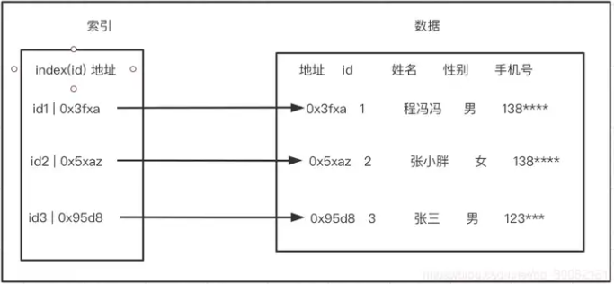
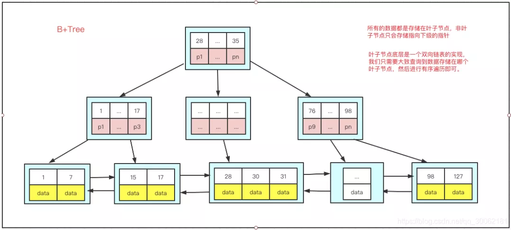

# mysql 笔记

## class 1 ：终端操作MySQL

### *终端启动MySQL服务*

```cmd
net start mysql80
```

### *终端停止MySQL服务*

```cmd
net stop mysql80
```

### *终端登录mysql*

命令：mysql -u "用户名" -p "密码"

```cmd
mysql -u root -p root
```


## class 2 : Navicat操作MySQL

### *创建数据库*

```mysql
create database name if not exists database_name;
```

### *删除数据库*

```mysql
drop database name if not exists database_name ;
```

### *打开数据库*

```mysql
use database_name;
```

### *查看数据库*

```mysql
show DATABASES;
```

### *查看字符集*

```mysql
show CHARACTER SET;
```

### *创建数据库同时设置编码和校对规则*

```mysql
CREATE DATABASE if not EXISTS haha CHARACTER SET utf8mb4 COLLATE utf8mb4_0900_ai_ci;
```

### *查看校对规则*

```mysql
show VARIABLES like "CHARACTER_set_database";
```

### *查看数据库的校对规则*

```mysql
show VARIABLES like "collation_server";
```

### *查看特定数据库的校对规则*

```mysql
show CREATE DATABASE table_name;
```

### *查看表的校对规则*

```mysql
show CREATE TABLE table_name;
```

### *创建表*

```mysql
CREATE table table_name
(
colum_name1 VARCHAR(4) primary key,
colum_name2 VARCHAR(3)
);
```

### *修改表名*

```mysql
alter table table_name1 rename to table_name2;
```

### *添加列主键*

```mysql
alter table table_name2 add PRIMARY key(colum_name);
```

### *添加列*

```mysql
alter table table_name2 add colum_name3 int null;
```

### *修改列类型*

```mysql
alter table table_name2 MODIFY colum_name3 char(4) null;
```

### *删除列*

```mysql
alter table table_name2 drop colum_name3;
```

### *删除表*

```mysql
drop TABLE if EXISTS table_name;
```


## class 3 : 字段约束

### *单字段主键*

方法一: 定义列级主键

```mysql
CREATE TABLE customers (      
cid char (6) primary key,   
ctruename  varchar(30) not null,
cpassword  varchar(30) not null,
csex  char(2),
caddress  varchar(50) ,
cmobile   varchar(11) ,
cemail  varchar(50) ,
cregisterdate  datetime
);
```

方法二: 定义表级主键

```mysql
CREATE TABLE customers (      
cid             char (6)       not null,   
ctruename       varchar(30)    not null,
cpassword       varchar(30)   not null,
csex            char(2)       not null,
caddress         varchar(50) ,
cmobile         varchar(11)    not null,
cemail          varchar(50) ,
cregisterdate     datetime      not null,
Primary Key(cid)
);
```

### *复合主键: 多个字段联合组成，只能定义为表的完整性约束。*

```mysql
CREATE TABLE orderdetails(      
oid  char (14),
gid  char(6) ,
odprice  float,
odnumber int,
primary key(oid,gid)
);
```

### *自动增长约束*

```mysql
CREATE TABLE users (
     id INT  AUTO_INCREMENT,
    username VARCHAR(50) ,
    email VARCHAR(100) ,
    PRIMARY KEY (id)
);
```

### *非空约束*

```mysql
CREATE TABLE category
(
  caid  char(2)  primary key,
   caname varchar not null,
   cadeleted bit  
);
```

### *检查约束* 

方法一：列级check约束

```mysql
CREATE TABLE salary
 (
    id INT primary key,
    name varchar(25),
    deptId int,
    salary float check(salary>0 and salary<50000)
  );


```

方法二: 表级check约束

```mysql
CREATE TABLE  student
    (
    stuno char(6) NOT NULL,
    sex char(2),
    check(sex  in ('男','女'))
    );
```

### *唯一约束*

方法一： 列级唯一约束

```mysql
create table category (
caid char(2)  primary key,
caname varchar(20)   not null unique,
cadeleted bit  not null
);
```

方法二: 标记唯一约束

```mysql
create table category (
caid  char(2)  primary key,
caname  varchar(20)   not null,
cadeleted  bit  not null,
unique(caname)
);
```

### *默认值约束*

```mysql
CREATE TABLE category
(
  caid  char(2)  primary key,
   caname varchar(20),
   cadeleted bit  default 0
);

```

### *外键约束 ： 必须先创建好customers表并且以cid列为主键*

```mysql
CREATE TABLE orders (      
oid     char(14)    PRIMARY KEY,
cid     char(6)      not null,
odate   datetime     not null,
osum   float        not null,
ostatus  char(1)      not null,
FOREIGN KEY(cid)  REFERENCES customers(cid)
);    
```

### *综合案例*

```mysql
在一张表中设置各种约束：
CREATE TABLE employees (
    employee_id INT NOT NULL AUTO_INCREMENT,      -- 主键约束 + 自动递增
    first_name VARCHAR(50) NOT NULL,             -- 非空约束
    last_name VARCHAR(50) NOT NULL,              -- 非空约束
    email VARCHAR(100) NOT NULL UNIQUE,          -- 唯一约束 + 非空约束
    hire_date DATE DEFAULT (CURRENT_DATE),       -- 默认约束
    salary  DECIMAL(10, 2) NOT NULL,              -- 非空约束
        PRIMARY KEY (employee_id)                    -- 主键约束
);
```


## class 4 ： 数据管理(增，删，查，改)

### *添加记录*

插入单条记录 :  

```mysql
INSERT INTO table_name(id) VALUES (1);
```

所有字段插入数据

```mysql
insert into table_name values(1);
```

向指定列插入数据

```mysql
INSERT INTO table_name(col_name,col_name2...col_name3) VALUES (value1,value2.. value3);
```

### *修改记录*

修改id为1的名字

```
UPDATE table_name
SET col_name=value, col_name1=value1,…col_name2=value2
where id = 1
```

修改全部名字

```mysql
UPDATE table_name
SET col_name=value, col_name1=value1,…col_name2=value2;
```

### *删除记录*

删除id为1的列

```mysql
DELETE FROM table_name where id = 1;
```

方法一： 删除表中所有数据

```mysql
DELETE FROM table_name;
```

方法二： 删除表中所有数据

```mysql
truncate table;
```


### *delete 和 truncate 的区别:*

1.truncate 不带任何条件（包括where ，order by,limit等） 语法只有一条： TRUNCATE [TABLE] **tbl_name** 而delete可以。

2.truncate 不能一次删除多个表的数据，而delete可以。

3.runcate不能带条件，所以可以看出truncate 属于表级别删除，一次行删除表中所有数据，而不能指定某行而delete可以。

4.truncate 会删掉自增的值，而delete 会保留.

5.delete 是属于dml语句，truncate是属于ddl 删除，因此，delete 作用与事务，删除时会进入回滚段中，在没有设置自动提交的前提下，还以rollback 操作进行回滚，而truncate则不可回滚。

6.delete 是一条一条删除，日志会记录每行数据的删除记录，而truncate 只记录TRUNCATE TABLE 通过释放存储表数据所用的数据页来删除数据，并且只在事务日志中记录页的释放。

7.对于由 FOREIGN KEY 约束引用的表，不能使用 TRUNCATE TABLE，而应使用不带 WHERE 子句的 DELETE 语句。由于 TRUNCATE TABLE 不记录在日志中，所以它不能激活触发器。

8.truncate比delete 快，大量数据时切不考虑事务时，可用truncate.

9.truncate比delete 快，大量数据时切不考虑事务时，可用truncate.


### *4 种SQL语言:*

| 类别    |           英文全称           |      核心作用      |                常用语句                |
| ------- | :--------------------------: | :----------------: | :------------------------------------: |
| DDL     |   Data Definition Language   | 定义数据库对象结构 | `CREATE`, `ALTER`, `DROP`, `TRUNCATE`  |
| **DML** |  Data Manipulation Language  | 操作数据库中的数据 | `INSERT`, `UPDATE`, `DELETE`, `SELECT` |
| **DCL** |    Data Control Language     |    管理用户权限    |           `GRANT`, `REVOKE`            |
| **TCL** | Transaction Control Language |    管理事务流程    |   `COMMIT`, `ROLLBACK`, `SAVEPOINT`    |


### *单表查询和条件查询*

查询book表

```mysql
SELECT * from book;
```

查询book表的id字段和书名字段,并用别名命名列

```mysql
SELECT bookid, bookname as 书名 from book;
```

去掉重复的typeid值

```mysql
SELECT DISTINCT typeid from book;
```

查询readerid大于20的读者

```mysql
SELECT readername from reader where readerid > 20;
```

查询读者id为0016的读者

```mysql
SELECT readername from reader where readerid = 0016;
```

查询book表typeid在1-5之间的书名

```mysql
SELECT bookname from book where typeid BETWEEN 1 and 5;
```

 查询没有写typeid的作者

```mysql
SELECT bookauthor from book where typeid is null;
```

查询包含程序的书名称

```mysql
SELECT bookname from book where bookname like '%程序%';
```

查询姓张的作者

```mysql
SELECT bookauthor from book where bookauthor like "张%";
```

 查询名字以轩结尾的作者

```mysql
SELECT bookauthor from book where bookauthor like "%轩";
```

*查询名字为黄XX作者的书名*

```mysql
SELECT bookname from book where bookauthor like "黄__";
```

### *排序*

查询书籍表中书籍名称和书籍价格并按价格从高到低排列

```mysql
select gname,gprice from goods order by gprice desc;
```

查询书籍表中书籍名称和书籍价格并按价格从低到高排列

```mysql
select gname,gprice from goods order by gprice asc;
```

查询书籍表价格30元以上的书籍类别、书籍名称和书籍价格，要求类别升序排列，如果类别相同，再按价格降序排列

```mysql
select gtypeid,gname,gprice 
from goods 
where gprice>30 
order by gtypeid asc,gprice desc;
```

### *限制行数*

查找商品表中价格最靠前的从第3条记录开始的3条记录的名称和价格 

```mysql
SELECT gname AS"书名",  gprice AS"价格"
FROM goods
ORDER BY gprice desc 
LIMIT 2,3;
```

注意：偏移量初始行为0

### *聚合函数*

查询书籍表中的书籍的数量，书籍价格的最大值、最小值、平均值和总库存数

```sql
select count(*) as 书籍总数, avg(Bprice) as 平均价格, MAX(Bprice) as 最高价格, min(Bprice) as 最小价格, sum(Bnumber) as 书本数量 from book;
```

### *分组查询*

对书籍表中的书籍按照书籍类别分类，统计各类书籍的数量和均价。

```sql
select Btypeid, count(*) as 数量, avg(Bprice) as 平均价格 
from books
group by Btypeid;
```

对书籍表中的书籍按照书籍类别进行统计，查找书籍类别为“05”的书籍的数量和均价。 

注意:  使用having进行过滤查找,需要是聚合函数后的字段,不能是原始字段

```sql
select Btypeid,count(*) as 数量, avg(Bprice) as 平均价格
from books
group by Btypeid
having Btypeid='05';
```

```sql
select Btypeid,count(*) as 数量, avg(Bprice) as 均价
from books
where Btypeid='05'
group by Btypeid;
```

对书籍表中的书籍按照书籍类别进行统计，查找平均价格大于30的书籍的数量和均价。

```sql
select Btypeid, count(*) as 数量, avg(Bprice) as 平均价格
from books
where Bprice > 30
group by Btypeid;
```

对书籍表中的书籍按照书籍类别分类统计，按照均价从高到低排序。 

```sql
select Btypeid, avg(Bprice) as 平均价格 
from books	
group by Btypeid 
order by 平均价格 desc;
```

显示每个分组中的字段,对书籍表中的书籍按照书籍类别分类统计，同时显示出每组中书籍的名称和每组中书籍的个数。

```sql
select Btypeid,GROUP_CONCAT(Bname) Bnames,COUNT(Bname) number
FROM books 
GROUP BY Btypeid;
```

### *内连接*

查询书籍类别编号、书籍类别名称及其书籍的相关信息。

```sql
select caid, caname, Bid, Bname, Btypeid 
from category,books
where caid = Btypeid;
```

```sql
select category.caid, category.caname, books.Bid, books.Bname, books.Btypeid 
from category,books
where category.caid = books.Btypeid;
```

查询书籍类别id为03的书籍类别编号、名称及其书籍的相关信息。

```sql
select caid, caname, Bid, Bname
from category, books
where caid = "03" and caid = Btypeid;
```

查询书籍类别编号、书籍类别名称及其书籍的相关信息。(join...on)	

```sql
select caid, caname, Bid, Bname
from category join books
on caid = Btypeid;
```

查询书籍类别为03的书籍类别编号、名称及其书籍的相关信息。

```sql
select caid, caname, Bid, Bname
from category join books
on caid = Btypeid and caid  = "03";
```

### *子查询*

查询价格高于 “现代遗传学”的书籍的书籍号、书籍名称和书籍单价，并按价格从高到低排序。

```sql
select Bid, Bname, Bprice
from books
where Bprice > (select Bprice from books where Bname = '现代遗传学')
order by Bprice desc;
```

查询书籍类别是“软件开发”的所有书籍信息，包括书籍名称和书籍价格。

```sql
select Bname, Bprice, Btypeid 
from books
where Btypeid = (select caid from category where caname = '软件开发');
```

```sql
select Bname, Bprice, Btypeid 
from books
join category
on books.Btypeid = category.caid and category.caname = "软件开发"
```


## class5: 视图和索引

### *1.创建视图*

查询商品表的编号和名称

```mysql
create view v_goods_gid

as 

select gid,gname from goods
```

### *2.查询视图：*

```mysql
select * from v_goods_gid;
```

### *3.修改视图：*

```mysql
alter view v_goods_gid

as 

select gid,gname,gwriter from goods;
```

### *4.更新视图中的数据：*

（1）向视图中添加数据：

```mysql
insert into v_goods_gid values('080001','计算机导论');
```

（2）修改视图中的数据：

```mysql
update v_goods_gid set gname='计算机基础' where gid='080001'
```

（3）删除视图中的数据：

```mysql
delete from v_goods_gid where gid='080001'
```

### *5.删除视图：*

```mysql
drop view v_goods_gid
```

### ***6.为多表创建视图：***

\#创建视图，查询商品类别编号、类别名称以及商品名称

```mysql
CREATE VIEW v_goods_category

AS

SELECT goods.gname AS 图书名, category.caname AS 分类名,

goods.gwriter AS 作者, goods.gpublisher AS 出版社, goods.gprice AS 单价

FROM goods

JOIN category ON goods.gtypeid = category.caid;


```


### *索引概要:*

*一、**什么是索引***

在关系数据库中，索引是一种单独的、物理的对数据库表中一列或多列的值进行排序的一种存储结构，它是某个表中一列或若干列值的集合和相应的指向表中物理标识这些值的数据页的逻辑指针清单。索引的作用相当于图书的目录，可以根据目录中的页码快速找到所需的内容。





***二、mysql中索引有哪些类型***

普通索引

通索引是mysql里最基本的索引，没有什么特殊性，在任何一列上都能进行创建。

```mysql
undefined-- 创建索引的基本语法
CREATE INDEX indexName ON table(column(length));
-- 例子 length默认我们可以忽略
CREATE INDEX idx_name ON user(name);
```

主键索引

我们知道每张表一般都会有自己的主键，mysql会在主键上建立一个索引，这就是主键索引。主键是具有唯一性并且不允许为NULL，所以他是一种特殊的唯一索引。一般在建立表的时候选定。

**
**

***唯一索引***

和普通索引类似，但是该索引有个特点，索引数据列中的值必须能出现一次，也就是索引列值要求唯一，需要使用UNIQUE关键词。

复合索引

复合索引也叫组合索引，指的是我们在建立索引的时候使用多个字段，例如同时使用身份证和手机号建立索引，同样的可以建立为普通索引或者是唯一索引。

复合索引的使用复合最左原则。举个例子 我们使用 phone和name创建索引。

```mysql
undefined-- 创建索引的基本语法
CREATE  INDEX indexName ON table(column1(length),column2(length));
-- 例子 
CREATE INDEX idx_phone_name ON user(phone,name);
```

我们看下面的查询语句，

```mysql
undefinedSELECT * FROM user_innodb where name = '程冯冯';
SELECT * FROM user_innodb where phone = '15100046637';
SELECT * FROM user_innodb where phone = '15100046637' and name = '程冯冯';
SELECT * FROM user_innodb where name = '程冯冯' and phone = '15100046637';
```

三条sql只有 2 、 3、4能使用的到索引idx_phone_name,因为条件里面必须包含索引前面的字段才能够进行匹配。而3和4相比where条件的顺序不一样，为什么4可以用到索引呢？是因为mysql本身就有一层sql优化，他会根据sql来识别出来该用哪个索引，我们可以理解为3和4在mysql眼中是等价的。

全文索引

全文索引主要用来查找文本中的关键字，而不是直接与索引中的值相比较。fulltext索引跟其它索引大不相同，它更像是一个搜索引擎，而不是简单的where语句的参数匹配。fulltext索引配合match against操作使用，而不是一般的where语句加like。

它可以在create table，alter table ，create index使用，不过目前只有char、varchar，text 列上可以创建全文索引。正常情况下我们也不会使用到全文索引，因为这不是mysql的专长。

空间索引

空间索引是对空间数据类型的字段建立的索引，MYSQL中的空间数据类型有4种，分别是GEOMETRY、POINT、LINESTRING、POLYGON。MYSQL使用SPATIAL关键字进行扩展，使得能够用于创建正规索引类型的语法创建空间索引。

创建空间索引的列，必须将其声明为NOT NULL，空间索引只能在存储引擎为MYISAM的表中创建。空间索引一般是用不到了，了解即可。


***三、索引的数据结构***

B+Tree



***索引是不是创建的越多越好呢***

答：并不是

- 我们已经知道了索引即数据，那么我们过多的创建索引就会导致数据量的增加。
- 我们知道索引是一颗平衡树，我们在更新数据的同时，索引也在频繁的进行页分裂和合并，非常耗时。

***哪些列适合添加索引***

- 区分度大的列
- 需要经常where的字段
- 需要join连表的字段
- 需要排序的字段
- 需要group by的字段


### ***1．创建索引***

  创建表时可以直接创建索引，这种方式最简单、方便。其基本语法形式如下：

```mysql
CREATE TABLE tb_name

( 

 col_name1 data_type,

 col_name2 data_type,

[UNIQUE | FULLTEXT | SPATIAL] [INDEX | KEY] [index_name](col_name [length]) [ASC | DESC]

)
```

其中：

- UNIQUE、FULLTEXT和SPATIAL为可选参数，分别表示唯一索引、全文索引和空间索引。
-  INDEX和 KEY为同义词，两者作用相同，用来指定创建索引。
- col_name为需要创建索引的字段列。
-  index_name指定索引的名称，为可选参数，如果不指定，MySQL默认col_name为索引值；
- length为可选参数，表示索引的长度，只有字符串类型的字段才能指定索引长度。

ASC或DESC参数用于指定数据表的排序顺序。

**【例】在商品表goods中的商品名称gname字段上建立普通索引。**  

```mysql
CREATE TABLE goods

(

 gid    char(6)   not null  primary key,

 gname   varchar(50),

 gtypeid  char(2)  ,

 gwriter  varchar(50),

 gpublisher varchar(50),

 gISBN   varchar(50),

 gprice   double,

 gcount  int,

INDEX(gname)

);
```


### ***2．创建升序索引***

在已经存在的表中，可以直接为表上的一个或几个字段创建索引。基本形式如下：

CREATE [UNIQUE | FULLTEXT| SPATIAL] INDEX in_name

ON tb_name( col_name[(length)] [ASC | DESC ]);

命令的参数说明如下：

- in_name为索引名称，该参数作用是给用户创建的索引赋予新的名称。
- UNIQUE | FULLTEXT | SPATIAL为可选参数，用于指定索引类型，分别表示唯一索引、全文索引、空间索引。
- col_name表示字段的名称，该字段必须预存在用户想要操作的数据表中，如果该数据表中不存在用户指定的字段，则系统会提示异常。
- length为可选参数，用于指定索引长度。
- ASC | DESC参数用于指定数据表的排序顺序。   

***【例】在goods表的gname列上建立一个升序索引index_cname。***

```mysql
Create index index_cname on goods(gname asc);
```

***为表的多个字段创建符合索引***

***【例】在goodstest表上按照gname的升序，gtypeid降序建立一个索引。***

```mysql
Create index index_cname_gtypeid on goods(gname asc,gtypeid desc);
```

### ***3.删除索引***

语法：DROP INDEX in_name ONtb_name;

其中，in_name参数指要删除的索引的名称；tb_name参数指索引所在的表的名称。

***【例】利用DROP命令，删除数据表goods中的索引。***

```mysql
Drop index index_cname on goods;
```


## class6:存储过程

### *不带参数的存储过程*

```mysql
#【例】创建一个无参数的存储过程goods_info，查找所有图书的书名、作者、出版社和ISBN，并且调用该存储过程，查看输出结果。

#（1）创建存储过程goods_info。

DELIMITER $$

CREATE PROCEDURE goods_Info ()

BEGIN

   SELECT gname,gwriter,gpublisher,gISBN

   FROM goods;

END $$

DELIMITER ;


#(2)调用存储过程

call goods_info();
```


### *带IN参数的存储过程*

```mysql
# MySQL 存储过程支持三种类型的参数，即输入参数、输出参数和输入/输出参数，分别用 IN、OUT和INOUT 三个关键字标识。其中，输入参数可以  传递给一个存储过程，输出参数用于存储过程需要返回一个操作结果的情形，而输入/输出参数既可以充当输入参数也可以充当输出参数。


#【例】创建一个带有输入参数的存储过程pro_querybygoodid，查找指定书籍编号的书名、作者、出版社和ISBN，并且调用该存储过程，查看输出结果。

#（1）创建存储过程pro_querybygoodid。

DELIMITER $$

CREATE PROCEDURE pro_querybygoodid(IN id CHAR(6))

BEGIN

  SELECT gname,gwriter,gpublisher,gISBN

  FROM goods  WHERE gid = id;

END $$

DELIMITER ;


#（2）调用存储过程pro_querybygoodid。

CALL pro_querybygoodid('030003');


# 带多个输入参数的存储过程

#【例】创建一个带有输入参数的存储过程pro_price_publisher，查找某个出版社并且价格大于某个值的书名、作者、出版社和ISBN，并且调用该存储过程，查找“湖南教育出版社”并且价格大于50的书籍，查看输出结果。

DELIMITER $$

create PROCEDURE pro_price_publisher(in publisher varchar(50),in price double)

begin

	select gname,gwriter,gpublisher,gISBN

	from goods 

	where gpublisher= publisher and gprice>price;

end $$

DELIMITER ;


call pro_price_publisher('湖南教育出版社',50)
```


### *带OUT参数的存储过程*

```mysql
#创建一个带有输入和输出参数的存储过程pro_countbytypeid，计算指定书籍分类编号（03）的图书总数量，并且调用该存储过程，查看输出结果。

DELIMITER $$

create PROCEDURE pro_countbytypeid(in id char(2),out number int)

begin

	select count(*) into number from goods where gtypeid=id;

end$$

DELIMITER ;


call pro_countbytypeid('03',@number)

select @number;
```


## class7:事务操作

### *事务控制语句*

**事务的定义：**

***•事务(TRANSACTION)是作为单个逻辑工作单元执行的一系列操作***

***•这些操作作为一个整体一起向系统提交，要么都执行、要么都不执行***

***•事务是一个不可分割的工作逻辑单元***


**事务的特性：**

***一般来说，事务是必须满足4个条件（ACID）：***

***原子性（Atomicity，或称不可分割性）、一致性（Consistency）、隔离性（Isolation，又称独立性）、持久性（Durability）。***

***•原子性：一个事务（transaction）中的所有操作，要么全部完成，要么全部不完成，不会结束在中间某个环节。事务在执行过程中发生错误，会被回滚（Rollback）到事务开始前的状态，就像这个事务从来没有执行过一样。***

***•一致性：在事务开始之前和事务结束以后，数据库的完整性没有被破坏。这表示写入的资料必须完全符合所有的预设规则，这包含资料的精确度、串联性以及后续数据库可以自发性地完成预定的工作。***

***•隔离性：数据库允许多个并发事务同时对其数据进行读写和修改的能力，隔离性可以防止多个事务并发执行时由于交叉执行而导致数据的不一致。事务隔离分为不同级别，包括读未提交（Readuncommitted）、读提交（readcommitted）、可重复读（repeatableread）和串行化（Serializable）。***

***•持久性：事务处理结束后，对数据的修改就是永久的，即便系统故障也不会丢失。***


**事务控制语句：**

- ***start transaction,开启事务***
- ***commit transaction，提交事务***
- ***rollback transaction，回滚事务***


***案例1：提交事务***

```mysql
start transaction;

insert into goods(gid,gname,gtypeid) values('090001','计算机基础',‘03');

commit;
```

***案例2：回滚事务***

```mysql
start transaction;

insert into goods(gid,gname,gtypeid) values('090002','计算机基础1','03');

rollback;
```

***案例3：***

```mysql
# 修改书籍表goods的某一本书籍的图书类型，如果修改的图书类型已存在于图书分类表则提交事务，修改一个不存在的图书类型则回滚事务。

DELIMITER $$

CREATE PROCEDURE upcid(in gtid char(2)) #创建存储过程，输入参数为商品类别编号gtid

BEGIN

DECLARE cid char(2);#定义变量cid

START TRANSACTION;#开始事务

UPDATE goods SET gtypeid=gtid WHERE gid='010001';#修改goods表的记录

SELECT caid INTO cid FROM category WHERE caid=gtid;#查找商品类别表中caid等于gtid的caid,并存储在变量cid中

IF cid=gtid THEN #如果商品类别表中存在gtid

SELECT CONCAT(gtid,'修改成功，提交事务！') ;#输出字符串

    COMMIT ; #提交事务

 ELSE

    SELECT CONCAT(gtid,'修改失败，回滚事务！') ;#输出字符串

   ROLLBACK;#回滚事务

END IF;

END $$

DELIMITER;


call upcid('03');#执行存储过程，带入‘03',修改成功

call upcid('11');#执行存储过程，带入‘11',修改失败
```

### 

## class8:数据备份和恢复

***进入DOS命令窗口，切换到mysql安装目录***

```cmd
cd C:\Program Files\MySQL\MySQL Server 8.0\bin
```

***备份bookshop数据库***

```cmd
mysqldump  -u root  -p  bookshop >D:\backup_bookshop.sql

#Enter password: ****
```

***恢复bookshop数据库***

```cmd
mysql  -u root  -p  bookshop <D:\backup_bookshop.sql

# Enter password: ****
```

***备份bookshop数据库的customers表和goods表***

```cmd
mysqldump  -u root  -p  bookshop customers goods >d:\backup_customers-goods.sql

# Enter password: ****
```


## class9:创建和删除用户

***在对 MySQL 的日常管理和实际操作中,为了数据库的安全,避免恶意用户使用 root 账号控制数据库,我们通常会创建一系列具备适当权限的账号.这样,我们就可以不用或少用 root 账号登录MySQL数据库,在一定程度上确保数据的安全访问.***


***创建用户***

***语法:***

```
CREATE USER '用户名'[@'登录主机名'] [ IDENTIFIED BY ] [ '密码' ]
```

***语法说明:***     

 ***用户名: 要创建的用户名。***   

 ***登录主机名: 用户连接 MySQL 时所在主机的名字,如果是本地用户可用          localhost;如果想让该用户可以从任意远程主机登陆,可以使用通配符%。            IDENTIFIED BY: 用于指定用户账号对应的密码,若该用户账号无密码,则可省略此子句。***


***注意:***

1. ***如果使用 CREATE USER 语句时没有为用户指定密码,那么 MySQL 允许该用户可以不使用密码登录系统.从安全的角度而言,不推荐这种做法.***
2. ***使用 CREATE USER 语句必须拥有 MySQL 中 MySQL 数据库的 INSERT 权限或全局 CREATE USER 权限.***
3. ***使用 CREATE USER 语句创建一个用户账号后,会在系统自身的 MySQL 数据库的 user 表中添加一条新记录.若创建的账户已经存在,则语句执行时会出现错误.***
4. ***新创建的用户拥有的权限很少.他们可以登录 MySQL,只允许进行不需要权限的操作,如使用 SHOW 语句查询所有存储引擎和字符集的列表等.***
5. ***如果两个用户具有相同的用户名和不同的主机名,MySQL 会将他们视为不同的用户,并允许为这两个用户分配不同的权限集合.***


***例子:***

***\# 创建用户neil，密码为123456,允许在任何远程主机上登录MySQL***

```mysql
CREATE USER 'neil'@'%' IDENTIFIED BY '123456';
```

***\# 创建用户neil1，密码为123456,允许在主机192.168.1.10上登录MySQL***

```mysql
CREATE USER 'neil1'@'192.168.1.10' IDENTIFIED BY '123456';
```

***\# 创建用户neil2，密码为123456,允许在本机登录MySQL***

```mysql
CREATE USER 'neil2'@'localhost' IDENTIFIED BY '123456';
```


***删除用户***

***语法：***

```mysql
DROP USER user [,user]…;
```

***例：***

```mysql
DROP USER 'neil2'@'localhost' ;
```

***修改用户名***

**语法：**

```mysql
RENAME USER old_user TO new_user

[, old_user TO new_user]
```

***例：***

```mysql
RENAME USER 'user2'@'localhost' TO 'Jenny'@'localhost';
```


