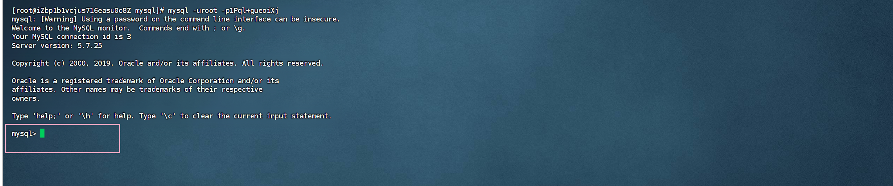
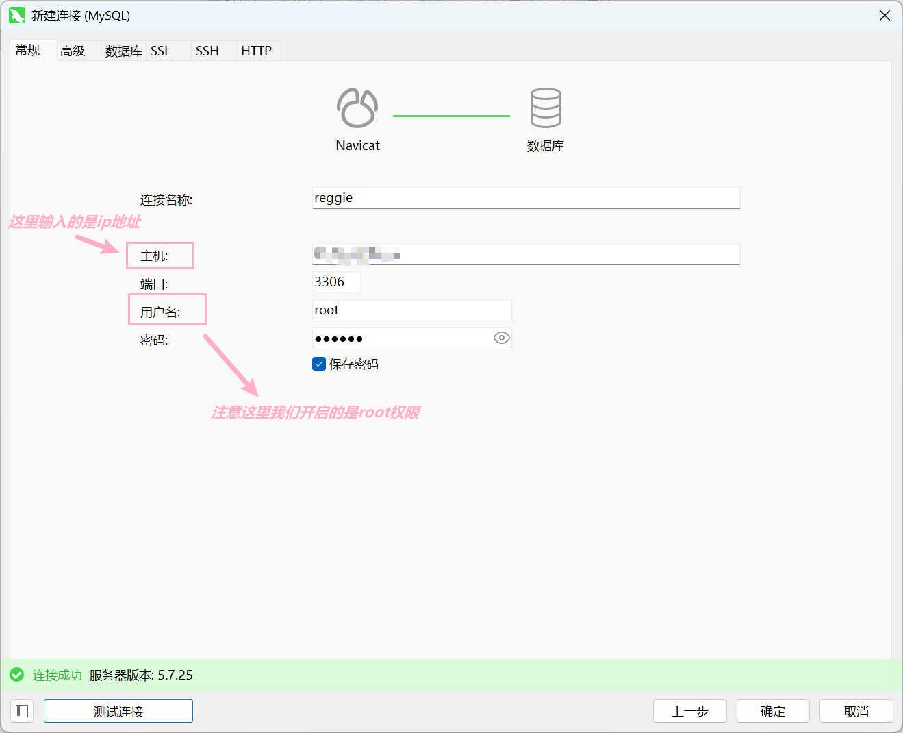

# Linux部署Mysql

## 一.安装MySQL

***1.创建目录***

```
mkdir -p /data/software/mysql # 创建mysql安装目录
tar -zxvf /data/software/mysql/mysql-5.7.25-1.el7.x86_64.rpm-bundle.tar.gz # 解压mysql安装包
```

***---结果如下：***


***2.安装mysql依赖 （注意：一定要按顺序安装,否则可能会冲突）***

```
rpm -ivh mysql-community-common-5.7.25-1.el7.x86_64.rpm
rpm -ivh mysql-community-libs-5.7.25-1.el7.x86_64.rpm
rpm -ivh mysql-community-libs-compat-5.7.25-1.el7.x86_64.rpm
rpm -ivh mysql-community-client-5.7.25-1.el7.x86_64.rpm
rpm -ivh mysql-community-server-5.7.25-1.el7.x86_64.rpm
```

***---结果如下, 因为前面我已经安装过了***


## 二、修改mysql服务密码

***说明: 当我们安装完mysql服务后,mysql会自动给我们一个随机密码***

***1.获取临时密码并登录mysql***

```
cat /var/log/mysqld.log | grep password
```

***---结果如下：***


***2.登录mysql***

```
mysql -uroot -p1Pql+gueoiXj # -u参数是用户名 -p参数是密码
```

***---结果如下：***




***3.修改密码并开启访问权限***

```
# 修改密码
set global validate_password_length=4; # 设置密码长度最低位数
set global validate_password_policy=LOW; # 设置密码安全等级低，便于修改简单密码
set password = password("123456"); # 设置密码为123456
# 开启访问权限
grant all on *.* to 'root'@'%' identified by "123456"; # 所有root用户连接的客户端密码123456 
flush privileges; # 刷新生效
```

***---结果如下：***


## 三、测试连接

***说明:这里配置的是root用户, 一般是测试和本地环境这样做,一般来说设置用户不是root并且权限配置的很小***

***---结果如下***




## 四、基本命令:

```
systemctl status mysqld # 查看mysql进程状态
systemctl start mysqld # 启动mysql进程
systemctl stop mysqld # 停止mysql进程
systemctl restart mysqld # 重启mysql进程
systemctl enable mysqld # 开启自启动mysql进程
systemctl disable mysqld # 禁用mysql进程

```

```
netstat -tunlp | grep mysql # 查看mysql进程端口 --- 注意：需要提前安装net-tools依赖
ps -ef | grep mysql # 查看mysql进程信息
```

