# Linux部署redis

## 一、安装redis

***1.解压redis压缩包***

```
tar -zxvf redis-4.0.0.tar.gz # 解压redis压缩包
```

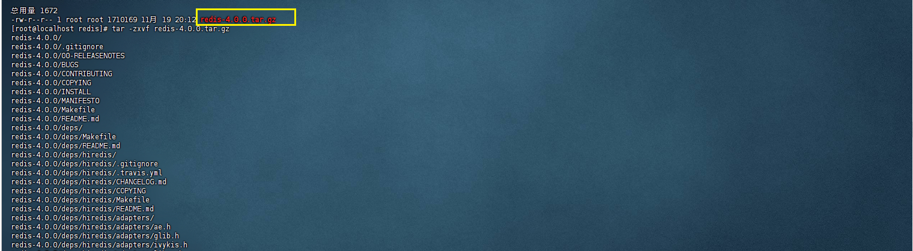


***2.编译并安装reids***

```
mv redis-4.0.0 redis # 修改redis的文件名为redis
cd redis # 进入redis目录
make && make install # 执行编译并安装redis
```

***---结果如下：***

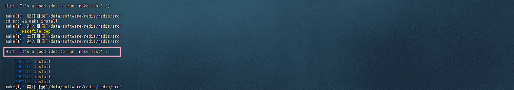

***说明:编译完redis执行文件会在/usr/local/bin这个目录下,这个目录系统是自带环境变量的,所以我们无需配置环境变量***


***3.修改redis配置文件***

***---修改redis配置文件***

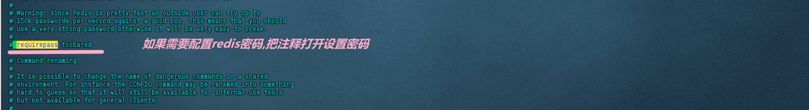

***设置redis密码为123456***

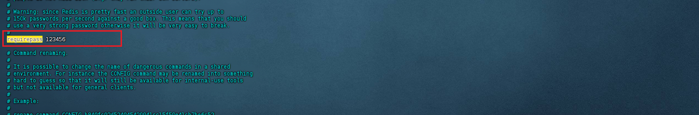

***开启连接redis权限***

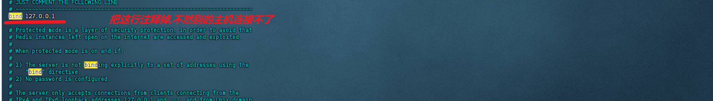

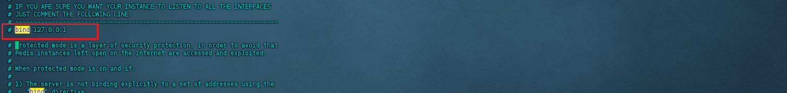


***4.配置redis服务（可选）***

```
vim /etc/systemd/system/redis.service # 配置redis服务文件
```

```
# redis服务配置
[Unit]
Description=Redis
After=network.target

[Service]
ExecStart=/usr/local/bin/redis-server /data/software/redis/redis/redis.conf --daemonize no
ExecStop=/usr/local/bin/redis-cli -h 127.0.0.1 -p 6379 -a 123456 shutdown

[Install]
WantedBy=multi-user.target
```

***---结果如下：***

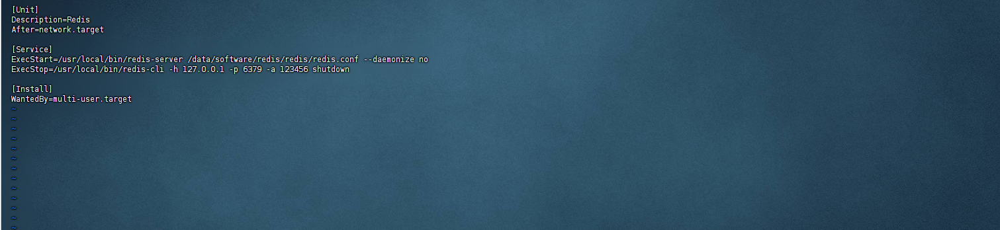


***5.启动redis***

```
systemctl start redis # 启动redis服务端
systemctl status redis # 查看redis状态
systemctl enable redis # 开启自启动redis
systemctl restart redis # 重启redis进程
systemctl stop redis # 停止redis服务端
systemctl disable redis # 禁用redis进程
```

***---结果如下：***

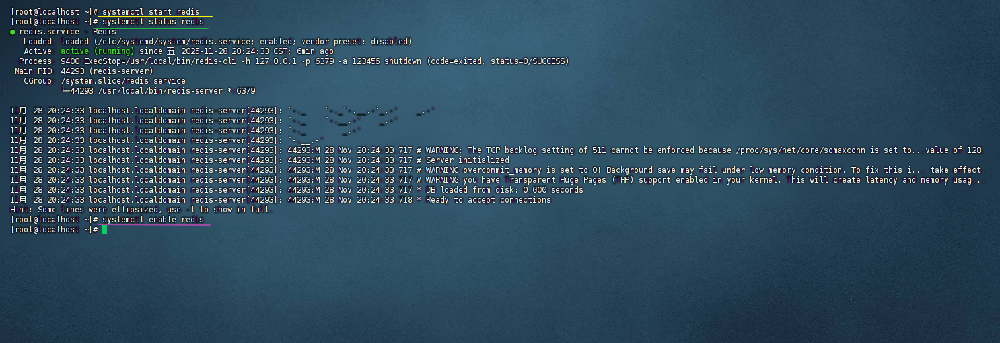


## 二、Java操作redis

***1.配置maven坐标, 简单来说就是下载这个依赖***

```
<dependency>
    <groupId>org.springframework.boot</groupId>
    <artifactId>spring-boot-starter-data-redis</artifactId>
</dependency>

<dependency>
    <groupId>org.springframework.boot</groupId>
    <artifactId>spring-boot-starter-cache</artifactId>
</dependency>
```

***---结果如下：***

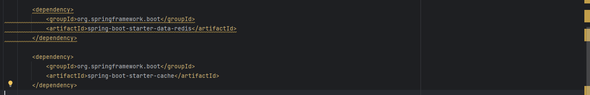

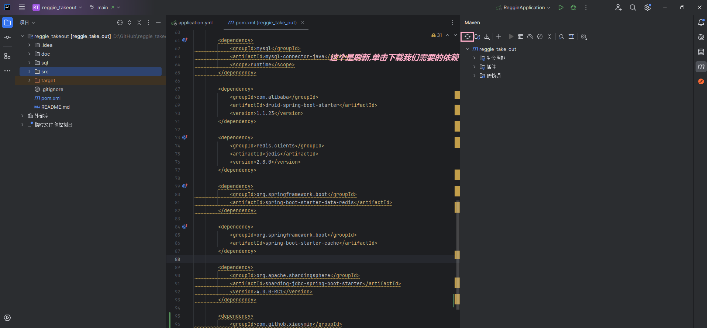


***2.配置application.yml***

```
spring:
  redis:
    host: 192.168.10.2 # redis主机ip地址
    port: 6379 # redis服务端口号
    password: 123456 # redis连接密码
    database: 0 # 操作0号数据库，可自定义
  cache:
    redis:
      time-to-live: 1800000 # 设置缓存有效期，ms为单位,1800000ms = 30min
```

***---结果如下：***

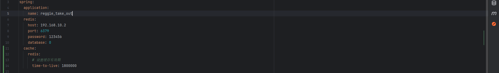


***--- 配置完redis连接,下面就可以通过java代码或者注解操作redis***


***3.手动操作redis***

***---注入RedisTemplate***

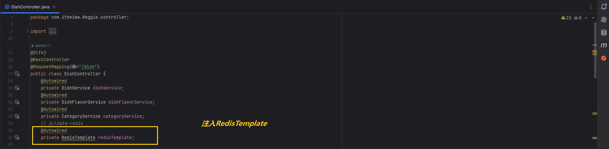

***需求分析：现在我们实现我们的菜品数据缓存到redis，当用户请求菜品数据的时候此时我们可以直接请求redis缓存,这样不仅可以缓解服务器的压力，并且查询会更快，因为redis的数据是存储到内存，而数据库的数据是存储到我们的磁盘的***

***---通过redisTemplate手动操作redis***

***---用户查询数据直接从redis缓存获取,如果存在***

***---如果数据不存在则存入redis缓存，并设置过期时间60分钟***


***---当新增数据的时候，删除redis菜品缓存（当有菜品分类的时候可以选择删除全部分类，也可以删除当前新增的分类菜品）***

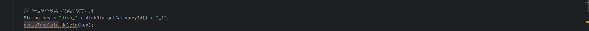

***---修改菜品也是同理***


***结果如下：***

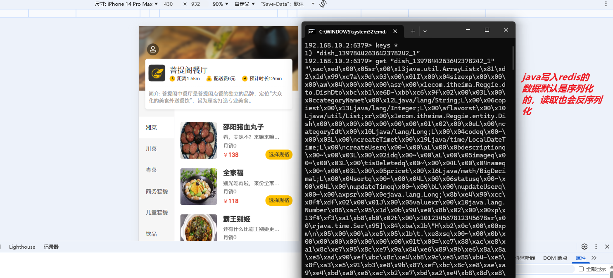

```
@Autowired
private RedisTemplate redisTemplate; # 注入redisTemplate

redisTemplate.opsForValue().set(key) # 设置key对应的值
redisTemplate.opsForValue().get(key) # 获取key对应的值
redisTemplate.opsForValue().delete(key) # 删除key对应的值
```


***4、注解操作redis***

***---开启注解缓存***

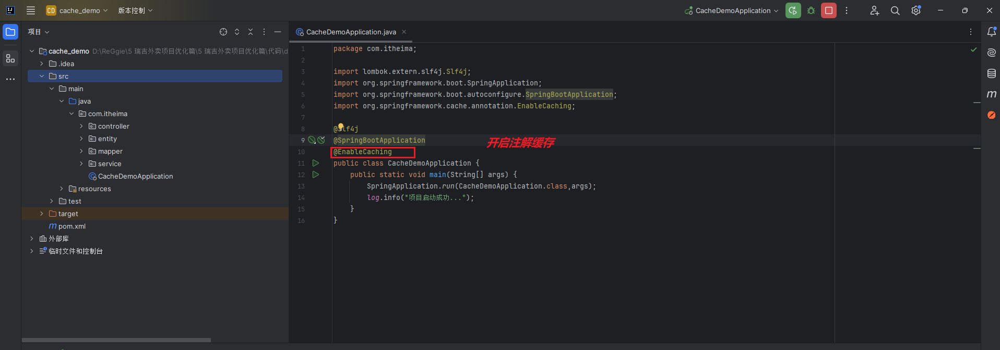

***---使用@CachePut注解可以将方法返回值放入缓存***

***---配置如下：***

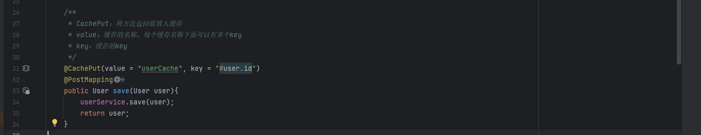

***---接下来我们验证一下***

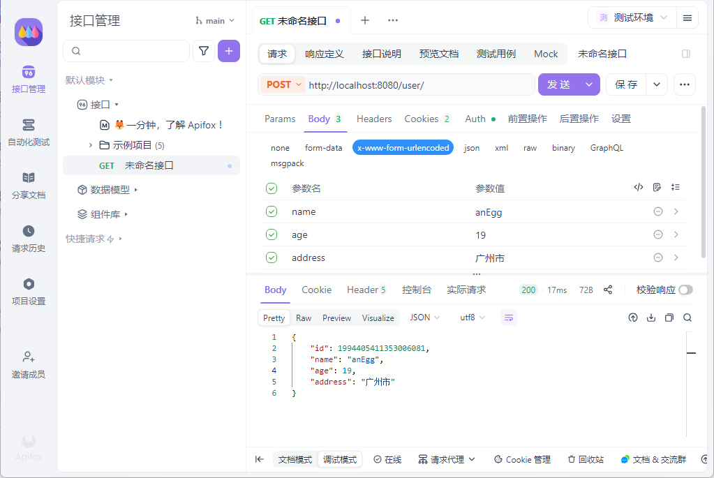

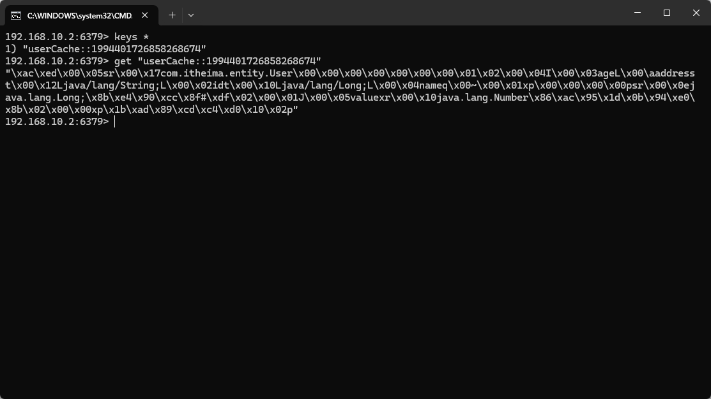

***---使用@CacheEvict注解可以清除redis缓存中key对应的值***

***---配置如下：***

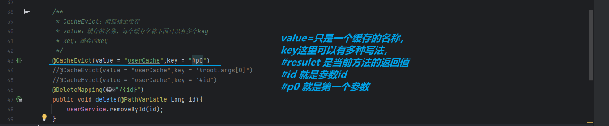

***---接下来我们验证一下***

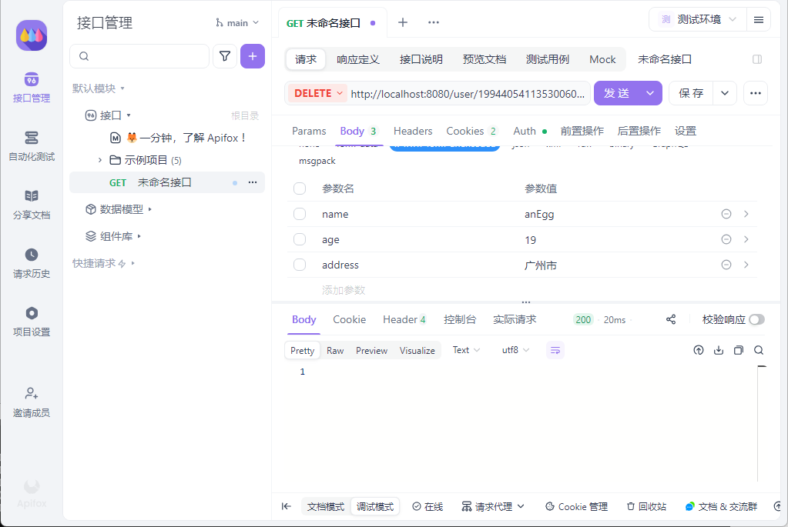

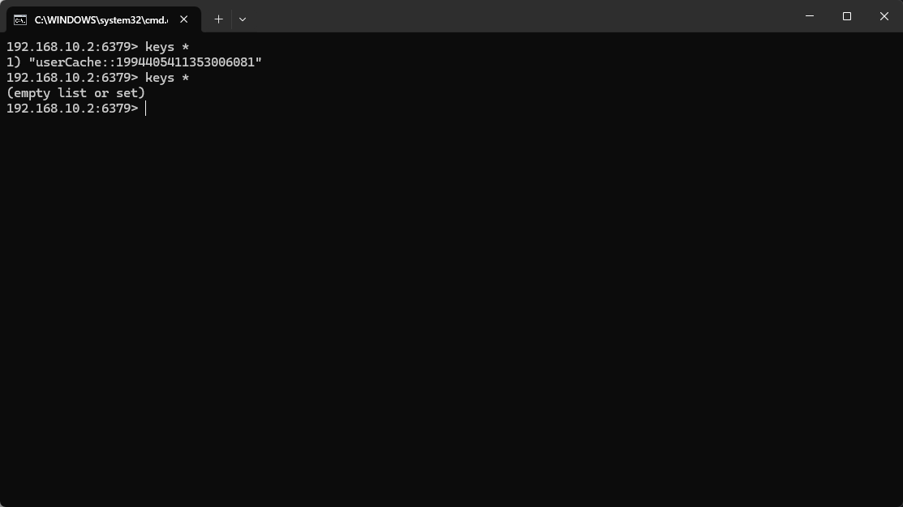

***---使用@Cacheable注解可以实现当请求的数据redis缓存中有直接从缓存中读取没有则存入redis缓存中***

***---配置如下：***

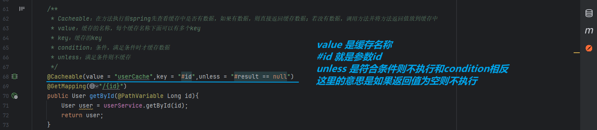

***---接下来我们验证一下***

***---这里我们可以设置断点来测试一下,如果命中说明没有存入redis缓存,没有命中返回数据说明存入redis缓存 (此时我们的redis缓存是没有数据的所以应该第一次命中第二次不命中)***

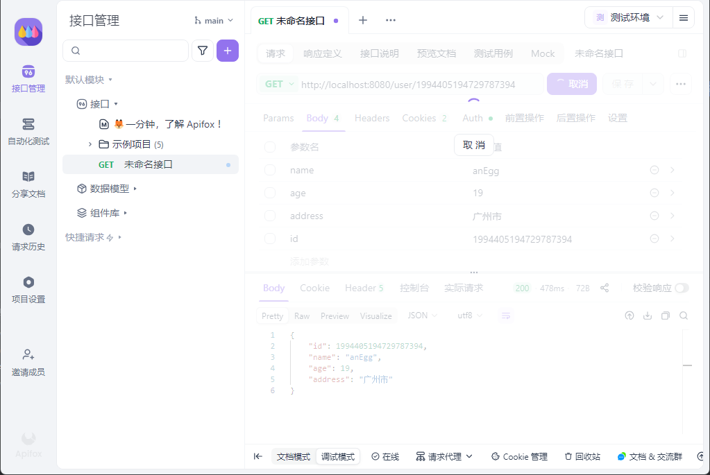


***---很明显第一次卡住了第二次直接就返回了***

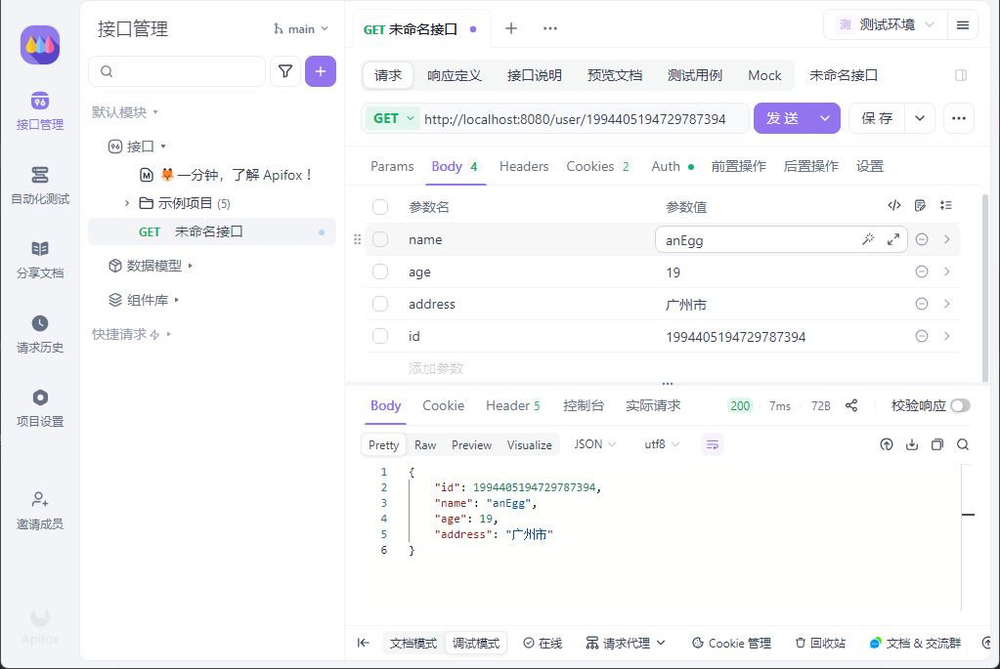